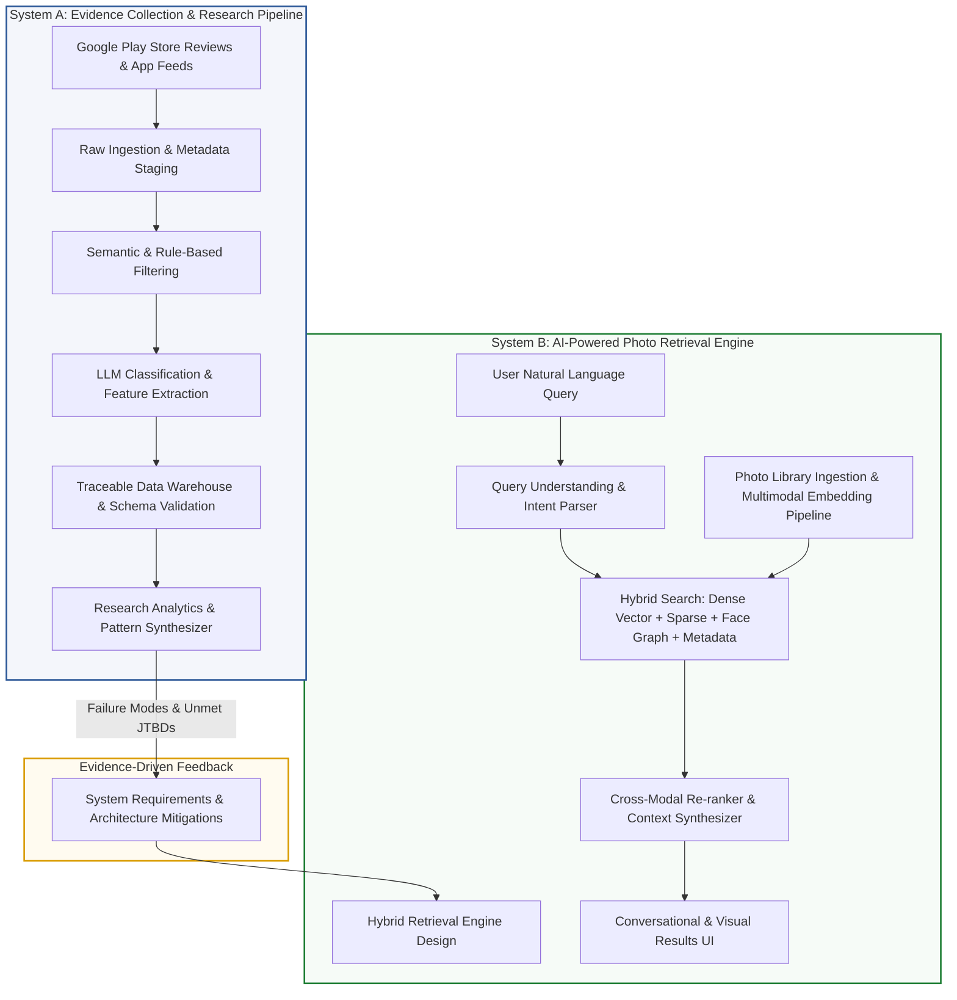

# System Architecture: AI-Powered Photo Retrieval & Evidence Research Platform

> **Document Status:** Active Specification  
> **Source Baseline:** [problemstatement.md](file:///d:/graduation%20project%203/problemstatement.md)  
> **Scope:** Comprehensive dual-system architecture covering (1) the **Evidence Collection & Research Intelligence Pipeline** and (2) the **Target AI-Powered Photo Retrieval Engine**.

---

## 1. Executive Summary & Architectural Scope

This document defines the end-to-end technical architecture for the **AI-Powered Photo Retrieval Project**. The architecture is organized into two tightly coupled subsystems:

1. **System A: Evidence Collection & Research Intelligence Pipeline:**  
   An automated data ingestion, filtering, NLP/LLM classification, and analytics pipeline executing the 15-step research methodology specified in [problemstatement.md](file:///d:/graduation%20project%203/problemstatement.md). It systematically mines, verifies, and analyzes real-world user feedback (e.g., Google Photos Play Store reviews) to quantify user pain points, failure modes, and feature expectations without confirmation bias.

2. **System B: Target AI-Powered Photo Retrieval Engine:**  
   A production-ready, privacy-preserving, multimodal photo retrieval system designed to directly overcome the core user frustrations and failure modes surfaced in the research (e.g., memory decay, unindexed visual context, face recognition degradation, and semantic query mismatch).



---

## 2. System A: Evidence Collection & Research Intelligence Pipeline

The evidence collection subsystem automates the collection, filtering, classification, and statistical synthesis of large-scale user feedback while strictly adhering to the neutrality rules in [problemstatement.md](file:///d:/graduation%20project%203/problemstatement.md).

### 2.1 Pipeline Architecture Overview

```mermaid
flowchart TD
    subgraph Ingestion ["1. Raw Ingestion Layer"]
        SRC[Play Store Scraper / Google Play API] --> RAW_STORE[(Raw Ingestion Lake: JSONL)]
    end

    subgraph Preprocessing ["2. Preprocessing & Deduplication"]
        RAW_STORE --> DEDUP[Hash Deduplication Engine]
        DEDUP --> EXCLUDE_FILTER{Exclusion Rule Filter\n(Billing, General UI, Crashes, Ads)}
        EXCLUDE_FILTER -- Excluded --> EXCLUDED_STORE[(Excluded Archive with Reason)]
        EXCLUDE_FILTER -- Passed --> RELEVANCE_FILTER{Semantic Relevance Filter\n(Vector Sim + Rule Heuristics)}
        RELEVANCE_FILTER -- Non-Relevant --> EXCLUDED_STORE
    end

    subgraph Classification ["3. NLP / LLM Classification & Enrichment"]
        RELEVANCE_FILTER -- Relevant --> LLM_CLASSIFIER[LLM Classification Agent / Prompt Pipeline]
        LLM_CLASSIFIER --> CATEGORY[Category Tagger: 15 Classes]
        LLM_CLASSIFIER --> EVIDENCE_TYPE[Direction of Evidence: 6 Types]
        LLM_CLASSIFIER --> JTBD[JTBD Extractor]
        LLM_CLASSIFIER --> SEARCH_METHOD[Search Method Extractor]
        LLM_CLASSIFIER --> FAILURE_MODE[Failure Mode Classifier]
        LLM_CLASSIFIER --> SIGNAL_DETECTOR[Signal Strength Evaluator: High/Med/Low]
        LLM_CLASSIFIER --> BIAS_GUARD[Language vs Interpretation Separator]
    end

    subgraph Storage_Analytics ["4. Storage, Integrity & Analytics"]
        CATEGORY & EVIDENCE_TYPE & JTBD & SEARCH_METHOD & FAILURE_MODE & SIGNAL_DETECTOR & BIAS_GUARD --> SCHEMA_VALIDATOR[Schema Validator: ReviewData]
        SCHEMA_VALIDATOR --> EVIDENCE_DB[(Validated Evidence DB)]
        EVIDENCE_DB --> QUANT_AGGREGATOR[Quantitative Metrics Aggregator]
        EVIDENCE_DB --> QUAL_ANALYZER[Qualitative Pattern & Cluster Engine]
        QUANT_AGGREGATOR & QUAL_ANALYZER --> DASHBOARD[Research Evidence Dashboard & Report]
    end

    style Ingestion fill:#f9f9f9,stroke:#666
    style Preprocessing fill:#f0f4ff,stroke:#4a6fa5
    style Classification fill:#fdf6e2,stroke:#b58900
    style Storage_Analytics fill:#eef9f0,stroke:#2aa198
```

### 2.2 Component Breakdown

#### A. Ingestion & Preprocessing Layer
- **Play Store Review Harvester:** Extracts reviews with exact text, timestamp, star rating, reviewer identifier, app version, and permalink.
- **Deduplication Engine (Step 13):** Computes normalized text hashes (`SHA-256` of sanitized review bodies) to eliminate duplicated syndications or bot spams, preserving the most complete record.
- **Rule-Based & Semantic Filter (Steps 2, 3, 4):**
  - **Exclusion Filter:** Discards reviews exclusively discussing billing/subscriptions, upload/sync bugs, pure editing tools (Magic Eraser, filters), general UI tweaks, or low-quality noise (emojis, single-word compliments).
  - **Semantic Relevance Filter:** Applies vector-similarity embeddings (e.g., embedding model comparison against retrieval-domain anchor concepts) combined with heuristic patterns to ensure the review touches upon discovery, search, face tagging, date/location recall, or library overload.

#### B. LLM Classification & Feature Extraction Engine (Steps 5–11)
To ensure objective, zero-hallucination processing, reviews are passed through an LLM orchestration pipeline configured with temperature 0.0 and deterministic JSON-schema output enforcement:

- **15 Primary Categories:** `RETRIEVAL_DIFFICULTY`, `SEARCH_PROBLEM`, `NATURAL_LANGUAGE_SEARCH`, `AI_SEARCH`, `FACE_RECOGNITION`, `OBJECT_RECOGNITION`, `EVENT_CONTEXT_SEARCH`, `DATE_SEARCH`, `LOCATION_SEARCH`, `LARGE_LIBRARY_OVERLOAD`, `SEARCH_ACCURACY`, `SEARCH_RELEVANCE`, `FEATURE_REQUEST`, `SUCCESSFUL_RETRIEVAL`, `OTHER_RETRIEVAL_EVIDENCE`.
- **Direction of Evidence:** `PAIN_POINT`, `FEATURE_REQUEST`, `SUCCESS`, `FAILURE`, `EXPECTATION`, `MIXED`.
- **JTBD Extraction:** Extracts user goal (e.g., *"Find daughter with dog at the beach without knowing year"*).
- **Search Method Extraction:** Maps attempted access mechanisms (e.g., `MANUAL_SCROLLING`, `FACE_RECOGNITION`, `KEYWORD_SEARCH`).
- **Failure Mode Classification:** Pinpoints precise failure mode (e.g., `CANNOT_FIND_PHOTO`, `WRONG_PERSON`, `REQUIRES_EXACT_DATE`, `CONTEXT_NOT_UNDERSTOOD`).
- **Signal Strength Detection:** Classifies reviews into `HIGH_SIGNAL` (specific numbers, scenarios, steps), `MEDIUM_SIGNAL`, or `LOW_SIGNAL`.
- **Ground Truth Guard:** Strictly keeps `original_review` unedited and isolates `research_interpretation` in a separate attribute.

#### C. Traceable Storage & Schema Conformance (Step 14)
Enforces the strict data model specified in [problemstatement.md](file:///d:/graduation%20project%203/problemstatement.md):

```typescript
export interface ReviewData {
  review_id: string;
  app_name: string;
  review_date?: string;
  rating?: number;
  original_review: string;
  relevance: "RELEVANT" | "NOT_RELEVANT";
  evidence_type: "PAIN_POINT" | "FEATURE_REQUEST" | "SUCCESS" | "FAILURE" | "EXPECTATION" | "MIXED";
  category: string[];
  job_to_be_done: string;
  search_method: string[];
  failure_mode: string;
  research_interpretation: string;
  signal_strength: "HIGH" | "MEDIUM" | "LOW";
  source: string;
}
```

---

## 3. System B: AI-Powered Natural-Language Photo Retrieval Engine

Based on the evidence categories and failure modes identified in the research hypothesis, System B is designed to replace traditional keyword and rigid metadata filtering with a **multimodal, context-aware semantic retrieval engine**.

### 3.1 Target System Architecture

```mermaid
flowchart TB
    subgraph Client_App ["Client Tier (Mobile / Web)"]
        UI[Search Interface / Ask Photos Chat UI]
        FEEDBACK[Relevance Feedback & Explicit Corrections]
    end

    subgraph API_Gateway ["API & Orchestration Layer"]
        GATEWAY[FastAPI Gateway / Session Orchestrator]
        CACHE[(Query & Embedding Cache: Redis)]
    end

    subgraph Query_Pipeline ["Query Processing Subsystem"]
        QP[Query Normalizer & Spell Fixer]
        NLU[Multimodal Intent & Semantic Parser]
        NER[Entity, Date & Spatial Resolver]
        EXPANDER[Context & Semantic Query Expander]
    end

    subgraph Ingestion_Indexing ["Library Indexing Subsystem (Edge & Cloud)"]
        PHOTO_SRC[User Photo Stream]
        VLM[Multimodal Vision-Language Encoder\n(SigLIP / CLIP ViT-H)]
        FACE_ENGINE[Face Recognition & Clustering Engine\n(ArcFace + Multi-Angle Aggregator)]
        OCR_ENGINE[Visual Text / OCR Ingestion]
        EXIF_PARSER[Temporal & Geolocation Resolver]
        GRAPH_BUILDER[Entity & Event Graph Builder]
    end

    subgraph Storage_Tier ["Hybrid Storage Tier"]
        VECTOR_DB[(Vector DB: HNSW Index\nVisual & Multimodal Embeddings)]
        GRAPH_DB[(Knowledge / Identity Graph DB\nPerson, Event & Group Clusters)]
        METADATA_DB[(Document Store: MongoDB/PostgreSQL\nEXIF, OCR, Timestamp, File Specs)]
    end

    subgraph Retrieval_Ranking ["Hybrid Retrieval & Re-ranking"]
        DENSE[Dense Semantic Vector Search]
        SPARSE[Sparse BM25 Search: OCR + Captions]
        GRAPH_SEARCH[Person & Social Relationship Traversal]
        META_FILTER[Spatial & Temporal Pre-Filter]
        RRF[Reciprocal Rank Fusion - RRF]
        CROSS_ENCODER[Cross-Encoder Multimodal Re-ranker]
    end

    UI --> GATEWAY
    FEEDBACK --> GATEWAY
    GATEWAY <--> CACHE
    GATEWAY --> QP
    QP --> NLU --> NER --> EXPANDER

    PHOTO_SRC --> VLM & FACE_ENGINE & OCR_ENGINE & EXIF_PARSER
    VLM --> VECTOR_DB
    FACE_ENGINE --> GRAPH_BUILDER --> GRAPH_DB
    OCR_ENGINE & EXIF_PARSER --> METADATA_DB

    EXPANDER --> DENSE & SPARSE & GRAPH_SEARCH & META_FILTER
    DENSE --> VECTOR_DB
    SPARSE --> METADATA_DB
    GRAPH_SEARCH --> GRAPH_DB
    META_FILTER --> METADATA_DB

    DENSE & SPARSE & GRAPH_SEARCH & META_FILTER --> RRF
    RRF --> CROSS_ENCODER
    CROSS_ENCODER --> GATEWAY
    GATEWAY --> UI

    style Client_App fill:#f0f8ff,stroke:#0066cc
    style Query_Pipeline fill:#fff5eb,stroke:#e65100
    style Ingestion_Indexing fill:#e8f5e9,stroke:#2e7d32
    style Storage_Tier fill:#ede7f6,stroke:#512da8
    style Retrieval_Ranking fill:#fce4ec,stroke:#c2185b
```

---

## 4. Architectural Subsystem Deep Dives

### 4.1 Ingestion & Multimodal Embedding Engine

To solve failure modes like `OBJECT_NOT_RECOGNIZED`, `EVENT_NOT_RECOGNIZED`, and `CANNOT_FIND_PHOTO`:

1. **Multimodal Vision-Language Indexing:**
   - Employs dual-encoder Vision-Language Models (e.g., **SigLIP** or **OpenCLIP ViT-bigG**) to project both images and natural language search descriptions into a shared latent space.
   - Computes whole-image embeddings and dense grid patch embeddings to represent fine-grained elements (e.g., specific animals, background landmarks, clothing colors).

2. **Advanced Face & Person Resolution Subsystem:**
   - *Addressing "side-profile/back-of-head issues" & "wrong person merged":*
   - Uses a **Multi-View Facial Embedder** (e.g., InsightFace / ArcFace with profile augmentation) coupled with **Body Silhouette & Clothing Consistency Tracking** across temporal bursts.
   - Maintains an incrementally updating **Identity Graph**: When a user is photographed from behind or in low light, the engine uses co-occurrence, clothing color histograms, and timestamp proximity to maintain identity continuity without misclustering.

3. **Context, Event, and OCR Extractor:**
   - Text in images (receipts, concert tickets, road signs, book titles) is extracted via an on-device OCR pipeline and stored in a sparse inverted index.
   - Unsupervised temporal clustering partitions continuous capture bursts into distinct "Events" (e.g., "Goa Vacation 2024", "Sister's Wedding Ceremony"), associating high-level event tags with individual photo vectors.

---

### 4.2 Natural Language Understanding & Query Resolution Pipeline

To solve `CONTEXT_NOT_UNDERSTOOD`, `REQUIRES_EXACT_DATE`, and `SEARCH_TOO_BROAD`:

1. **Query Decomposition & Semantic Parser:**
   - Receives raw conversational prompts (e.g., *"Show me that photo of my daughter wearing yellow boots playing with our golden retriever at the beach last summer"*).
   - Decomposes queries into multi-dimensional slot constraints:
     - **Visual Concepts:** `["yellow boots", "beach", "sand", "ocean"]`
     - **Entities / People:** `["daughter", "golden retriever / dog"]`
     - **Activity / Action:** `["playing"]`
     - **Temporal Expression:** `["last summer"]` $\rightarrow$ resolves to dynamic date range `[2025-06-01 TO 2025-08-31]`.

2. **Memory Decay Compensation Engine:**
   - Users frequently misremember exact dates or locations. The parser treats temporal and geographical entities as soft priors rather than hard exclusions.
   - If a strict time match yields low retrieval confidence, the engine dynamically relaxes the temporal boundary while retaining high visual semantic weights.

---

### 4.3 Hybrid Retrieval & Re-ranking Architecture

Relying exclusively on keyword search or purely on vector similarity leads to hallucinations and low precision. The retrieval engine combines four complementary modalities:

$$\text{Final Score}(p) = \text{RRF}\Big(S_{\text{dense}}(p), S_{\text{sparse}}(p), S_{\text{graph}}(p), S_{\text{meta}}(p)\Big)$$

```mermaid
flowchart LR
    Q[Parsed Query] --> V_SEARCH[Dense Semantic Vector Search\nSigLIP Cosine Similarity]
    Q --> S_SEARCH[Sparse Lexical Search\nBM25 on OCR & Captions]
    Q --> G_SEARCH[Graph Traversal\nPerson & Event Affinity]
    Q --> M_FILTER[Temporal/Spatial Soft Match\nEXIF & Geohash]

    V_SEARCH --> RRF_LAYER[Reciprocal Rank Fusion\n(RRF Score Aggregator)]
    S_SEARCH --> RRF_LAYER
    G_SEARCH --> RRF_LAYER
    M_FILTER --> RRF_LAYER

    RRF_LAYER --> TOP_K[Candidate Pool: Top 100 Photos]
    TOP_K --> RERANKER[Cross-Encoder Multimodal Reranker\nFine-grained Vision-Text Alignment]
    RERANKER --> RESULTS[Final Ranked Results: Top 20 Photos]
```

1. **Reciprocal Rank Fusion (RRF):** Combines the ranks from dense visual similarity, OCR keyword matches, and person graph matches using:
   $$RRF\_Score(d) = \sum_{m \in M} \frac{1}{k + r_m(d)}$$
   where $k \approx 60$, ensuring no single retrieval modality dominates erroneously.
2. **Cross-Encoder Multimodal Re-ranker:** The top 100 candidates from RRF pass through a cross-modal transformer that evaluates cross-attention between image patches and query tokens, accurately assessing complex relational actions (e.g., *"daughter hugging dog"* vs *"daughter and dog present separately"*).

---

## 5. Failure Mode to Architectural Mitigation Matrix

The table below maps the specific failure modes identified in [problemstatement.md](file:///d:/graduation%20project%203/problemstatement.md) directly to the architectural solutions implemented in System B:

| Failure Mode (from `problemstatement.md`) | Root Cause in Traditional Systems | System B Architectural Mitigation |
| :--- | :--- | :--- |
| `CANNOT_FIND_PHOTO` | Reliance on exact file names, folders, or basic tags; user lacks metadata. | **Dual-Encoder Multimodal Search:** Matches conceptual and fuzzy visual memories directly against image embeddings. |
| `IRRELEVANT_RESULTS` | Polysemy in keywords or low-dimensional image clustering. | **Cross-Attention Re-ranker & Concept Disambiguation:** Computes token-to-patch relevance scores to reject spurious visual matches. |
| `INCOMPLETE_RESULTS` | Strict filtering drops photos with missing GPS, bad EXIF, or partial occlusions. | **Multi-Modal Hybrid Union (RRF):** Combines visual embeddings, event graph clusters, and ambient context. |
| `WRONG_PERSON` | Over-reliance on frontal facial 2D landmarks without body context. | **Identity Graph with Contextual Fusion:** Combines ArcFace facial vectors with clothing, timestamp proximity, and co-occurrence graphs. |
| `PERSON_NOT_RECOGNIZED` | Side-profiles, extreme angles, low lighting, or occlusions. | **Multi-View Pose Clustering:** Aggregates profile vectors and leverages surrounding burst-shot contextual priors. |
| `OBJECT_NOT_RECOGNIZED` | Limited fixed vocabulary in legacy classifiers (e.g., 1,000 ImageNet classes). | **Open-Vocabulary Vision-Language Model (SigLIP):** Supports open-ended natural language descriptions and zero-shot object identification. |
| `EVENT_NOT_RECOGNIZED` | Lack of temporal-spatial event segmentation. | **Spatiotemporal Event Graph:** Unsupervised spatio-temporal clustering generates cohesive event boundaries. |
| `CONTEXT_NOT_UNDERSTOOD` | Inability to parse relational grammar (e.g., *"dog under car"* vs *"dog near car"*). | **Relational Spatial Reasoning in Cross-Encoder:** Parses prepositional phrases and spatial interactions between detected bounding regions. |
| `REQUIRES_EXACT_DATE` | Rigid SQL-style date filters (`DATE = 2023-04-15`). | **Soft Temporal Prior & Decay Curves:** Gaussian temporal decay allows semantic visual match to surface even if date estimate is off. |
| `REQUIRES_EXACT_LOCATION` | String-matching location names without spatial hierarchy or geocoding. | **Reverse Geocoding & Hierarchical Spatial Indexing:** Geohash H3 spatial cells support broad regions (e.g., "Goa beaches", "South Europe"). |
| `MANUAL_SCROLLING_REQUIRED` | Inability to formulate an effective query in the search bar. | **Conversational 'Ask Photos' Interface:** Multi-turn disambiguation dialogues (e.g., *"Did you mean the beach trip in 2022 or 2024?"*). |
| `LARGE_LIBRARY_OVERLOAD` | Endless grid presentation of 20,000+ unorganized media items. | **Semantic Result Collapsing & Memory Summarization:** Deduplicates visual bursts and groups results by event/story arcs. |

---

## 6. Privacy, Edge vs. Cloud, & Security Architecture

Photo collections contain highly sensitive personal data (faces, documents, intimate memories, location histories). System B implements a **Hybrid On-Device / Cloud Privacy-Preserving Architecture**:

```mermaid
graph TD
    subgraph On_Device ["On-Device Sandbox (Mobile Client)"]
        LOCAL_PHOTOS[(Local Photos)]
        EDGE_FACE[On-Device Face Clustering]
        EDGE_CLIP[Mobile Vision Encoder: SigLIP-Nano]
        EDGE_OCR[On-Device OCR Engine]
        PRIVATE_STORE[(Local Encrypted Vector DB)]
        
        LOCAL_PHOTOS --> EDGE_FACE & EDGE_CLIP & EDGE_OCR
        EDGE_FACE & EDGE_CLIP & EDGE_OCR --> PRIVATE_STORE
    end

    subgraph Secure_Sync ["Privacy-Preserving Sync Protocol"]
        PRIVATE_STORE -.->|End-to-End Encrypted Embeddings\n(Zero-Knowledge Sync)| CLOUD_VAULT[(Encrypted Cloud Vector Vault)]
    end

    subgraph Cloud_Tier ["Cloud AI Service (Opt-in / Heavy Compute)"]
        CLOUD_LLM[Large Multimodal Query Reasoner]
        CLOUD_VAULT --> SECURE_SEARCH[Homomorphic / Tokenized Search]
        CLOUD_LLM <--> SECURE_SEARCH
    end

    style On_Device fill:#e8f4f8,stroke:#0288d1,stroke-width:2px;
    style Secure_Sync fill:#fff9c4,stroke:#fbc02d,stroke-width:2px;
    style Cloud_Tier fill:#f3e5f5,stroke:#7b1fa2,stroke-width:2px;
```

1. **On-Device Feature Extraction:**
   - Facial recognition, initial biometric clustering, and OCR on sensitive documents (passports, cards) occur strictly within on-device sandboxes (e.g., Android Neural Networks API / Apple CoreML).
2. **Encrypted Vector Synchronization:**
   - High-dimensional image feature vectors are synchronized using client-side encryption. Cloud servers perform vector similarity search over blind tokens or within confidential computing enclaves (AWS Nitro / GCP Confidential VMs).
3. **Zero Data Retention for Query LLMs:**
   - Queries sent to conversational query interpreters (e.g., Gemini / Claude) are stripped of PII, and raw user images are never stored in prompt cache logs.

---

## 7. Data Models & API Specifications

### 7.1 Target System Search API Specification

#### `POST /v1/photos/search`

```json
{
  "query": "photos of mom and the dog at the beach in sunny weather",
  "session_id": "sess_89432ab7",
  "temporal_context": {
    "approximate_year": 2024,
    "season": "summer",
    "strict_mode": false
  },
  "pagination": {
    "limit": 20,
    "offset": 0
  }
}
```

#### Response: `200 OK`

```json
{
  "query_interpretation": {
    "target_entities": ["Mother (Person ID: p_492)", "Dog (Entity: Golden Retriever)"],
    "visual_concepts": ["beach", "sand", "ocean waves", "sunlight"],
    "inferred_time_range": {
      "start": "2024-06-01T00:00:00Z",
      "end": "2024-08-31T23:59:59Z",
      "confidence": 0.88
    }
  },
  "results": [
    {
      "photo_id": "img_9876214",
      "timestamp": "2024-07-14T15:24:10Z",
      "location": {
        "city": "Anjuna",
        "region": "Goa",
        "country": "India"
      },
      "relevance_score": 0.942,
      "matched_features": ["FACE_MATCH: Mother", "OBJECT_MATCH: Dog", "SCENE_MATCH: Beach", "LIGHTING: Sunny"],
      "thumbnail_url": "https://vault.photos.app/thumb/img_9876214"
    }
  ],
  "clarification_prompt": null
}
```

---

## 8. Technology Stack Recommendations

| Layer | System A (Evidence Pipeline) | System B (Target Retrieval System) |
| :--- | :--- | :--- |
| **Language / Runtime** | Python 3.11+, TypeScript | Rust (Core Indexer), Python / Go (Services), Kotlin / Swift (Mobile) |
| **AI / ML Models** | GPT-4o / Claude 3.5 Sonnet (Classification), Sentence-Transformers | SigLIP / OpenCLIP ViT-bigG, ArcFace / InsightFace, Whisper / MobileNet |
| **Vector Index** | Qdrant / Milvus (review embeddings) | Qdrant / Milvus (HNSW, PQ-quantized, 100M+ photo vectors) |
| **Relational / Doc Store** | PostgreSQL (ReviewData records) | PostgreSQL (pgvector + JSONB metadata, EXIF, tags) |
| **Graph Database** | NetworkX (Pattern analysis) | Neo4j / AWS Neptune (Social identity & event graphs) |
| **Orchestration & Scraping** | Playwright / Node.js Play Store Scraper, Prefect / Celery | Temporal.io / Apache Kafka (Async ingestion streams) |
| **API Framework** | FastAPI | FastAPI / gRPC / Envoy |
| **Frontend / Client** | Streamlit / React (Research Dashboard) | React Native / Jetpack Compose / Flutter UI |

---

## 9. Verification, Quality Control & Monitoring

1. **Evidence Neutrality Auditing (System A):**
   - Run automated distribution tests checking the ratio of `PAIN_POINT` vs `SUCCESS` vs `FEATURE_REQUEST` reviews to ensure the scraper and classification filters do not skew toward the hypothesis.
   - Regular human-in-the-loop review on a random 5% sample of classified reviews to compute Inter-Annotator Agreement (Cohen's Kappa $\ge 0.85$).
2. **Retrieval Benchmark Suite (System B):**
   - Benchmarked against standard multimodal datasets (**MS-COCO**, **PhotoChat**, and internal user-blind benchmark sets).
   - Core metrics: Mean Reciprocal Rank (MRR@10), Normalized Discounted Cumulative Gain (NDCG@10), and Failure Latency ($< 150\text{ms}$ hybrid search latency).
