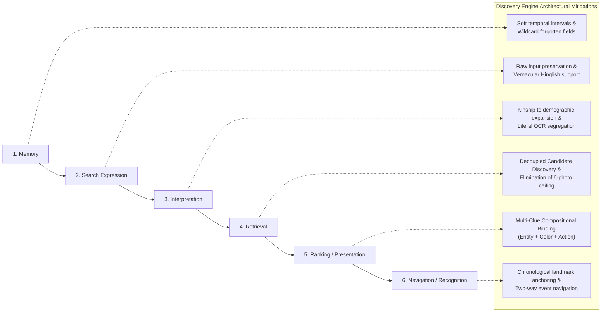

# Part 1 — Discovery Engine Architecture

## 1. Architecture Objective

The objective of the **Discovery Engine** in Part 1 is to solve a fundamental human-computer interaction problem in personal photo retrieval:

$$\text{HOW DOES THE DISCOVERY ENGINE TURN A NATURAL HUMAN MEMORY DESCRIPTION INTO A SET OF PHOTOS THAT THE USER CAN RECOGNIZE?}$$

Modern commercial photo retrieval engines (e.g., Google Photos with Ask Photos / Gemini) force users to become query engineers. Users must guess whether the system expects an object label (`"5 girls"` instead of `"5 sisters"`), strip out their everyday language particles (`"marble cake pic"` instead of `"marble cake wali photo"`), or suffer catastrophic truncation where the system silently caps results to 6 photos across a 10-year collection.

### Core Architectural Principle
> **The user should NOT have to translate their memory into the exact technical vocabulary or data structures expected by the search system.**  
> **The Discovery Engine must perform that translation.**

A user remembers rich, subjective, relational, and sometimes approximate fragments:
- Who was there (`my cousin`, `brother`, `maid`)
- What was happening (`sister's wedding`, `river rafting`, `farewell lunch`)
- What visual props were present (`white bike`, `ring box`, `papaya`, `diya`)
- What people were wearing (`yellow suit`, `blue outfit`, `Diwali black`)
- What approximate time or era it was (`2021`, `around 4 years ago`, `July 2016`)
- What setting or landscape framed it (`mountain`, `beach`, `gate`)
- What literal text was printed on an item (`Progressive`, `bitcoin`, `I love being a man`)

The Discovery Engine architecture defined here is a **conceptual intelligence pipeline** designed to ingest natural memory expressions, generate multi-modal discovery signals, discover broad candidate pools, compositionally evaluate multiple clues, and present results in an orientation that facilitates immediate human recognition.

> [!IMPORTANT]
> **Strict Conceptual Boundaries Maintained:**
> - This is a **conceptual intelligence architecture**, not an infrastructure or deployment specification.
> - It does **not** select database engines, vector indexes, LLM vendors, or vision models.
> - It does **not** specify API endpoints, server topologies, or UI wireframes.
> - It represents a rigorously justified architectural hypothesis derived from empirical research.

---

## 2. Evidence-to-Architecture Mapping

Every major component of this architecture is grounded directly in real-world user failures and behaviors documented in [part1_combined_evidence.md](file:///d:/graduation%20project%203/part1_combined_evidence.md) and audited in [part1_memory_schema_audit.md](file:///d:/graduation%20project%203/part1_memory_schema_audit.md):

| Research Evidence & Observed Case | Observed Failure / Phenomenon | Architectural Component Required | Architectural Responsibility |
| :--- | :--- | :--- | :--- |
| **"5 sisters" vs. "5 girls"** (Ep 05) | Kinship gap: `5 sisters` returned 0 results; converting to machine label `5 girls` gave #1. | **Memory Interpretation Layer & Retrieval Signal Layer** | Translates social/kinship roles (`sister`) into visual demographic concepts (`women/girls`) with cardinality (`count: 5`) without dropping relational intent. |
| **"rohtang ki ice wali photo"** (Ep 06) / **"marble cake wali photo"** (Ep 07) | Multilingual blackout: Hinglish grammatical particles (`ki`, `wali`, `ke sath`) triggered total zero-result errors (*"No results found"*). | **Memory Interpretation Layer (Raw Input Preservation)** | Preserves verbatim input; isolates grammatical particles; extracts core entities (`rohtang ice`, `marble cake`) rather than rejecting the query. |
| **"white bike"** (Ep 13) | Instant #1 retrieval when a distinctive color is bound directly to a physical object. | **Multi-Clue Matching Layer (Compositional Binding)** | Evaluates `[Bike: White]` as a unified compositional entity, preventing `white` and `bike` from being scored as disconnected independent tokens. |
| **"yellow suit"** (Ep 02) / **"family yellow"** (Ep 22) | Single color `yellow` flooded with random items; `family yellow` isolated grandmother's 80th birthday. | **Multi-Clue Matching Layer (Entity-Attribute Binding)** | Restricts color signals to the specific host entity (`family`, `suit`), preventing global scene flooding across unrelated yellow pixels. |
| **"rafting"** (Ep 23) / **"farewell"** (Ep 21) | Zero-friction instant retrieval when a highly distinctive action verb or canonical event taxonomy aligns. | **Retrieval Signal Layer (Dynamic Action & Event Routing)** | Treats distinctive dynamic action verbs and canonical event nouns as high-specificity primary discovery signals. |
| **"around 4 years ago"** (Ep 10) / **"2021"** (Ep 07) | Users recall coarse elapsed offsets and multi-year eras; exact calendar days are forgotten. | **Retrieval Signal Layer (Coarse Temporal Windowing)** | Maps approximate temporal expressions to flexible temporal intervals rather than forcing rigid ISO timestamp filters. |
| **"July 2016"** (Reddit Case 7) | Conversational AI search explicitly blocked date queries (*"can't search using those terms"*). | **Retrieval Signal Layer (Temporal Anchoring)** | Retains explicit month/year expressions as deterministic boundary signals rather than treating them as forbidden tokens. |
| **"Progressive" bill** (Reddit Case 5) / **"I love being a man" meme** (Reddit Case 6) | Conversational models treated literal text searches as conversational prompts, returning *"I can't help with that"*. | **Literal Text Retrieval Path (Segregated OCR Channel)** | Routes literal alphanumeric text directly to an exact/substring OCR matching channel, isolated from conversational LLM dialog. |
| **"diya at the gate"** (Ep 25) | Face recognition failed for infrequent contact (watchman); multi-object spatial query rescued retrieval. | **Candidate Discovery Layer (Multi-Signal Fallback)** | Allows spatial and object co-occurrences (`diya` + `gate`) to discover candidates when biometric face clustering yields zero results. |
| **Broad "wedding" searches** (Ep 02; Reddit Case 10) | Querying `wedding` flooded interface; unable to browse surrounding multi-day trip or find in-person moments. | **Result Ordering / Discovery Layer (Chronological Anchoring)** | Preserves chronological context around discovered photos, enabling users to explore surrounding events without losing orientation. |
| **"The 6-Photo Ceiling"** (Reddit Case 4 & 11) | Ask Photos artificially capped results to 6 photos across a 50k library (6 of 400+ birds; 2 of 10 days of trucks). | **Candidate Discovery Layer (Decoupled Candidate Generation)** | Explicitly separates candidate discovery from ranking, ensuring broad candidate gathering before scoring and preventing artificial truncation. |
| **"white top" exiled to 17th grid** (Ep 14) | System recognized clothing color chronologically, but omitted it from "Best Match", requiring 17 grids of manual scrolling. | **Multi-Clue Matching & Result Ordering** | Ensures multi-attribute matches are properly elevated into initial visible grids rather than demoted behind deep pagination. |

---

## 3. End-to-End Discovery Engine Flow

The Discovery Engine operates as a seven-stage conceptual intelligence pipeline. The diagram below illustrates how a natural human memory expression transitions across the system to surface recognizable photographs:

```mermaid
flowchart TD
    subgraph S1 ["Stage 1: User Memory Expression"]
        A["Raw User Input<br/>• Natural Language (Text/Voice)<br/>• Code-Mixed Vernacular (Hinglish)<br/>• Sparse, Rich, or Approximate"]
    end

    subgraph S2 ["Stage 2: Memory Interpretation Layer"]
        B["Interpretive Parser<br/>• Preserves raw_input verbatim<br/>• Bridges vernacular particles (ki, wali)<br/>• Maps to V2 Memory Representation Frame"]
    end

    subgraph S3 ["Stage 3: Retrieval Signal Generation Layer"]
        C["Signal Decomposer & Expander<br/>• Kinship to Demographic Expansion<br/>• Entity-Bound Color Signals<br/>• Coarse Temporal Intervals<br/>• Distinct Literal OCR Signals"]
    end

    subgraph S4 ["Stage 4: Candidate Discovery Layer"]
        D["Multi-Path Candidate Gathering<br/>• Broad Recall Maximization<br/>• Decoupled from Final Ranking<br/>• Prevents '6-Photo Ceiling' Truncation"]
    end

    subgraph S5 ["Stage 5: Multi-Clue Matching Layer"]
        E["Compositional Evaluator<br/>• Evaluates Combined Memory Frame<br/>• Entity-Attribute Co-occurrence<br/>• Soft Multi-Criteria Scoring"]
    end

    subgraph S6 ["Stage 6: Result Ordering / Discovery Layer"]
        F["Episodic Result Organizer<br/>• Balances Relevance & Chronology<br/>• Surfaces Event Landmark Anchors<br/>• Prevents Deep-Grid Burying"]
    end

    subgraph S7 ["Stage 7: Discovery Presentation"]
        G["Surfaced Photo Gallery<br/>• Immediate Visual Recognition<br/>• Contextual Event Surrounding"]
    end

    A --> B
    B --> C
    C --> D
    D --> E
    E --> F
    F --> G

    style S1 fill:#f8f9fa,stroke:#495057,stroke-width:1px;
    style S2 fill:#e8f4fd,stroke:#1971c2,stroke-width:2px;
    style S3 fill:#e7f5ff,stroke:#228be6,stroke-width:2px;
    style S4 fill:#f3f0ff,stroke:#7950f2,stroke-width:2px;
    style S5 fill:#fff4e6,stroke:#fd7e14,stroke-width:2px;
    style S6 fill:#e6fcf5,stroke:#0ca678,stroke-width:2px;
    style S7 fill:#f8f9fa,stroke:#212529,stroke-width:2px;
```



---

## 4. Memory Interpretation Layer

### 1. Purpose
The Memory Interpretation Layer ingests the user's raw natural-language query and transforms it into the structured [V2 Memory Representation Frame](file:///d:/graduation%20project%203/part1_memory_representation_schema_v2.md) (`raw_input`, `people`, `events`, `objects`, `actions`, `temporal`, `literal_text`, `spatial_setting`).

### 2. Input
- Verbatim user expression string (e.g., `"rohtang ki ice wali photo"`, `"5 sisters"`, `"brother on a white bike at cousin's wedding"`, `"July 2016"`, `"Progressive bill"`).

### 3. Output
- A populated V2 Memory Representation Frame preserving `raw_input` alongside interpreted entity-attribute components.

### 4. Why the Stage Exists
Human beings do not speak in database schemas or search keywords. Bilingual and everyday users naturally query using conversational syntax, possessive pronouns (`my dog`), code-mixed particles (Hinglish `ki`, `wali`, `ke sath`), and social relationships (`sisters`). This layer bridges human expression into a machine-interpretable representation without forcing the user to guess system keywords.

### 5. Evidence Supporting It
- **Episode 05:** Candidate 2 typed `5 sisters` $\rightarrow$ 0 results. Translating kinship to visual count (`5 girls`) produced the #1 result.
- **Episode 06 & 07:** Candidate 2 typed `rohtang ki ice wali photo` and `marble cake wali photo` $\rightarrow$ system failed on `wali photo`. Stripping `wali photo` to `pic` immediately succeeded.
- **Episode 20:** Candidate 5 typed `my dog` expecting personal ownership grounding.

### 6. What Failure It Is Intended to Address
Addresses the **Search Expression $\rightarrow$ Interpretation** failure in the six-stage failure model:
- Prevents colloquial language and grammatical particles from acting as poison pills that trigger zero-result screens.
- Prevents relational family terms from returning zero results.

### 7. What Is Still Unknown
- The exact degree of linguistic code-mixing complexity the parser must handle across varied dialects without resorting to an oversized, high-latency language model.

---

## 5. Retrieval Signal Layer

### 1. Purpose
The Retrieval Signal Layer decomposes the interpreted V2 Memory Frame into a coordinated set of specific **retrieval signals** suitable for candidate searching across multimodal libraries.

### 2. Input
- Interpreted V2 Memory Representation Frame.

### 3. Output
- Coordinated retrieval signals categorized by modality and specificity:
  - `Visual Entity Signals`: Concepts to match in pixel space (e.g. `bike`, `papaya`, `diya`).
  - `Bound Attribute Signals`: Visual modifiers tied to entities (e.g. `[bike: white]`, `[family: yellow]`).
  - `Demographic Expansion Signals`: Kinship roles expanded to visual counterparts (e.g. `sister` $\rightarrow$ `female / woman / girl` with cardinality `5`).
  - `Action Verb Signals`: High-specificity physical activities (e.g. `rafting`, `skiing`).
  - `Temporal Boundary Signals`: Flexible date/interval windows (e.g. `[2021-01-01 to 2021-12-31]`, `[now - 4.5y to now - 3.5y]`).
  - `Literal Lexical Signals`: Exact alphanumeric tokens for in-image matching (e.g. `"Progressive"`, `"bitcoin"`).
  - `Spatial Setting Signals`: Environmental context (e.g. `mountain`, `beach`, `gate`).

### 4. Why the Stage Exists
Computer vision and image indexing pipelines operate on physical perceptual properties (objects, text, colors, dates, faces). They do not natively index abstract human concepts like "sister" or "my childhood dog". This layer performs the necessary semantic translation—expanding kinship into demographic visual primitives, mapping relative offsets into temporal windows, and isolating literal text strings.

### 5. Evidence Supporting It
- **Episode 05:** Translating `5 sisters` into demographic visual primitives (`5 girls/women`) is necessary because image classifiers tag visual appearance, not family trees.
- **Reddit Case 5:** Isolating the string `"Progressive"` as an exact literal signal prevents conversational AI from treating an insurance provider name as an abstract adjective.
- **Episode 19:** Translating sensory mood (`fog`) into a visual proxy (`clouds`) was necessary to retrieve the high mountain viewpoint.

### 6. What Failure It Is Intended to Address
Addresses the **Interpretation $\rightarrow$ Retrieval** gap:
- Bridges the semantic disconnect between episodic human concepts and computer vision index tags.
- Prevents conversational engines from misinterpreting literal inscriptions as conversational prompts.

### 7. What Is Still Unknown
- The optimal expansion threshold for kinship terms: how broadly a role should expand (e.g., does "cousin" expand to any gender/age group, or require contextual pruning?).

---

## 6. Candidate Discovery Layer

### 1. Purpose
The Candidate Discovery Layer executes broad, high-recall gathering across the photo archive using the generated retrieval signals, producing a candidate set of potential matching photos.

### 2. Input
- Coordinated retrieval signals (Visual, Lexical, Temporal, Spatial, Demographic).

### 3. Output
- A broad, unranked or coarsely scored pool of candidate photos (e.g. 50–500 photos depending on archive size).

### 4. Why the Stage Exists
> [!IMPORTANT]
> **Candidate Discovery MUST be decoupled from Final Ranking.**  
> If a target photo is excluded during candidate discovery, no downstream ranking or presentation algorithm can ever surface it.

Commercial AI engines often combine candidate discovery and ranking into a single opaque step (e.g. Ask Photos "Best Match"), leading to the catastrophic **"6-photo ceiling"** where the engine returns only a tiny sample of matching images. Candidate discovery must prioritize **recall over precision**, ensuring that all plausible photos enter the evaluation pool.

### 5. Evidence Supporting It
- **Reddit Case 4:** User searched for birds in a 50k library (having 400+ bird photos). The AI engine returned exactly 6 photos. The candidate stage artificially truncated recall.
- **Reddit Case 11:** User searched `"yellow truck"` photographed across 10 days. The engine retrieved only 2 of the 10 days.
- **Episode 14:** Candidate 4 searched `white top`; the photo was present in the library but omitted from initial results, buried 17 grids deep.

### 6. What Failure It Is Intended to Address
Addresses the **Retrieval Failure Stage**:
- Eliminates artificial recall ceilings ("The Few Photos" truncation bug).
- Ensures that photos matching broad or weak clues are not dropped prematurely.

### 7. What Is Still Unknown
- The ideal candidate pool size: determining the optimal threshold that balances recall completeness against downstream computational latency in large (50k+) libraries.

---

## 7. Multi-Clue Matching Layer

### 1. Purpose
The Multi-Clue Matching Layer evaluates the candidate photos against the **combined compositional memory frame**, scoring how comprehensively each candidate fulfills the bound entity-attribute relationships.

### 2. Input
- Candidate photo pool + V2 Memory Representation Frame.

### 3. Output
- Scored candidate photos with multi-dimensional match evaluations (e.g., entity match, attribute binding match, temporal congruence).

### 4. Why the Stage Exists
In human memory, clues do not operate independently. Single clues almost always over-generate:
- Searching `yellow` returns hundreds of shirts, flowers, and vehicles.
- Searching `cake` returns dozens of celebrations.
- Searching `bike` returns every bicycle or motorcycle in the library.

Retrieval succeeds when clues are evaluated **compositionally**:
- `yellow` bound to `family` isolates grandmother's 80th birthday (Ep 22).
- `white` bound to `bike` isolates the brother at the cousin's wedding (Ep 13).
- `diya` co-occurring with `gate` isolates the watchman on Diwali (Ep 25).
- `black` bound to `Diwali` isolates the gathering with friends (Ep 12).

Evaluating clues independently causes rank degradation; evaluating them compositionally isolates the target memory.

### 5. Evidence Supporting It
- **Episode 22:** Candidate 6 searched `yellow` $\rightarrow$ flooded with random items. Searched `family yellow` $\rightarrow$ found target in Grid 2. The combination of social group + bound color was necessary.
- **Episode 13:** Candidate 3 searched `white bike` $\rightarrow$ instant Position 1–3 retrieval.
- **Episode 25:** Candidate 6 searched `diya gate` $\rightarrow$ found watchman photo in Grid 2 when face recognition failed completely.
- **Episode 12:** Candidate 3 searched `diwali` $\rightarrow$ flooded. Searched `Diwali black` $\rightarrow$ isolated photo in Grid 1.

### 6. What Failure It Is Intended to Address
Addresses the **Ranking / Presentation Failure Stage**:
- Prevents candidate photos matching a single dominant generic keyword from monopolizing the top results.
- Elevates candidates that fulfill multiple co-occurring, bound attributes.

### 7. What Is Still Unknown
- How to handle partial attribute mismatches (e.g., if the user recalls a "yellow suit" but the fabric was olive or gold).

---

## 8. Result Ordering / Discovery Layer

### 1. Purpose
The Result Ordering / Discovery Layer structures and orders the evaluated candidate photos into a coherent presentation that optimizes human episodic visual recognition.

### 2. Input
- Scored and evaluated candidate photos.

### 3. Output
- An ordered discovery set ready for display, maintaining chronological coherence and contextual landmark anchors.

### 4. Why the Stage Exists
A photo engine is not a document search engine. A user does not read text search snippets; they visually scan thumbnail grids. 
If an engine sorts photos purely by uncalibrated relevance scores, it destroys the user's **temporal orientation**:
- Photos from a single event are scattered across disparate rows.
- The user cannot see what happened immediately before or after an anchor photo.
- Visual recognition degrades when thumbnails appear out of chronological context.

This layer ensures that results are presented with **episodic landmark anchoring**: allowing the user to recognize the target photo and, if desired, explore surrounding photos taken during the same event.

### 5. Evidence Supporting It
- **Reddit Case 10:** User searched for nephew, found two photos from sister's wedding, but could not view surrounding photos from that 4-day trip. Forced workaround: user had to memorize the date, exit search, return to camera roll, and manually scroll down years of media.
- **Reddit Case 5:** Users reported that splitting search into uncalibrated "Best Match" and "Most Recent" produced chaotic, unusable results.
- **Episode 14:** Candidate 4's photo was recognized only after 17 grids of manual scrolling because relevance demoted it into a chronological wasteland.

### 6. What Failure It Is Intended to Address
Addresses the **Navigation / Recognition Failure Stage**:
- Prevents the destruction of chronological landmarks.
- Enables two-way contextual navigation from an anchor photo to its surrounding event timeline.

### 7. What Is Still Unknown
- The optimal UI presentation mode: whether to display results as a strict reverse-chronological gallery with relevance badges or as grouped event clusters.

---

## 9. Sparse Memory Handling

A fundamental reality of human memory is **sparsity**: users rarely recall all dimensions of an event simultaneously. The Discovery Engine must function robustly whether the user provides seven clues or only one.

```
┌────────────────────────────────────────────────────────────────────────────────────────┐
│                        SPARSE MEMORY RETRIEVAL STRATEGIES                              │
├───────────────────────────────┬───────────────────────────────┬────────────────────────┤
│ SCENARIO A: SINGLE STRONG     │ SCENARIO B: SINGLE WEAK       │ SCENARIO C: COMPOUND   │
├───────────────────────────────┼───────────────────────────────┼────────────────────────┤
│ • Example: "rafting" (Ep 23), │ • Example: "cake" (Ep 01),    │ • Example: "white bike"│
│   "farewell" (Ep 21)          │   "dog" (Ep 20), "document"   │   (Ep 13), "diya gate" │
│ • Specificity: HIGH           │ • Specificity: LOW            │ • Specificity: HIGH    │
│ • Strategy: Direct narrow     │ • Strategy: Broad candidate   │ • Strategy: Multi-clue │
│   candidate generation; fast  │   gathering; rely on chrono-  │   compositional match; │
│   high-precision retrieval.   │   logical / event clustering. │   filters out noise.   │
└───────────────────────────────┴───────────────────────────────┴────────────────────────┘
```

### 1. Single Strong / High-Specificity Clues
- **Examples:** `"rafting"` (Ep 23), `"farewell"` (Ep 21), `"kookaburra"` (Reddit Case 4).
- **Behavior:** These clues represent rare activities, distinct species, or standardized organizational milestones.
- **Architectural Handling:** The signal is assigned high specificity; candidate discovery directly isolates a small, high-precision candidate set. Zero-friction retrieval occurs without requiring temporal or geographic coordinates.

### 2. Single Weak / Broad Clues
- **Examples:** `"cake"` (Ep 01), `"dog"` (Ep 20), `"yellow"` (Ep 22), `"document"` (Ep 10).
- **Behavior:** These clues represent high-frequency common objects, colors, or pets.
- **Architectural Handling:** The engine must **avoid artificial truncation** (preventing the "6-photo ceiling"). Because specificity is low, the engine must gather candidates broadly and present results organized by chronological era or visual cluster, enabling user scanning without silent omissions.

### 3. Multiple Weak Clues (Weak + Weak Compounds)
- **Examples:** `"diwali"` (broad event) + `"black"` (broad color) $\rightarrow$ `Diwali black` (Ep 12); `"diya"` + `"gate"` (Ep 25); `"yellow"` + `"family"` (Ep 22).
- **Behavior:** Individually, each clue causes result flooding. Combined, their intersection is highly distinctive.
- **Architectural Handling:** Multi-Clue Matching treats the co-occurrence as a composite filter, elevating candidates that satisfy both dimensions simultaneously.

### 4. Asymmetric Memory: Strong Clue + Weak Clue
- **Examples:** `"brother on a white bike at cousin's wedding"` (Ep 13).
- **Behavior:** Wedding is broad; bike is common; but `[Bike: White]` + `Brother` is unique.
- **Architectural Handling:** The engine prioritizes the bound entity-attribute (`white bike`) to drive initial candidate discovery, using the event (`wedding`) to rank candidates within that pool.

### 5. Missing and Forgotten Clues
- **Examples:** River rafting without knowing location (Ep 23); morning trip without knowing destination (Ep 19).
- **Architectural Handling:** The absence of a field in the V2 schema is treated as a wildcard. The engine **never penalizes** a photo for lacking a location tag if the user did not specify one.

---

## 10. Uncertainty and Approximation

The audit in [part1_memory_schema_audit.md](file:///d:/graduation%20project%203/part1_memory_schema_audit.md) rejected rigid confidence enums (`CONFIRMED_FACT`, `APPROXIMATE_GUESS`) because users do not assign probability scores to their memories. Instead, uncertainty must be handled flexibly across the retrieval pipeline.

### Architectural Mechanisms for Handling Approximation:

1. **Temporal Expansion Windows:**
   - When a user says `"around 4 years ago"` (Ep 10), the Temporal Signal layer expands this into an open continuous window (e.g., $t - 4.5\text{ years}$ to $t - 3.5\text{ years}$).
   - When a user says `"2021"` (Ep 07) or `"Holi 2020"` (Ep 08), the signal encompasses the entire calendar year or seasonal interval.
   - It **never** requires an exact day/month timestamp.

2. **Soft Multi-Clue Satisfaction (No Strict Boolean AND):**
   - Human memory is prone to minor descriptive drift (e.g. recalling a "blue top" when it was navy or teal; recalling "cake on steel plate" when plate was ceramic).
   - If a candidate photo matches 3 out of 4 bound clues (e.g., matches Event, People, and Setting, but garment color is slightly divergent), the engine must **not** drop the candidate. It applies soft satisfaction scoring, ranking partial matches beneath complete matches rather than returning zero results.

3. **Verbatim Uncertainty Preservation:**
   - Natural hedging words (*"around"*, *"maybe"*, *"I think"*) are preserved in `raw_input`, allowing semantic matching models to account for linguistic fuzziness without requiring an artificial numeric threshold.

---

## 11. Literal Text Retrieval Path

The evidence reveals that text embedded in personal images represents a distinct retrieval paradigm that modern AI engines frequently break.

```
┌────────────────────────────────────────────────────────────────────────────────────────┐
│                   SEPARATION OF LITERAL TEXT VS. SEMANTIC VISUAL SEARCH                │
├───────────────────────────────────────────┬────────────────────────────────────────────┤
│ LITERAL TEXT PATH (Exact / Substring OCR) │ SEMANTIC VISUAL PATH (Perceptual Embeddings)│
├───────────────────────────────────────────┼────────────────────────────────────────────┤
│ • "Progressive" (Insurance bill)          │ • "dog in a hat" (Visual scene)            │
│ • "bitcoin" (Order confirmation code)     │ • "white bike" (Entity + Color)            │
│ • "I love being a man" (Meme quote)       │ • "river rafting" (Dynamic activity)       │
│ • "boarding pass" (Document keyword)      │ • "sunset over beach" (Landscape setting)  │
├───────────────────────────────────────────┼────────────────────────────────────────────┤
│ MECHANISM: Exact alphanumeric string      │ MECHANISM: Multimodal semantic similarity  │
│ matching on image pixel OCR data.         │ matching on visual features and tags.      │
├───────────────────────────────────────────┼────────────────────────────────────────────┤
│ FAILURE MITIGATED: Prevents conversational│ FAILURE MITIGATED: Prevents rigid keyword  │
│ LLMs from rejecting queries as dialog.    │ failures on visual concepts (e.g. 5 girls).│
└───────────────────────────────────────────┴────────────────────────────────────────────┘
```

### Architectural Separation
1. **Isolated Routing:** When `literal_text` is populated in the V2 schema, its tokens are routed to a dedicated literal text candidate generator.
2. **Bypassing Conversational Chatbot Logic:** Literal text queries must **never** be evaluated as conversational chat prompts (which caused Reddit Case 6: *"I can't help with that"* on meme quotes).
3. **Hybrid Candidate Fusion:** Candidates discovered via literal OCR text are merged directly into the candidate discovery pool alongside candidates discovered via visual signals.

---

## 12. Failure Modes This Architecture Is Designed to Address

Below is the complete mapping showing how each layer of the Discovery Engine addresses the **Six-Stage Retrieval Failure Model**:



1. **Stage 1: Memory (Degraded / Fuzzy Recall)**  
   - *Failure:* User cannot remember dates, locations, or exact names.
   - *Mitigation:* Architecture supports sparse queries, open temporal windows, and wildcard handling of unremembered dimensions.
2. **Stage 2: Search Expression (Query Formulation Gap)**  
   - *Failure:* User enters natural language or Hinglish (`wali photo`) that search bars reject.
   - *Mitigation:* Raw input preservation and interpretation layer strip syntax noise without losing semantic entities.
3. **Stage 3: Interpretation (System Semantic Blindness)**  
   - *Failure:* System returns 0 results for `"5 sisters"` or treats `"Progressive"` as conversational chat.
   - *Mitigation:* Kinship expansion maps social roles to visual demographics; literal OCR routing segregates in-image text.
4. **Stage 4: Retrieval (Candidate Under-Retrieval)**  
   - *Failure:* System caps results to 6 photos across a 10-year library.
   - *Mitigation:* Decoupled Candidate Discovery prioritizes broad recall before ranking, eliminating artificial ceilings.
5. **Stage 5: Ranking / Presentation (Result Degradation & Flooding)**  
   - *Failure:* Target photo buried 17 grids deep; single colors flood results with noise.
   - *Mitigation:* Multi-Clue Matching evaluates entity-attribute compounds (`family yellow`, `white bike`), elevating true matches.
6. **Stage 6: Navigation / Recognition (Visual Disorientation)**  
   - *Failure:* Relevance sorting scatters event photos; user cannot jump to camera roll timeline.
   - *Mitigation:* Result Ordering preserves chronological landmark context, enabling two-way event exploration.

---

## 13. Architecture Alternatives and Trade-offs

To determine the most defensible architecture, three plausible conceptual approaches were evaluated against our research evidence:

| Evaluation Dimension | Alternative 1: Monolithic Conversational AI Pipeline | Alternative 2: Pure Pipeline of Disconnected Lexical Filters | Alternative 3: Two-Stage Interpreted Multi-Signal Discovery (Proposed) |
| :--- | :--- | :--- | :--- |
| **Conceptual Model** | Single end-to-end LLM/VLM chatbot handles query parsing, visual search, and ranking in one prompt/generation step. | Traditional database/search pipeline with regex token parsing, metadata SQL filters, and strict boolean queries. | Decoupled pipeline: Interpretation Layer $\rightarrow$ Multi-Signal Candidate Discovery $\rightarrow$ Compositional Multi-Clue Matching $\rightarrow$ Chronological Ordering. |
| **Evidence Fit** | **Poor.** Direct cause of observed commercial failures (Reddit Cases 4, 5, 6: 6-photo ceiling, OCR destruction, chatbot refusals). | **Poor.** Fails completely on kinship (`5 sisters`), Hinglish syntax, and semantic visual descriptions (Ep 05, 06, 12). | **Exceptional.** Directly addresses each stage of the six-stage failure model observed in interviews and reviews. |
| **Handling of Relational Memory** | Moderate (LLM understands kinship, but visual grounding is opaque). | Non-existent (relational terms return 0 results in strict keyword indexes). | High (Interpretation layer explicitly expands kinship to demographic primitives while preserving intent). |
| **Handling of Literal OCR Text** | Low (conversational models treat text as dialog prompts). | High (exact string search), but cannot combine with fuzzy visual semantics. | High (segregates literal text channel into candidate pool alongside visual signals). |
| **Handling of Sparse Memory** | Low (tends to hallucinate answers or refuse short queries). | Low (returns either massive unranked floods or zero results). | High (explicitly routes single strong clues vs. weak compound clues). |
| **Explainability & Traceability** | Extremely Low (black box; cannot explain why a photo was included or omitted). | High, but rigid. | High (each clue dimension produces traceable match scores). |
| **System Complexity** | High operational cost, non-deterministic latency. | Very low complexity, but functionally broken for human memory. | Balanced: decoupled modular stages with deterministic boundaries. |

---

## 14. Recommended Conceptual Architecture

### Architecture Choice: Alternative 3 (Two-Stage Interpreted Multi-Signal Discovery)

Based strictly on empirical evidence, prototype feasibility, and alignment with the [V2 Memory Representation Schema](file:///d:/graduation%20project%203/part1_memory_representation_schema_v2.md), **Alternative 3 is the recommended architecture**.

### Explicit Justification:
1. **Direct Reversal of Commercial AI Failures:** Alternative 1 (the monolithic conversational approach currently deployed in commercial apps) is the direct cause of user backlash documented across 52 Reddit threads and Play Store reviews—specifically the "6-photo ceiling", OCR destruction, and loss of chronological navigation. Alternative 3 prevents these failures by decoupling candidate discovery from ranking.
2. **Preservation of the Kinship and Language Gap:** Alternative 3 provides a dedicated Interpretation Layer that bridges Hinglish particles and translates kinship (`5 sisters` $\rightarrow$ `5 girls`) without altering the underlying raw user memory.
3. **Compositional Entity Binding Without Graph Overhead:** Alternative 3 allows entities and visual attributes (`white bike`, `family yellow`) to be evaluated compositionally at the matching stage without requiring premature graph database infrastructure.
4. **Isolated Literal OCR Path:** Alternative 3 guarantees that utility documents, insurance bills, and memes are discovered via exact alphanumeric tokens without conversational chatbot distortion.

---

## 15. Open Questions

Before proceeding to physical implementation or technology selection, the following key architectural questions must be resolved through targeted experiments:

1. **Optimal Candidate Pool Volume:** What is the ideal candidate pool size generated by Stage 4 across libraries of varying scale (e.g., 2,000 photos vs. 50,000 photos) to ensure 99%+ recall of target memories without degrading downstream matching latency?
2. **Kinship Demographic Expansion Boundaries:** What are the precise boundary rules for expanding familial roles (e.g. does "cousin" expand to all young adults, or does it require temporal co-occurrence filtering)?
3. **Soft-Matching Weight Calibration:** In Stage 5 (Multi-Clue Matching), what is the optimal scoring penalty when a candidate matches 3 out of 4 bound clues (e.g., matches event, person, and action, but clothing color diverges)?
4. **Presentation Mode for Visual Homogeneity:** When candidate discovery returns a cluster of visually similar photos (e.g., Candidate 1, Ep 03: 30 identical sunset photos), what organizational view best assists user recognition?

---

## 16. Architecture Boundaries

To prevent premature engineering decisions, the strict boundaries of what this architecture **does NOT yet decide** are explicitly documented:

- **No Technology Stack Selected:** This architecture does not choose between vector databases (e.g., Pinecone, Qdrant, Chroma, Milvus), lexical engines (e.g., SQLite FTS, BM25, Lucene), or relational stores.
- **No Embedding Models Specified:** It does not specify whether visual embeddings will be generated by CLIP, SigLIP, MobileNet, or proprietary models.
- **No LLM / Parsing Framework Prescribed:** It does not select specific NLP parsers, small language models, or prompting frameworks for Stage 2.
- **No Hardware / Execution Topologies:** It does not decide whether interpretation and discovery execute locally on-device, in private edge clouds, or in centralized servers.
- **No UI / Interaction Design:** It does not specify mobile screens, filter chips, search bar designs, or gesture controls.

These decisions belong strictly to subsequent engineering specifications once this conceptual intelligence architecture is approved.
