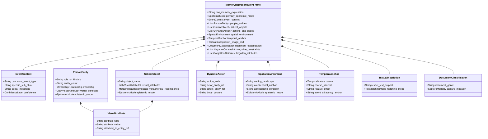

# Part 1 — Memory Representation Schema

## 1. Purpose

The purpose of this document is to derive an empirical **Memory Representation Schema** for **Part 1: Build an AI-Powered Discovery Engine**.

When a user attempts to retrieve an old photograph from their personal archive, their internal episodic memory undergoes a fundamental transformation:

$$\text{HUMAN EPISODIC MEMORY} \longrightarrow \text{Natural-Language Memory Description} \longrightarrow \text{AI Memory Representation} \longrightarrow \text{[Retrieval Pipeline]}$$

Before any retrieval engine, vector database, embedding model, ranking function, or user interface is designed, the intelligence layer must possess a formal schema capable of representing what human beings actually remember and articulate about photographs.

> [!IMPORTANT]
> **Strict Scope Constraints Applied:**
> - This document does **not** design the retrieval engine, search algorithms, or indexing pipelines.
> - It does **not** design ranking functions, scoring weights, or UI wireframes.
> - It does **not** build an MVP or select technology stacks (vector stores, LLMs, vision backbones).
> - It does **not** invent schema fields based on generic search conventions.
> - Every field, relationship, qualifier, and constraint is derived directly from observed user behaviors documented in the consolidated evidence base.

---

## 2. Evidence Used

The schema is grounded exclusively in the empirical evidence documented across:
1. **[part1_combined_evidence.md](file:///d:/graduation%20project%203/part1_combined_evidence.md):** Consolidated evidence base for Part 1 synthesizing all 61 pristine reviews and 25 behavioral interview episodes.
2. **[research_summary.md](file:///d:/graduation%20project%203/research_summary.md):** Play Store (1,456 raw reviews, 23 pristine) and Reddit (52 raw posts, 38 pristine) research data.
3. **[interview_research_summary.md](file:///d:/graduation%20project%203/interview_research_summary.md):** 1:1 user testing synthesis across 6 candidates and 25 retrieval tasks.
4. **[interview_behavioral_episodes.md](file:///d:/graduation%20project%203/interview_behavioral_episodes.md):** Detailed step-by-step behavioral records of Episodes 01 through 25, including pre-search remembered clues, query formulation iterations, visual returns, and debrief transcripts.

---

## 3. Design Principles Derived From Evidence

Analysis of the 25 interview episodes and 61 pristine public cases yields seven structural principles that govern how human memory of photographs must be represented:

### Principle 1: Relational Binding Over Keyword Bags
- **Evidence:** When users describe memories, elements are structurally connected: `"my photo with my cousin at sister's wedding wearing yellow suit"` (Ep 02); `"brother on a white bike at cousin's wedding"` (Ep 13); `"uncle peeling papaya to feed his pet dog"` (Ep 17).
- **Rule:** The schema must represent entities, actions, visual attributes, and events as an **interconnected graph of relations**, not as a flat list of independent keywords. A color belongs to a specific garment worn by a specific person; an action is performed by an agent on an object.

### Principle 2: Epistemic Stratification (Fact vs. Approximation vs. Metaphor)
- **Evidence:** Users remember some clues as literal facts (`"farewell"`, Ep 21), others as coarse estimates (`"around 4 years ago"`, Ep 10), and others as metaphorical impressions (`"thing like octopus tentacles on his head"`, Ep 15).
- **Rule:** The schema must explicitly preserve the **epistemic mode** of every clue: whether it is a confirmed entity, an approximate range, an uncertain guess, or a visual simile/resemblance.

### Principle 3: Kinship and Personal Ownership Are First-Class Primitives
- **Evidence:** Users think in terms of `"5 sisters"` (Ep 05), `"my dog"` (Ep 20), and `"my maid"` (Ep 08). Systems that flatten these into generic third-person labels (`5 girls`, `dog`) produce 0 results or return friend's pets.
- **Rule:** Relational roles (`sister`, `cousin`, `maid`, `watchman`) and possessive ownership (`user_owned` vs. `third_party_incidental`) must be natively represented rather than forced into generic public-object categories.

### Principle 4: Temporal and Spatial Coarseness by Default
- **Evidence:** In 100% of the 25 interview tasks, participants did not remember exact calendar days or GPS coordinates. They remembered years (`"2021"`, Ep 07), relative offsets (`"4 years ago"`, Ep 10), cultural seasons (`"Holi 2020"`, Ep 08), or event adjacency (`"near the actual one with an event memory"`, Ep 03).
- **Rule:** Temporal and spatial fields must default to **coarse intervals, relative offsets, and contextual anchors**, rather than requiring exact ISO timestamps or latitude/longitude coordinates.

### Principle 5: Asymmetric Multi-Clue Redundancy
- **Evidence:** Users often recall 4–6 distinct clues before searching, but may express only 1 or 2 initially, reformulating when generic queries flood the interface (e.g., Ep 02: wedding $\rightarrow$ Haldi $\rightarrow$ yellow suit $\rightarrow$ cousin).
- **Rule:** The schema must support **multiple co-existing clue dimensions** simultaneously, allowing partial query expressions to map into richer underlying memory structures.

### Principle 6: Preserving In-Image Literal Text Separately from Semantic Concepts
- **Evidence:** Users search utility bills (`"Progressive"`, Reddit Case 5), memes (`"I love being a man"`, Reddit Case 6), and order confirmations (`"bitcoin"`, Ep 16) by exact printed text. Treating literal text as conversational themes destroys retrieval.
- **Rule:** Literal OCR strings must be represented distinctly from semantic scene concepts and visual entities.

### Principle 7: Representing Negative Exclusions and Participation Modality
- **Evidence:** Users recall compositional absences (`"brown cake on a steel plate with no one in background"`, Ep 07) and distinguish in-person physical presence from digital screenshots or video calls (`"physically present with cousin at sister's wedding"` vs. video call screenshot, Ep 02).
- **Rule:** The schema must accommodate **negative constraints** (absent entities) and **capture modalities** (in-person physical capture vs. digital screen capture / document).

---

## 4. Proposed Memory Representation Schema

The complete schema is modeled as a unified structured memory frame: `MemoryRepresentationFrame`.



### JSON-Schema Specification of the Memory Frame

```json
{
  "$schema": "https://json-schema.org/draft/2020-12/schema",
  "title": "MemoryRepresentationFrame",
  "description": "Structured representation of a user's natural-language episodic memory description for photo retrieval.",
  "type": "object",
  "properties": {
    "raw_memory_expression": {
      "type": "string",
      "description": "Verbatim natural-language description as uttered or typed by the user."
    },
    "event_context": {
      "type": "object",
      "properties": {
        "canonical_event_type": { "type": "string", "description": "High-level cultural or social milestone (e.g., wedding, birthday, diwali, holi, farewell, trip)." },
        "specific_sub_ritual": { "type": "string", "description": "Specific sub-ceremony or ritual phase within a multi-day or complex event (e.g., Haldi ceremony, rehearsal, farewell lunch)." },
        "social_milestone": { "type": "string", "description": "Specific life milestone identifier (e.g., grandmother's 80th birthday, best friend's engagement)." },
        "confidence": { "type": "string", "enum": ["CONFIRMED_FACT", "APPROXIMATE_GUESS", "UNCERTAIN"] }
      },
      "additionalProperties": false
    },
    "people_entities": {
      "type": "array",
      "items": {
        "type": "object",
        "properties": {
          "entity_id": { "type": "string" },
          "role_or_kinship": { "type": "string", "description": "Relational kinship or social role (e.g., sister, cousin, brother, father, aunt, maid, watchman, colleague, friend)." },
          "entity_count": { "type": "string", "description": "Cardinality of the group if specified (e.g., '5', 'two ladies', '2 best friends')." },
          "ownership": { "type": "string", "enum": ["SELF", "FAMILY_INNER_CIRCLE", "INFREQUENT_CONTACT", "THIRD_PARTY", "UNKNOWN"] },
          "visual_attributes": {
            "type": "array",
            "items": {
              "type": "object",
              "properties": {
                "attribute_type": { "type": "string", "enum": ["CLOTHING_COLOR", "CLOTHING_TYPE", "FACIAL_FEATURE", "BODY_STANCE"] },
                "value": { "type": "string" }
              },
              "required": ["attribute_type", "value"]
            }
          },
          "epistemic_mode": { "type": "string", "enum": ["EXPLICIT_FACT", "APPROXIMATE", "UNCERTAIN"] }
        },
        "required": ["entity_id"]
      }
    },
    "salient_objects": {
      "type": "array",
      "items": {
        "type": "object",
        "properties": {
          "object_id": { "type": "string" },
          "object_name": { "type": "string", "description": "Name of physical prop, food item, vehicle, animal, or entity (e.g., Cake, papaya, white bike, yellow truck, ring box, diya)." },
          "visual_attributes": {
            "type": "array",
            "items": {
              "type": "object",
              "properties": {
                "attribute_type": { "type": "string", "enum": ["COLOR", "MATERIAL", "STATE"] },
                "value": { "type": "string" }
              },
              "required": ["attribute_type", "value"]
            }
          },
          "ownership_qualification": { "type": "string", "enum": ["USER_OWNED", "FAMILY_OWNED", "THIRD_PARTY_INCIDENTAL", "UNKNOWN"] },
          "metaphorical_resemblance": {
            "type": "object",
            "properties": {
              "is_metaphor": { "type": "boolean" },
              "resembled_concept": { "type": "string", "description": "The metaphorically recalled shape/concept (e.g., 'octopus tentacles')." },
              "physical_reality_note": { "type": "string", "description": "Indication that physical reality may differ from visual simile." }
            },
            "required": ["is_metaphor", "resembled_concept"]
          },
          "epistemic_mode": { "type": "string", "enum": ["EXPLICIT_FACT", "APPROXIMATE", "METAPHORICAL_RESEMBLANCE", "UNCERTAIN"] }
        },
        "required": ["object_id", "object_name"]
      }
    },
    "actions_and_poses": {
      "type": "array",
      "items": {
        "type": "object",
        "properties": {
          "action_verb": { "type": "string", "description": "Dynamic activity or interaction (e.g., river rafting, skiing on snow, peeling papaya, lighting diya, holding ring box)." },
          "actor_entity_ref": { "type": "string", "description": "Reference to entity_id performing the action." },
          "target_entity_ref": { "type": "string", "description": "Reference to entity_id or object_id receiving the action." },
          "body_posture": { "type": "string", "description": "Specific bodily stance or configuration (e.g., arms crossed, sitting alone on mountain)." },
          "epistemic_mode": { "type": "string", "enum": ["EXPLICIT_FACT", "UNCERTAIN"] }
        },
        "required": ["action_verb"]
      }
    },
    "spatial_environment": {
      "type": "object",
      "properties": {
        "setting_landscape": { "type": "string", "description": "Natural or geographical landscape (e.g., mountain peak, beach, river, viewpoint)." },
        "architectural_anchor": { "type": "string", "description": "Built environmental boundary (e.g., building gate, hotel room, balcony)." },
        "atmospheric_condition": { "type": "string", "description": "Sensory or atmospheric qualities (e.g., cold, early morning, foggy, mist/clouds below)." },
        "co_occurring_spatial_pairs": {
          "type": "array",
          "items": {
            "type": "object",
            "properties": {
              "entity_a_ref": { "type": "string" },
              "relation": { "type": "string", "enum": ["AT", "ON_HEAD", "IN_HAND", "NEAR", "BACKGROUND", "FOREGROUND"] },
              "entity_b_ref": { "type": "string" }
            },
            "required": ["entity_a_ref", "relation", "entity_b_ref"]
          }
        },
        "epistemic_mode": { "type": "string", "enum": ["EXPLICIT_FACT", "SENSORY_MOOD_PROXY", "APPROXIMATE", "UNCERTAIN"] }
      },
      "additionalProperties": false
    },
    "temporal_anchor": {
      "type": "object",
      "properties": {
        "nature": { "type": "string", "enum": ["COARSE_CALENDAR_BLOCK", "RELATIVE_ELAPSED_OFFSET", "EVENT_ADJACENCY_ANCHOR", "UNKNOWN_AMNESIA"] },
        "coarse_interval": { "type": "string", "description": "Broad calendar interval (e.g., 'July 2016', '2021', '2020', 'childhood')." },
        "relative_offset": { "type": "string", "description": "Elapsed time relative to present (e.g., 'around 4 years ago', 'last month')." },
        "event_adjacency_anchor": { "type": "string", "description": "Proximity to another memorable episodic landmark (e.g., 'near the event memory')." },
        "confidence": { "type": "string", "enum": ["HIGH_CERTAINTY", "APPROXIMATE", "HIGHLY_UNCERTAIN"] }
      },
      "required": ["nature"],
      "additionalProperties": false
    },
    "in_image_text": {
      "type": "object",
      "properties": {
        "exact_text_snippet": { "type": "string", "description": "Literal alphanumeric text remembered as printed on an object, document, or screen (e.g., 'Progressive', 'I love being a man', 'bitcoin')." },
        "matching_mode": { "type": "string", "enum": ["EXACT_LEXICAL_OCR", "PARTIAL_OCR_TOKEN"] }
      },
      "required": ["exact_text_snippet", "matching_mode"],
      "additionalProperties": false
    },
    "document_classification": {
      "type": "object",
      "properties": {
        "document_genre": { "type": "string", "description": "Functional document type (e.g., boarding pass, flight ticket, utility bill, order confirmation, screenshot)." },
        "capture_modality": { "type": "string", "enum": ["PHYSICAL_CAMERA_CAPTURE", "DIGITAL_SCREENSHOT", "VIRTUAL_CALL_SCREENSHOT", "UNKNOWN"] }
      },
      "additionalProperties": false
    },
    "negative_constraints": {
      "type": "array",
      "items": {
        "type": "object",
        "properties": {
          "excluded_aspect": { "type": "string", "description": "Element remembered as explicitly absent (e.g., 'no one in background', 'not a virtual call screenshot')." },
          "constraint_type": { "type": "string", "enum": ["EXCLUDE_PEOPLE_IN_BACKGROUND", "EXCLUDE_VIRTUAL_SCREENSHOT", "EXCLUDE_THIRD_PARTY_PETS"] }
        },
        "required": ["excluded_aspect", "constraint_type"]
      }
    },
    "forgotten_attributes": {
      "type": "array",
      "items": {
        "type": "string",
        "description": "Categories that the user explicitly states they cannot remember (e.g., 'exact date', 'geographic city/river name', 'person's name')."
      }
    }
  },
  "required": ["raw_memory_expression"]
}
```

---

## 5. Field-by-Field Evidence Mapping

Below is the rigorous mapping of every proposed field against the observed research evidence.

---

### Field 1: `event_context`
- **Definition:** The cultural, social, or corporate milestone and its sub-rituals or ceremonies framing the photograph.
- **Type of Human Memory:** Episodic event memory; hierarchical social rituals.
- **Evidence Supporting Field:** Strongly present across interviews and public reviews. Users anchor photos to milestone occurrences and recall sub-ceremonies.
- **Evidence Strength:** **HIGH**
- **Specific Episode / Case References:**
  - `interview_behavioral_episodes.md`: Ep 01 (`"birthday photo"`), Ep 02 (`"wedding"`, `"HALDI"`, `"CEREMONY"`), Ep 08 (`"Holi 2020"`), Ep 12 (`"diwali"`), Ep 18 (`"best friend's engagement"`), Ep 21 (`"farewell lunch"`), Ep 22 (`"grandmother's 80th birthday"`).
  - `research_summary.md`: Case 10 (Sister's wedding, 4-day multi-day trip, rehearsal).
- **Example Participant Wording:**
  - *"sister's wedding"* / *"HALDI ceremony"* (Candidate 1, Ep 02)
  - *"grandmother's 80th birthday"* (Candidate 6, Ep 22)
  - *"farewell"* (Candidate 5, Ep 21)
  - *"Diwali"* (Candidate 3, Ep 12; Candidate 6, Ep 25)
- **Epistemic Classification:** Explicitly stated; relational to life calendar.
- **Needs Confidence / Uncertainty:** Yes (users may know the broad event like "wedding" with certainty, but be uncertain of the specific sub-ritual like "Haldi" vs. "Reception").
- **Can Contain Multiple Values:** Yes (hierarchical: e.g., Event: `Wedding` $\rightarrow$ Sub-ritual: `Haldi` $\rightarrow$ Day: `Day 2 of 4`).
- **Do Relationships Between Values Matter:** Yes. Sub-rituals belong to specific parent events.
- **Observed Edge Cases:**
  - Multi-day events: In Reddit Case 10, the wedding event spanned 4 days (travel, rehearsal, ceremony).
  - Virtual vs. Physical Event: In Ep 02, searching `wedding` surfaced a virtual video call from the sister's wedding instead of physical in-person attendance.
- **What This Field Must NOT Assume:**
  - Must NOT assume an event implies a single 2-hour window.
  - Must NOT assume all photos tagged with the event name depict in-person attendance.

---

### Field 2: `people_entities` & `role_or_kinship`
- **Definition:** Human individuals present in the photo, defined by social kinship, family relation, occupational role, or demographic grouping.
- **Type of Human Memory:** Social kinship memory; interpersonal role network.
- **Evidence Supporting Field:** Users consistently recall individuals by their relationship to the user or by collective social groupings.
- **Evidence Strength:** **HIGH**
- **Specific Episode / Case References:**
  - `interview_behavioral_episodes.md`: Ep 02 (`"cousin"`), Ep 05 (`"5 sisters"`), Ep 08 (`"durga ke sath picture jo meri maid hai"`), Ep 09 (`"two ladies with a man"`, `"father and father's two elderly sisters"`), Ep 13 (`"brother"`), Ep 15 & 17 (`"uncle"`), Ep 21 (`"colleague"`), Ep 25 (`"watchman"`).
  - `research_summary.md`: Case 8 (`"new grandchild"`), Case 10 (`"nephew"`).
- **Example Participant Wording:**
  - *"5 sisters"* (Candidate 2, Ep 05)
  - *"durga ke sath picture jo meri maid hai"* (Candidate 2, Ep 08)
  - *"my photo with my cousin"* (Candidate 1, Ep 02)
  - *"building watchman"* (Candidate 6, Ep 25)
  - *"two ladies with a man"* (Candidate 2, Ep 09)
- **Epistemic Classification:** Explicitly stated; inherently relational.
- **Needs Confidence / Uncertainty:** Low for kinship (users are certain someone is their sister/brother); High for peripheral roles or unconfirmed counts.
- **Can Contain Multiple Values:** Yes (multiple entities co-occurring).
- **Do Relationships Between Values Matter:** Yes. Relationships between the person and the user (kinship) and between multiple people (grouping) are paramount.
- **Observed Edge Cases:**
  - The Semantic Kinship Gap: `5 sisters` returned 0 results; translating to `5 girls` worked (Ep 05).
  - Infrequent Contacts: Watchman (Ep 25) and maid (Ep 08) photographed only once fall below facial clustering thresholds and lack registered names.
- **What This Field Must NOT Assume:**
  - Must NOT assume every person has a recognized face profile in the phone's roster.
  - Must NOT assume users know or will type the legal proper name of casual acquaintances or domestic workers.

---

### Field 3: `ownership` & `personal_attachment`
- **Definition:** The distinction between an entity belonging personally to the user/family versus an incidental third-party entity.
- **Type of Human Memory:** Emotional ownership; personal boundary schema.
- **Evidence Supporting Field:** Searching generic entity words (`dog`) floods results with third-party items; users expect possessive modifiers (`my dog`) to isolate their personal life.
- **Evidence Strength:** **HIGH**
- **Specific Episode / Case References:**
  - `interview_behavioral_episodes.md`: Ep 20 (`"childhood dog who passed away"`, `"my dog"`).
  - `research_summary.md`: Case 9 (Registered household pets vs. general animals).
- **Example Participant Wording:**
  - *"the app doesn't know it's mine emotionally, just that it's a dog"* (Candidate 5, Ep 20)
  - *"my dog"* vs. *"dog"* (Candidate 5, Ep 20)
- **Epistemic Classification:** Relational, emotional ownership.
- **Needs Confidence / Uncertainty:** Moderate (identifying whether a recalled entity is primary household vs. friend's).
- **Can Contain Multiple Values:** Yes (user may own multiple pets over time).
- **Do Relationships Between Values Matter:** Yes. Differentiates `User` $\rightarrow$ `BelongsTo` from incidental capture.
- **Observed Edge Cases:** Deceased pets from childhood photographed years prior without explicit tagging (Ep 20).
- **What This Field Must NOT Assume:** Must NOT assume that the presence of an object/animal in a photo implies ownership by the user.

---

### Field 4: `salient_objects_props`
- **Definition:** Distinct, concrete physical items, food preparations, vehicles, or ceremonial objects that serve as memory anchors.
- **Type of Human Memory:** Perceptual object memory; episodic prop association.
- **Evidence Supporting Field:** Strongly supported across all three sources. Salient objects are often the first clue retrieved when event or temporal metadata is weak.
- **Evidence Strength:** **HIGH**
- **Specific Episode / Case References:**
  - `interview_behavioral_episodes.md`: Ep 01 (`"Cake"`), Ep 13 (`"white bike"`), Ep 17 (`"papaya"`), Ep 18 (`"ring box"`), Ep 25 (`"diya"`).
  - `research_summary.md`: Case 3 (`"cooling fan"`), Case 11 (`"yellow truck"`, `"fork"`).
- **Example Participant Wording:**
  - *"Cake"* (Candidate 1, Ep 01)
  - *"brother who was in a bike that too of white colour"* (Candidate 3, Ep 13)
  - *"peeling papaya"* (Candidate 4, Ep 17)
  - *"holding the ring box for a joke photo"* (Candidate 5, Ep 18)
  - *"diya at the gate"* (Candidate 6, Ep 25)
- **Epistemic Classification:** Explicitly stated; concrete physical entities.
- **Needs Confidence / Uncertainty:** Low to Moderate.
- **Can Contain Multiple Values:** Yes (e.g., `diya` and `gate`).
- **Do Relationships Between Values Matter:** Yes (the prop is typically attached to an actor or a setting).
- **Observed Edge Cases:** Common objects causing massive over-retrieval when searched without modifiers (`fork` in Case 11; `cake` in Ep 07).
- **What This Field Must NOT Assume:** Must NOT assume the salient object is the photographic subject (e.g., the ring box in Ep 18 was a small hand-held prop in a human portrait).

---

### Field 5: `visual_attributes` (Color, Stance, Facial Hair)
- **Definition:** Perceptual visual modifiers describing color of clothing, physical body posture, or distinctive facial features.
- **Type of Human Memory:** Visual sensory memory; perceptual appearance recall.
- **Evidence Supporting Field:** Universally utilized across interviews and public cases as the primary human disambiguation tool.
- **Evidence Strength:** **HIGH**
- **Specific Episode / Case References:**
  - `interview_behavioral_episodes.md`: Ep 02 (`"YELLOW SUIT"`), Ep 09 (`"blue outfit"`), Ep 12 (`"Diwali black"`), Ep 13 (`"white bike"`), Ep 14 (`"white top"`), Ep 15 (`"mustache"`), Ep 22 (`"family yellow"`, `"matching yellow"`).
  - `research_summary.md`: Case 11 (`"banana yellow"`), Case 12 (`"picture of myself with my arms crossed"`).
- **Example Participant Wording:**
  - *"Diwali black"* (Candidate 3, Ep 12)
  - *"family yellow"* (Candidate 6, Ep 22)
  - *"2 ladies with blue outfit"* (Candidate 2, Ep 09)
  - *"white top"* (Candidate 4, Ep 14)
  - *"arms crossed"* (Reddit Case 12)
  - *"mustache"* (Candidate 4, Ep 15)
- **Epistemic Classification:** Explicitly stated perceptual attributes.
- **Needs Confidence / Uncertainty:** Moderate (color shade memory may be approximate, e.g. "yellow" vs. "mustard").
- **Can Contain Multiple Values:** Yes (multiple colors or features).
- **Do Relationships Between Values Matter:** **Crucial.** A color MUST bind to its specific host entity (e.g. `Suit` = `Yellow`, not the entire scene; `Bike` = `White`).
- **Observed Edge Cases:** Searching a color alone (`yellow` in Ep 22) returns unranked noise across random objects; color succeeds only when bound to an entity (`family yellow`).
- **What This Field Must NOT Assume:** Must NOT treat color as a global scene-level histogram. It must attach to specific entities.

---

### Field 6: `dynamic_actions_and_poses`
- **Definition:** The physical activity, sport, ritual action, or bodily pose taking place in the image.
- **Type of Human Memory:** Action/verb memory; dynamic episodic recall.
- **Evidence Supporting Field:** Distinct verbs allow zero-friction retrieval even when all temporal, spatial, and social metadata is forgotten.
- **Evidence Strength:** **HIGH**
- **Specific Episode / Case References:**
  - `interview_behavioral_episodes.md`: Ep 06 (`"sking photo"`, skiing with instructor), Ep 12 (`"firecracker lighted in their hands"`), Ep 17 (`"peeling papaya"`, `"feed his pet dog"`), Ep 18 (`"holding the ring box for a joke"`), Ep 23 (`"river rafting"`, `"rafting"`), Ep 25 (`"lighting a diya"`).
  - `research_summary.md`: Case 12 (`"picture of myself with my arms crossed"`).
- **Example Participant Wording:**
  - *"rafting"* (Candidate 6, Ep 23)
  - *"sking photo"* (Candidate 2, Ep 06)
  - *"peeling papaya to feed his pet dog"* (Candidate 4, Ep 17)
  - *"arms crossed"* (Reddit Case 12)
- **Epistemic Classification:** Explicit action verbs.
- **Needs Confidence / Uncertainty:** Low.
- **Can Contain Multiple Values:** Yes.
- **Do Relationships Between Values Matter:** Yes (links Actor $\rightarrow$ Action $\rightarrow$ Target/Prop).
- **Observed Edge Cases:** Rare action verbs (`rafting`) succeed instantly (#1 result), while general actions (`sitting`) require spatial modifiers.
- **What This Field Must NOT Assume:** Must NOT assume an action implies a sports or professional activity; everyday micro-actions (`peeling`, `holding`) are highly salient.

---

### Field 7: `spatial_environment` & `architectural_anchors`
- **Definition:** The landscape type, architectural boundary, built environment, or atmospheric weather condition framing the scene.
- **Type of Human Memory:** Spatial setting memory; environmental context.
- **Evidence Supporting Field:** Supported in landscape retrieval, environmental co-occurrences, and sensory mood searches.
- **Evidence Strength:** **HIGH**
- **Specific Episode / Case References:**
  - `interview_behavioral_episodes.md`: Ep 06 (`"rohtang"`, snow/ice), Ep 11 (`"mountain"`, `"sitting on a mountain alone"`), Ep 15 (`"trip to malwan (taali beach)"`, `"sea"`), Ep 19 (`"early morning, foggy, cold"`, `"clouds"`), Ep 25 (`"gate"`, `"diya at the gate"`).
  - `research_summary.md`: Case 2 (`"maps"`, work location diagrams).
- **Example Participant Wording:**
  - *"mountain"* (Candidate 3, Ep 11)
  - *"diya gate"* (Candidate 6, Ep 25)
  - *"early morning, foggy, cold"* $\rightarrow$ *"clouds"* (Candidate 5, Ep 19)
  - *"sea"* (Candidate 4, Ep 15)
- **Epistemic Classification:** Explicit setting or sensory mood proxy.
- **Needs Confidence / Uncertainty:** High for sensory atmospheric conditions (`fog` vs. `clouds`).
- **Can Contain Multiple Values:** Yes (`gate` + `diya`).
- **Do Relationships Between Values Matter:** Yes (spatial co-occurrence between entity and setting).
- **Observed Edge Cases:**
  - Spatial proxying: Searching `fog` or `morning trip` failed; user deduced `clouds` as a visual proxy for atmospheric cold (Ep 19).
  - Intent hijacking: Querying `maps` switched the phone to the Google Maps navigation app (Play Store Case 2).
- **What This Field Must NOT Assume:** Must NOT assume users remember GPS coordinates or official municipality names.

---

### Field 8: `temporal_anchor` (Coarse & Relative)
- **Definition:** Approximate calendar eras, elapsed years, seasonal blocks, or adjacency to other memorable events.
- **Type of Human Memory:** Coarse temporal orientation; event-relative episodic sequencing.
- **Evidence Supporting Field:** Ubiquitous across sources. Exact dates are absent; approximate time offsets and year tags are common.
- **Evidence Strength:** **HIGH**
- **Specific Episode / Case References:**
  - `interview_behavioral_episodes.md`: Ep 03 (`"near the actual one with a event memory"`), Ep 07 (`"2021"`), Ep 08 (`"2020"`), Ep 10 (`"4 years ago"`).
  - `research_summary.md`: Case 7 (`"July 2016"`), Case 10 (4-day stay).
- **Example Participant Wording:**
  - *"around 4 years ago"* (Candidate 3, Ep 10)
  - *"2021"* (Candidate 2, Ep 07)
  - *"Holi 2020"* (Candidate 2, Ep 08)
  - *"July 2016"* (Reddit Case 7)
  - *"near the actual one with an event memory"* (Candidate 1, Ep 03)
- **Epistemic Classification:** Approximate; relative offset; coarse interval.
- **Needs Confidence / Uncertainty:** **Mandatory.** Must never represent coarse memory as an exact timestamp.
- **Can Contain Multiple Values:** Yes (e.g. `Year: 2020` + `Relative: around 4 years ago`).
- **Do Relationships Between Values Matter:** Yes (relative offsets map against current search time; event adjacency links to another memory).
- **Observed Edge Cases:** AI search blocking date queries (Reddit Case 7: system stated *"can't search using those terms"* for `July 2016`).
- **What This Field Must NOT Assume:**
  - Must NOT assume exact timestamp (YYYY-MM-DD HH:MM:SS) precision.
  - Must NOT assume the user knows the month or day.

---

### Field 9: `in_image_text` (Literal OCR Inscriptions)
- **Definition:** Alphanumeric strings, names, quotes, or codes printed physically on objects, utility documents, or digital memes.
- **Type of Human Memory:** Verbal / reading memory; literal text recall.
- **Evidence Supporting Field:** Documented in both Reddit and interview evidence. Users recall exact text strings embedded in images.
- **Evidence Strength:** **HIGH**
- **Specific Episode / Case References:**
  - `interview_behavioral_episodes.md`: Ep 16 (`"order id"`, `"bitcoin"`), Ep 24 (`"boarding pass"`).
  - `research_summary.md`: Case 5 (`"Progressive"` bill), Case 6 (`"I love being a man"` meme).
- **Example Participant Wording:**
  - *"Progressive"* (Reddit Case 5)
  - *"I love being a man"* (Reddit Case 6)
  - *"bitcoin"* (Candidate 4, Ep 16)
- **Epistemic Classification:** Exact lexical string.
- **Needs Confidence / Uncertainty:** Moderate (users may recall partial snippets).
- **Can Contain Multiple Values:** Yes.
- **Do Relationships Between Values Matter:** Low (primarily exact or partial token matching).
- **Observed Edge Cases:** Conversational AI models treating literal text queries as conversational chat prompts and returning *"I can't help with that"* (Reddit Case 6).
- **What This Field Must NOT Assume:** Must NOT assume the text represents the semantic subject of the photo (e.g. "Progressive" is text on an insurance bill, not an adjective describing social progress).

---

### Field 10: `metaphorical_visual_resemblance`
- **Definition:** A subjective simile or visual metaphor where memory encodes what an entity *looked like*, rather than what it objectively was.
- **Type of Human Memory:** Metaphorical visual impression; associative perceptual memory.
- **Evidence Supporting Field:** Direct behavioral observation in 1:1 testing where literal object search broke down completely.
- **Evidence Strength:** **MEDIUM**
- **Specific Episode / Case References:**
  - `interview_behavioral_episodes.md`: Ep 15 (Uncle at beach with tentacle-like object; searched `octopus` $\rightarrow$ 0 results).
- **Example Participant Wording:**
  - *"thing like octopus’s tentacles"* (Candidate 4, Ep 15)
- **Epistemic Classification:** Metaphorical, subjective perceptual impression.
- **Needs Confidence / Uncertainty:** **Mandatory.** Must be flagged as a resemblance rather than a taxonomic fact.
- **Can Contain Multiple Values:** No.
- **Do Relationships Between Values Matter:** Yes (attached to a person or object).
- **Observed Edge Cases:** The physical prop was not a marine cephalopod; searching the literal object string returned 0 results.
- **What This Field Must NOT Assume:** Must NOT assume the recalled entity physically existed in the scene.

---

### Field 11: `document_classification` & `capture_modality`
- **Definition:** The functional utility genre of a document image and whether it was captured via camera roll or digital screenshot.
- **Type of Human Memory:** Document genre memory; utility record-keeping.
- **Evidence Supporting Field:** Observed across multiple interview scenarios and public cases.
- **Evidence Strength:** **HIGH**
- **Specific Episode / Case References:**
  - `interview_behavioral_episodes.md`: Ep 10 (`"document taken a picture by camera"`), Ep 16 (`"screenshot of order id"`), Ep 24 (`"screenshot of a flight ticket"` $\rightarrow$ `boarding pass`).
  - `research_summary.md`: Case 5 (utility bills).
- **Example Participant Wording:**
  - *"screenshot of a flight ticket"* (Candidate 6, Ep 24)
  - *"taken a picture by camera"* (Candidate 3, Ep 10)
  - *"boarding pass"* (Candidate 6, Ep 24)
- **Epistemic Classification:** Functional category.
- **Needs Confidence / Uncertainty:** Low.
- **Can Contain Multiple Values:** No.
- **Do Relationships Between Values Matter:** Yes (differentiates camera photos from screen grabs).
- **Observed Edge Cases:** Broad document term `ticket` returned movie tickets mixed with flight boarding passes; fine-grained taxonomy required (Ep 24).
- **What This Field Must NOT Assume:** Must NOT assume all document images are PDFs or scans; smartphone camera captures of paper documents are common.

---

### Field 12: `negative_constraints` & `participation_modality`
- **Definition:** Elements explicitly remembered as absent from the scene, and the physical vs. virtual reality of participation.
- **Type of Human Memory:** Exclusionary memory; episodic boundary discrimination.
- **Evidence Supporting Field:** Observed in specific interview debriefs and query breakdowns.
- **Evidence Strength:** **MEDIUM**
- **Specific Episode / Case References:**
  - `interview_behavioral_episodes.md`: Ep 02 (In-person attendance at wedding vs. virtual video call screenshot), Ep 07 (`"with no one in background"`).
- **Example Participant Wording:**
  - *"physically present with cousin"* vs. video call screenshot (Candidate 1, Ep 02)
  - *"with no one in background"* (Candidate 2, Ep 07)
- **Epistemic Classification:** Explicit exclusion / negation.
- **Needs Confidence / Uncertainty:** Low.
- **Can Contain Multiple Values:** Yes.
- **Do Relationships Between Values Matter:** Yes (negates specific entities or scene compositions).
- **Observed Edge Cases:** Searching `wedding` returned a screenshot of a Zoom video call rather than in-person attendance (Ep 02).
- **What This Field Must NOT Assume:** Must NOT assume traditional image tags distinguish physical attendance from screen-captured remote calls.

---

## 6. Relationships Between Memory Elements

A defining failure of current photo search engines is treating queries as a bag of independent keywords. The evidence proves that human memory organizes retrieval clues as **structured relational propositions**.

### Relational Triples Supported by Evidence

```
┌────────────────────────────────────────────────────────────────────────────────────────┐
│                        RELATIONAL BINDING PATTERNS OBSERVED                            │
├────────────────────────────────────────────────────────────────────────────────────────┤
│ 1. Entity-Attribute Binding:                                                           │
│    [Entity: Brother] ──(has_attribute)──> [Color: White] ──(attached_to)──> [Bike]     │
│    [Entity: Cousin]  ──(has_attribute)──> [Clothing: Yellow Suit]                      │
│    [Entity: Family]  ──(has_attribute)──> [Theme: Matching Yellow]                     │
├────────────────────────────────────────────────────────────────────────────────────────┤
│ 2. Kinship / Ownership Binding:                                                        │
│    [User] ──(kinship: sister)──> [Person: Sister] ──(hosts_event)──> [Wedding]         │
│    [User] ──(kinship: cousin)──> [Person: Cousin] ──(co_present_at)──> [Haldi]         │
│    [User] ──(owns_primary_pet)──> [Animal: Dog] (vs. Third-party dog)                  │
├────────────────────────────────────────────────────────────────────────────────────────┤
│ 3. Action-Actor-Object Binding:                                                        │
│    [Entity: Uncle] ──(action: peeling)──> [Object: Papaya] ──(purpose)──> [Feed Dog]   │
│    [Entity: Watchman] ──(action: lighting)──> [Object: Diya] ──(at_spatial)──> [Gate]  │
│    [Entity: Rehan] ──(action: holding)──> [Prop: Ring Box] ──(pose: joke)              │
├────────────────────────────────────────────────────────────────────────────────────────┤
│ 4. Spatial Co-occurrence Binding:                                                      │
│    [Object: Diya] ──(spatially_co_occurs)──> [Architectural: Gate]                     │
│    [Person: Uncle] ──(prop_on_head)──> [Prop: Tentacle-like object]                    │
│    [Subject: User] ──(sitting_alone_on)──> [Landscape: Mountain Peak]                  │
└────────────────────────────────────────────────────────────────────────────────────────┘
```

### Why Relationships Matter: Concrete Evidence Breakdowns
1. **The Disconnected Color Breakdown (Ep 22):** Searching `yellow` alone returned hundreds of unrelated shirts, food, and flowers. Searching `family yellow` isolated the grandmother's 80th birthday because the color was relationally bound to the social group.
2. **The Disconnected Object Breakdown (Ep 17):** Searching `uncle` or `dog` returned dozens of photos. Only the relationship `Uncle` $\rightarrow$ `peeling papaya` $\rightarrow$ `feed pet dog` uniquely defined the episode.
3. **The Multi-Entity Face Breakdown (Reddit Case 9):** Google Photos successfully found two people, but returned "no results" when querying `Person + Pet` or `Two Pets`, because its index lacks relational compound binding.

---

## 7. Uncertainty, Approximation and Confidence

Episodic memory does not operate with binary boolean precision. The schema must model degrees of certainty and approximation across every dimension.

### Dimensions of Uncertainty Observed in Evidence

| Clue Dimension | Observed Memory Behavior | Evidence Case | Schema Requirement |
| :--- | :--- | :--- | :--- |
| **Temporal Range** | User recalls time as an approximate elapsed offset or coarse calendar block. | Candidate 3, Ep 10 (`"4 years ago"`); Candidate 2, Ep 08 (`"Holi 2020"`). | Must represent an open temporal window (e.g. $[t - 4.5\text{y}, t - 3.5\text{y}]$), never an exact timestamp. |
| **Sensory / Atmospheric State** | User recalls cold, foggy morning; system requires visual proxy. | Candidate 5, Ep 19 (`"fog"` $\rightarrow$ `"morning trip"` $\rightarrow$ `"clouds"`). | Must flag atmospheric terms as `SENSORY_MOOD_PROXY` with lower visual confidence. |
| **Visual Metaphor** | User recalls an object by resemblance, not ground truth. | Candidate 4, Ep 15 (`"octopus tentacles"` on head). | Must store the attribute under `metaphorical_resemblance` with `is_metaphor: true`. |
| **Entity Count** | User recalls approximate demographic grouping. | Candidate 2, Ep 09 (`"two ladies with a man"`, `"old people"`). | Must support cardinal ranges and approximate demographic filters. |
| **Document Classification** | User recalls broad document type without knowing layout. | Candidate 6, Ep 24 (`"ticket"` vs. `"boarding pass"`). | Must support hierarchical taxonomy (Transit Document $\rightarrow$ Boarding Pass). |

---

## 8. Incomplete, Forgotten and Metaphorical Memory

A critical finding from the 1:1 user testing is that users are frequently aware of what they **do not** remember.

### 1. Representation of Forgotten Attributes
- **Observed Behavior:** In Ep 23, Candidate 6 stated that location-based search was useless because she genuinely forgot the river and state where she went rafting. In Ep 19, Candidate 5 could not recall the mountain viewpoint name.
- **Schema Representation:**
  ```json
  "forgotten_attributes": ["GEOGRAPHIC_LOCATION_NAME", "EXACT_CALENDAR_DATE"]
  ```
- **Architectural Rule:** The schema must explicitly record forgotten dimensions to prevent retrieval pipelines from penalizing candidates that lack those specific metadata tags.

### 2. Representation of Metaphorical Impressions
- **Observed Behavior:** In Ep 15, the uncle was not wearing a biological octopus; he had an unknown object on his head whose shape evoked tentacles in the user's episodic memory.
- **Schema Representation:**
  ```json
  "salient_objects": [{
    "object_id": "prop_1",
    "object_name": "unknown_prop_on_head",
    "metaphorical_resemblance": {
      "is_metaphor": true,
      "resembled_concept": "octopus tentacles",
      "physical_reality_note": "Unidentified physical object evoking tentacle geometry"
    },
    "epistemic_mode": "METAPHORICAL_RESEMBLANCE"
  }]
  ```

---

## 9. What the Schema Must Preserve

When translating natural-language expressions into the `MemoryRepresentationFrame`, the system must strictly preserve:

1. **Multilingual and Vernacular Code-Mixing (Hinglish):**
   - In Ep 06, 07, and 08, queries failed because the engine choked on Hindi grammatical particles (`ki`, `wali`, `ke sath`).
   - The schema must preserve the semantic root (`marble cake`, `rohtang ice`, `Durga maid`) while isolating language particles, rather than rejecting the query with 0 results.
2. **Kinship Semantics:**
   - Preserving `sister`, `cousin`, `maid`, `watchman` as relational roles, rather than irreversibly flattening them to `girl` or `man`.
3. **Entity-Attribute Linkages:**
   - Ensuring `yellow` is linked to `suit` in Ep 02 and to `family` in Ep 22, rather than floating as an unanchored token.
4. **Distinction Between Physical Presence and Digital Capture:**
   - Preserving the user's intent for an in-person physical event rather than a virtual meeting screenshot (Ep 02).
5. **Exact Lexical OCR Tokens:**
   - Preserving string literals (`Progressive`, `bitcoin`, `I love being a man`) for direct pixel-text matching, preventing LLM conversational refusal loops.

---

## 10. Rejected / Not Yet Supported Fields

To prevent schema bloat and avoid building a generic AI search specification, the following candidate fields are **explicitly rejected** because our empirical research evidence does not support them:

| Proposed Field | Why It Is Rejected / Not Supported by Evidence | Evidence Source Contradiction |
| :--- | :--- | :--- |
| `exact_gps_coordinates` / `geo_bounding_box` | In 100% of the 25 interview tasks, participants did not remember or query by GPS coordinates. Even city/river names were frequently forgotten (Ep 19, Ep 23). | Supported only as coarse regional names (`rohtang`, `Mussoorie`); exact lat/long coordinates are completely unevidenced in human memory. |
| `exact_iso_timestamp` | Users never recall exact timestamps. Forcing exact date parsing causes total search failure (Reddit Case 7). | Evidence universally demonstrates coarse intervals (`"2021"`, `"July 2016"`, `"4 years ago"`). |
| `camera_technical_exif_metadata` (ISO, Aperture, Shutter, Focal Length, Sensor Model) | Not a single user across 1,456 Play Store reviews, 52 Reddit posts, or 25 interview scenarios ever attempted to retrieve a memory using camera hardware specs. | Complete absence of evidence; pure technical artifact. |
| `file_system_properties` (File Format, File Size, File Path, Storage Directory) | Users do not think of their life memories as `.jpg` or `.png` files in folder paths. In Play Store Case 1, users explicitly complained that folder management is a burden. | Completely absent from memory descriptions. |
| `biometric_face_id_cluster_tokens` | Internal numerical face vectors cannot be queried directly by users, and fail completely for one-off contacts like watchmen (Ep 25) or maids (Ep 08). | The People tab fails for infrequent contacts; users think in relational roles, not face IDs. |
| `external_social_media_handles` (@usernames) | Users recall kinship and real-world roles, not Instagram/Twitter usernames. | No evidence of users searching personal galleries by social media handles. |
| `categorical_sentiment_polarity_scores` (e.g. `positive: 0.85`, `joy: 0.92`) | While users remember comedic jokes (Ep 18) or sensory moods (Ep 19), they do not articulate memories as generic sentiment labels ("happy photo"). | Generic NLP sentiment models do not match episodic retrieval behavior. |
| `aesthetic_quality_ratings` ("high quality", "bokeh blur", "rule of thirds") | Users search for meaningful life moments regardless of photographic perfection; family photos with blurred colors or photobombs (Ep 04, Ep 08) are highly prized. | No participant searched by photographic quality metrics. |

---

## 11. Minimum Memory Representation

The **Minimum Memory Representation (MMR)** defines the smallest, non-negotiable set of informational capabilities that the intelligence layer must be able to represent to resolve the empirical failures documented in our research.

> [!NOTE]
> This is **not** an MVP product feature list or UI design. It is the minimum informational expressiveness required of the AI memory model.

```
┌────────────────────────────────────────────────────────────────────────────────────────┐
│                        MINIMUM MEMORY REPRESENTATION (MMR)                             │
├────────────────────────────────────────────────────────────────────────────────────────┤
│ 1. Relational Entity Binding:                                                          │
│    Ability to bind an Entity (Person/Object) to its Visual Attribute (Color/Stance).   │
│    (e.g., [Person: Brother] + [Color: White] + [Object: Bike])                         │
├────────────────────────────────────────────────────────────────────────────────────────┤
│ 2. Kinship & Relational Role Representation:                                           │
│    Ability to represent social/familial relationships ("sister", "cousin", "maid")     │
│    distinct from raw demographic vision labels ("girl", "woman").                      │
├────────────────────────────────────────────────────────────────────────────────────────┤
│ 3. Hierarchical Event & Ritual Anchoring:                                              │
│    Ability to represent a parent milestone ("wedding", "diwali") and its sub-rituals   │
│    ("Haldi", "diya lighting", "farewell lunch").                                       │
├────────────────────────────────────────────────────────────────────────────────────────┤
│ 4. Coarse & Relative Temporal Modeling:                                                │
│    Ability to represent open multi-year intervals ("2021", "July 2016") and relative   │
│    offsets ("~4 years ago") without collapsing to exact timestamps.                    │
├────────────────────────────────────────────────────────────────────────────────────────┤
│ 5. Distinct In-Image Literal OCR Channel:                                              │
│    Ability to represent exact printed text strings ("Progressive", "bitcoin")          │
│    independent of conversational LLM interpretation.                                   │
├────────────────────────────────────────────────────────────────────────────────────────┤
│ 6. Epistemic Resemblance Flag:                                                         │
│    Ability to flag visual similes ("octopus-like prop") as metaphorical resemblances   │
│    rather than confirmed taxonomic facts.                                              │
└────────────────────────────────────────────────────────────────────────────────────────┘
```

If an intelligence layer can represent these six core capabilities, it possesses the minimum necessary foundation to capture the episodic memories documented across our 25 interview tasks and 61 pristine research cases.

---

## 12. Evidence Limitations

To maintain scientific integrity, the limitations of this schema's empirical foundation are noted:

1. **Bilingual / Code-Mixed Representation Limits:** While Hinglish is thoroughly represented, code-mixing in other linguistic families (e.g. Spanglish, Arabic-French, Taglish) was not directly observed in the interview protocol.
2. **Video Temporal Granularity:** The schema models static photo capture; temporal granularity *within* long-form video files (e.g., specific timestamped moments in a 20-minute video clip) was not tested.
3. **Collaborative / Shared Archives:** The evidence reflects single-user personal galleries; multi-user shared albums where memories belong to different contributors were outside the primary test set.
4. **Epistemic Model Validation:** The distinction between metaphorical resemblance and physical fact was directly evidenced in Episode 15 (`octopus` prop), but warrants further testing across larger cohorts of visual metaphor descriptions.
