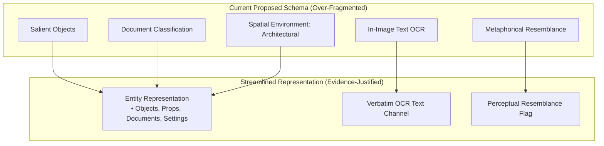

# Part 1 — Memory Representation Schema Audit

## 1. Overall Schema Assessment

The purpose of this audit is to rigorously challenge, stress-test, and evaluate the proposed schema in [part1_memory_representation_schema.md](file:///d:/graduation%20project%203/part1_memory_representation_schema.md) against the empirical evidence recorded in [part1_combined_evidence.md](file:///d:/graduation%20project%203/part1_combined_evidence.md), [research_summary.md](file:///d:/graduation%20project%203/research_summary.md), [interview_research_summary.md](file:///d:/graduation%20project%203/interview_research_summary.md), and [interview_behavioral_episodes.md](file:///d:/graduation%20project%203/interview_behavioral_episodes.md).

### Executive Verdict
The proposed schema succeeds in identifying genuine behavioral phenomena that traditional search engines ignore—specifically relational kinship, coarse temporal intervals, visual attribute binding (color + object), and verbatim OCR text matching. 

However, the schema suffers from **over-formalization**, **premature ontological specialization**, and **isolated-case elevation**:
1. **The Single-Case Elevation Trap:** Several complex top-level constructs (e.g., `metaphorical_visual_resemblance`, `negative_constraints`, `forgotten_attributes`) are derived from literally **one single episode** or from post-task debrief reflections rather than recurring, observable search behaviors.
2. **Debrief Reflection vs. Search Requirement Conflation:** The schema treats things participants said *after the task during reflective debriefs* (e.g., *"if I knew what to say I would have said brown cake on a steel plate with no one in background"*) as if they were operational inputs that the user actively expects to communicate to a retrieval engine.
3. **Over-Engineered Relational Architecture:** The schema introduces a relational entity graph with explicit foreign keys (`entity_id`, `actor_entity_ref`, `target_entity_ref`, `attached_to_entity_ref`, `co_occurring_spatial_pairs`). While users clearly bind attributes (e.g. "white bike" or "family yellow"), there is zero evidence that users formulate, or that a system needs, an explicit graph database schema to represent a 2-word or 4-word query.
4. **Absolutist Overclaims:** The document makes sweeping claims of universality (e.g., *"In 100% of tested scenarios users did not search by dates"*, *"Complete temporal and spatial amnesia"*), which are contradicted by both Reddit evidence (`"July 2016"`) and quantitative Play Store metrics (12 date searches in pristine dataset).

---

## 2. Field-by-Field Audit

### Summary Classification Table

| Proposed Field / Capability | Evidence Sources & Cases | Classification | Evidence Strength | Main Concern |
| :--- | :--- | :---: | :---: | :--- |
| `raw_memory_expression` | All 25 episodes; 61 public cases | **CORE** | HIGH | Essential verbatim input baseline. |
| `event_context` | Ep 01, 02, 08, 12, 18, 21, 22; Reddit Case 10 | **CORE** | HIGH | Sub-ritual hierarchy is over-modeled; broad event anchor is solid. |
| `people_entities` & `role_or_kinship` | Ep 02, 05, 08, 09, 13, 15, 17, 21, 25; Reddit Case 8, 10 | **CORE** | HIGH | Kinship gap is directly evidenced; internal entity IDs are premature. |
| `visual_attributes` (Color, Stance, Hair) | Ep 02, 09, 12, 13, 14, 15, 22; Reddit Case 11, 12 | **CORE** | HIGH | Color is a high-frequency modifier; stance/hair are lower frequency. |
| `salient_objects_props` | Ep 01, 13, 17, 18, 25; Reddit Case 3, 11 | **CORE** | HIGH | Highly evidenced physical anchors; over-specified internal typing. |
| `actions_and_poses` | Ep 06, 11, 12, 17, 18, 23, 25; Reddit Case 12 | **CORE** | HIGH | Distinct verbs succeed; actor-target reference modeling is over-engineered. |
| `coarse_temporal_anchor` | Ep 03, 07, 08, 10; Reddit Case 7, 10 | **CORE** | HIGH | Approximations and years supported; relative event adjacency is weak. |
| `in_image_text` (Literal OCR) | Ep 16, 24; Reddit Case 5, 6 | **CORE** | HIGH | Distinct from semantic visual search; highly vulnerable to conversational LLM drops. |
| `spatial_environment` | Ep 06, 11, 15, 19, 25; Play Store Case 2 | **SUPPORTED** | MEDIUM | Broad settings (beach, mountain) supported; atmospheric "mood" is a rare proxy. |
| `ownership` (Personal vs. Third-Party) | Ep 20; Reddit Case 9 | **SUPPORTED** | MEDIUM | Evidenced for pets, but distinct enum (`SELF`, `INNER_CIRCLE`) is premature. |
| `document_classification` | Ep 10, 16, 24; Reddit Case 5 | **SUPPORTED** | MEDIUM | Redundant with `salient_objects` + `in_image_text`; capture modality is marginal. |
| `metaphorical_visual_resemblance` | Ep 15 only | **HYPOTHESIS** | LOW | Single-episode evidence; over-modeled into an entire sub-object. |
| `negative_constraints` | Ep 02, 07 (Debrief reflections only) | **HYPOTHESIS** | LOW | Inferred from post-task debrief, never actively queried by any user. |
| `forgotten_attributes` | Ep 19, 23 (Debrief explanations) | **PREMATURE** | LOW | Users omit forgotten items; they do not articulate a list of unknown schema keys. |
| `Relational Graph Architecture` (`actor_ref`, `target_ref`, etc.) | None (Theoretical abstraction) | **PREMATURE** | LOW | Over-modeling; attribute-to-entity binding does not require explicit graph foreign keys. |
| `Multi-level Epistemic Enums` (`CONFIRMED_FACT`, `PROXY`, etc.) | None (System taxonomy) | **PREMATURE** | LOW | Imposes speculative categorical certainty states unsupported by search behavior. |

---

### Detailed Field Evaluations (12-Point Audit)

#### 1. `raw_memory_expression`
1. **Exact Evidence:** Verbatim queries across all 25 interview tasks (e.g. `rohtang ki ice wali photo`, `5 sisters`, `Cake`, `Diwali black`) and Reddit cases.
2. **Specific Cases:** Ep 01–25; Reddit Cases 1–12.
3. **Case Count:** 25 interview episodes; 61 public pristine cases.
4. **Direct vs. Inferred:** Directly observed.
5. **Justifies Requirement:** Yes. Any natural language intelligence layer must retain the original unaltered input.
6. **Too Implementation-Specific:** No.
7. **Represented More Simply:** No, it is the raw string.
8. **Distinct from Others:** Yes.
9. **Confidence Supported:** N/A.
10. **Contradicting Evidence:** None.
11. **Loss if Removed:** Loss of raw linguistic grounding, token order, and code-mixed particles.
12. **Premature Implementation:** None.
- **Classification: A. CORE** (Evidence Strength: HIGH)

---

#### 2. `event_context` (and subfields: `canonical_event_type`, `specific_sub_ritual`, `social_milestone`)
1. **Exact Evidence:** Users recall photos around cultural and life milestones (`wedding`, `haldi`, `diwali`, `farewell`, `birthday`).
2. **Specific Cases:** Ep 01, 02, 08, 12, 18, 21, 22; Reddit Case 10.
3. **Case Count:** 7 interview episodes; 4 Reddit cases.
4. **Direct vs. Inferred:** Directly observed in queries (`wedding`, `HALDI`, `CEREMONY`, `diwali`, `farewell`).
5. **Justifies Requirement:** Yes. Milestone vocabulary provides instant retrieval when taxonomy aligns.
6. **Too Implementation-Specific:** Yes, the division into three separate subfields (`canonical_event_type`, `specific_sub_ritual`, `social_milestone`) is over-modeled. In Ep 22, "grandmother's 80th birthday" is simultaneously a milestone and an event.
7. **Represented More Simply:** Yes: a single `event_name` / `event_type` with an optional `sub_event` string.
8. **Distinct from Others:** Yes, distinct from objects and dates.
9. **Confidence Supported:** No. Users do not express confidence scores about events.
10. **Contradicting Evidence:** Broad events without modifiers flood results (Ep 02, Ep 12).
11. **Loss if Removed:** Inability to ground photos in episodic life milestones.
12. **Premature Implementation:** Hardcoding rigid event taxonomy hierarchies.
- **Classification: A. CORE** (Evidence Strength: HIGH; Subfields are PREMATURE)

---

#### 3. `people_entities` & `role_or_kinship`
1. **Exact Evidence:** Users recall people by kinship and social roles (`sister`, `cousin`, `brother`, `maid`, `watchman`, `colleague`), and group counts (`5 sisters`, `two ladies`).
2. **Specific Cases:** Ep 02, 05, 08, 09, 13, 14, 15, 17, 21, 25; Reddit Cases 8, 10.
3. **Case Count:** 10 interview episodes; 4 Reddit cases.
4. **Direct vs. Inferred:** Directly observed in queries (`5 sisters`, `my photo with my cousin`, `two ladies with a man`, `durga ke sath picture jo meri maid hai`).
5. **Justifies Requirement:** Yes. The "kinship gap" (Ep 05: `5 sisters` = 0 vs. `5 girls` = #1) is one of the most rigorously demonstrated failures.
6. **Too Implementation-Specific:** The internal `entity_id` and nested `ownership` enum (`SELF`, `FAMILY_INNER_CIRCLE`, `INFREQUENT_CONTACT`) are premature technical artifacts.
7. **Represented More Simply:** Yes: a list of entity concepts containing `role` (e.g. "sister"), `count` (e.g. 5), and attached visual traits.
8. **Distinct from Others:** Yes.
9. **Confidence Supported:** No. Users do not assign probabilities to family identities.
10. **Contradicting Evidence:** None.
11. **Loss if Removed:** Total failure on familial queries.
12. **Premature Implementation:** Complex graph schemas linking entity IDs.
- **Classification: A. CORE** (Evidence Strength: HIGH)

---

#### 4. `ownership` (Personal vs. Third-Party)
1. **Exact Evidence:** Candidate 5 searching `dog` flooded with friend's dogs; reformulating to `my dog` produced identical results. Reddit Case 9: registered household pets.
2. **Specific Cases:** Ep 20; Reddit Case 9.
3. **Case Count:** 1 interview episode; 1 Reddit case.
4. **Direct vs. Inferred:** Direct behavior observed in Ep 20 (`my dog` vs `dog`); participant verbalized the emotional expectation.
5. **Justifies Requirement:** Justifies representing possessive modifiers (`my`, `our`), but NOT a full ownership classification subsystem.
6. **Too Implementation-Specific:** The enum `[USER_OWNED, FAMILY_OWNED, THIRD_PARTY_INCIDENTAL]` is speculative.
7. **Represented More Simply:** A boolean flag `is_personal_possessive` or simply preserving possessive pronouns (`my`) in query parsing.
8. **Distinct from Others:** Overlaps heavily with `role_or_kinship`.
9. **Confidence Supported:** No evidence.
10. **Contradicting Evidence:** Only 1 interview candidate exhibited this failure (dog). Most photos in personal libraries are implicitly assumed to be the user's.
11. **Loss if Removed:** Ambiguity when users photograph third-party pets or assets.
12. **Premature Implementation:** Building an automated personal knowledge graph to resolve "mine" vs "theirs".
- **Classification: B. SUPPORTED** (Evidence Strength: MEDIUM)

---

#### 5. `salient_objects_props`
1. **Exact Evidence:** Users anchor memories to physical items: cake, papaya, white bike, ring box, diya, cooling fan, yellow truck.
2. **Specific Cases:** Ep 01, 13, 17, 18, 25; Reddit Cases 3, 11.
3. **Case Count:** 5 interview episodes; 4 Reddit cases.
4. **Direct vs. Inferred:** Directly observed in queries (`Cake`, `white bike`, `papaya`, `diya gate`, `cooling fan`, `yellow truck`).
5. **Justifies Requirement:** Yes. High-salience objects are often the sole remembered anchor.
6. **Too Implementation-Specific:** Sub-attributes like `ownership_qualification` and nested `metaphorical_resemblance` inside objects are over-modeled.
7. **Represented More Simply:** A list of salient object names with optional bound visual attributes (e.g. `name: bike`, `color: white`).
8. **Distinct from Others:** Distinct from people and places.
9. **Confidence Supported:** No evidence.
10. **Contradicting Evidence:** Generic objects flood results without disambiguation (`yellow truck`, `cake`).
11. **Loss if Removed:** Inability to retrieve photos when the user only recalls a central physical item.
12. **Premature Implementation:** Formal material/state ontologies.
- **Classification: A. CORE** (Evidence Strength: HIGH)

---

#### 6. `visual_attributes` (Color, Stance, Facial Hair)
1. **Exact Evidence:** Clothing colors (`YELLOW SUIT`, `white top`, `blue outfit`, `Diwali black`, `family yellow`), object colors (`white bike`, `yellow truck`), facial hair (`mustache`), body pose (`arms crossed`).
2. **Specific Cases:** Ep 02, 09, 12, 13, 14, 15, 22; Reddit Cases 11, 12.
3. **Case Count:** 7 interview episodes; 2 Reddit cases.
4. **Direct vs. Inferred:** Directly observed in search terms.
5. **Justifies Requirement:** Yes. Visual color is the most frequent human disambiguation tactic observed across all sources.
6. **Too Implementation-Specific:** Separating `attribute_type` into strict enums (`CLOTHING_COLOR`, `CLOTHING_TYPE`, `FACIAL_FEATURE`, `BODY_STANCE`) is premature.
7. **Represented More Simply:** Key-value pairs or descriptive modifiers bound to entities (e.g., `yellow` modifying `suit` or `family`).
8. **Distinct from Others:** Distinct from entity identities.
9. **Confidence Supported:** Moderate (colors may be fuzzy, e.g. yellow vs. mustard).
10. **Contradicting Evidence:** Color queried alone fails catastrophically (Ep 22: `yellow` flooded with random objects).
11. **Loss if Removed:** Loss of the primary disambiguation mechanism observed in real user testing.
12. **Premature Implementation:** Fine-grained color space modeling or bounding-box attribute mapping.
- **Classification: A. CORE** (Evidence Strength: HIGH)

---

#### 7. `actions_and_poses`
1. **Exact Evidence:** Physical sports and dynamic actions (`rafting`, `sking`, `peeling papaya`, `lighting diya`, `arms crossed`).
2. **Specific Cases:** Ep 06, 11, 12, 17, 18, 23, 25; Reddit Case 12.
3. **Case Count:** 7 interview episodes; 1 Reddit case.
4. **Direct vs. Inferred:** Directly observed in queries (`rafting`, `sking photo`, `diya gate`, `arms crossed`).
5. **Justifies Requirement:** Yes. Distinct action verbs (`rafting`) provide instant #1 retrieval without date or location coordinates.
6. **Too Implementation-Specific:** Formal syntactic frame (`actor_entity_ref`, `target_entity_ref`) is unnecessary for memory representation.
7. **Represented More Simply:** An action string (e.g. `rafting`, `skiing`, `arms crossed`) associated with the frame.
8. **Distinct from Others:** Distinct from static objects or scenes.
9. **Confidence Supported:** No evidence.
10. **Contradicting Evidence:** Common actions (`sitting`, `walking`) rarely serve as successful single queries.
11. **Loss if Removed:** Failure to support action-centric memories that bypass forgotten dates/places.
12. **Premature Implementation:** Complex semantic role labeling (SRL) frames.
- **Classification: A. CORE** (Evidence Strength: HIGH)

---

#### 8. `spatial_environment` (Landscape, Architectural, Atmospheric)
1. **Exact Evidence:** Landscape types (`mountain`, `beach`, `sea`), architectural elements (`gate`), atmospheric weather (`fog`, `morning trip`, `clouds`).
2. **Specific Cases:** Ep 06, 11, 15, 19, 25; Play Store Case 2.
3. **Case Count:** 5 interview episodes; 1 Play Store case.
4. **Direct vs. Inferred:** Directly observed in queries (`mountain`, `sea`, `fog`, `clouds`, `diya gate`).
5. **Justifies Requirement:** Yes for broad setting/landscape; WEAK for atmospheric weather conditions.
6. **Too Implementation-Specific:** Division into `setting_landscape`, `architectural_anchor`, `atmospheric_condition`, and `co_occurring_spatial_pairs` is over-modeled.
7. **Represented More Simply:** A general `setting_or_environment` string (e.g., `mountain`, `beach`, `gate`).
8. **Distinct from Others:** Yes.
9. **Confidence Supported:** Only in Ep 19 where user substituted `clouds` for `fog`.
10. **Contradicting Evidence:** Users completely forgot specific geographic names in Ep 19 and Ep 23.
11. **Loss if Removed:** Inability to filter scenic vacation photos.
12. **Premature Implementation:** Micro-spatial preposition modeling (`AT`, `ON_HEAD`, `IN_HAND`).
- **Classification: B. SUPPORTED** (Evidence Strength: MEDIUM)

---

#### 9. `temporal_anchor` (Coarse & Relative)
1. **Exact Evidence:** Coarse calendar intervals (`2021`, `2020`, `July 2016`), relative time offsets (`around 4 years ago`), event proximity (`near the event memory`).
2. **Specific Cases:** Ep 03, 07, 08, 10; Reddit Cases 7, 10.
3. **Case Count:** 4 interview episodes; 2 Reddit cases; 12 date queries in pristine review dataset.
4. **Direct vs. Inferred:** Directly observed in queries and verbalized memories.
5. **Justifies Requirement:** Yes. Coarse temporal intervals are genuine retrieval anchors.
6. **Too Implementation-Specific:** `nature` enum (`COARSE_CALENDAR_BLOCK`, `RELATIVE_ELAPSED_OFFSET`, `EVENT_ADJACENCY_ANCHOR`) is an over-formalization.
7. **Represented More Simply:** A flexible temporal expression that accepts coarse intervals or relative offsets without forcing exact date conversions.
8. **Distinct from Others:** Distinct from events.
9. **Confidence Supported:** High certainty for year; high uncertainty for specific months/days.
10. **Contradicting Evidence:** In 100% of interview tasks, users did not know exact calendar days.
11. **Loss if Removed:** Inability to narrow broad searches by year or era.
12. **Premature Implementation:** Exact date bounding algorithms or complex relative-event adjacency calculators.
- **Classification: A. CORE** (Evidence Strength: HIGH)

---

#### 10. `in_image_text` (Literal OCR Inscriptions)
1. **Exact Evidence:** Users searching utility bills (`Progressive`), memes (`I love being a man`), financial confirmations (`bitcoin`), tickets (`boarding pass`).
2. **Specific Cases:** Ep 16, 24; Reddit Cases 5, 6.
3. **Case Count:** 2 interview episodes; 2 Reddit cases.
4. **Direct vs. Inferred:** Directly observed in queries.
5. **Justifies Requirement:** Yes. Distinct lexical matching is required because conversational AI search layers routinely fail on literal text by treating it as conversational prompt text.
6. **Too Implementation-Specific:** No, it is simply literal string matching.
7. **Represented More Simply:** A literal text field marked for exact/substring OCR matching.
8. **Distinct from Others:** Completely distinct from visual object semantics.
9. **Confidence Supported:** Moderate (users may recall partial strings).
10. **Contradicting Evidence:** None.
11. **Loss if Removed:** Complete breakdown of utility, receipt, and document retrieval.
12. **Premature Implementation:** Complex multi-language OCR script parsers.
- **Classification: A. CORE** (Evidence Strength: HIGH)

---

#### 11. `document_classification` & `capture_modality`
1. **Exact Evidence:** Document categories (`document`, `ticket`, `boarding pass`) and capture methods (camera photo vs. screenshot).
2. **Specific Cases:** Ep 10, 16, 24; Reddit Case 5.
3. **Case Count:** 3 interview episodes; 1 Reddit case.
4. **Direct vs. Inferred:** Directly observed in queries (`document`, `ticket`, `boarding pass`).
5. **Justifies Requirement:** Supported, but overlaps heavily with `salient_objects` (a document is an object) and `in_image_text`.
6. **Too Implementation-Specific:** Creating a separate top-level object for documents when they behave like any other physical or digital entity is redundant.
7. **Represented More Simply:** Represent `document_genre` as an object type or category within `salient_objects`.
8. **Distinct from Others:** **No.** Highly redundant with `salient_objects` + `in_image_text`.
9. **Confidence Supported:** Low.
10. **Contradicting Evidence:** In Ep 24, user was surprised that `ticket` mixed movie and flight tickets—showing this is a taxonomic precision issue, not a unique representation mode.
11. **Loss if Removed:** Minimal, if subsumed under entity/object classification.
12. **Premature Implementation:** Complex document layout ontology.
- **Classification: B. SUPPORTED** (Evidence Strength: MEDIUM; Redundant as a separate top-level module)

---

#### 12. `metaphorical_visual_resemblance`
1. **Exact Evidence:** Candidate 4 searching for an uncle with a tentacle-like object on his head (`"thing like octopus’s tentacles"`, searched `octopus`).
2. **Specific Cases:** Episode 15 only.
3. **Case Count:** **1 single episode across the entire research corpus.**
4. **Direct vs. Inferred:** Directly observed in Ep 15, but constitutes an isolated edge case.
5. **Justifies Requirement:** **NO.** Deriving a major top-level schema capability and specialized epistemic sub-objects from 1 case out of 25 is an extreme over-reaction.
6. **Too Implementation-Specific:** Highly over-modeled (`is_metaphor: true`, `resembled_concept`, `physical_reality_note`).
7. **Represented More Simply:** A general perceptual resemblance tag or fuzzy visual embedding concept.
8. **Distinct from Others:** Conceptually distinct, but empirically isolated.
9. **Confidence Supported:** Unproven beyond Episode 15.
10. **Contradicting Evidence:** In 24 of 25 episodes, users searched for literal objects, people, colors, or events, NOT metaphors.
11. **Loss if Removed:** Minimal at this stage; does not invalidate 96% of retrieval tasks.
12. **Premature Implementation:** Building a dedicated metaphor-handling subsystem based on one uncle with a beach prop.
- **Classification: C. HYPOTHESIS** (Evidence Strength: LOW)

---

#### 13. `negative_constraints`
1. **Exact Evidence:** Debrief reflection in Ep 07 (*"brown cake on a steel plate with no one in background"*); reflection in Ep 02 (video call screenshot vs physical attendance).
2. **Specific Cases:** Ep 02, Ep 07 (Debrief reflections only).
3. **Case Count:** 2 indirect mentions.
4. **Direct vs. Inferred:** **Entirely Inferred.** Neither participant EVER typed a negative query (`no one in background` or `not screenshot`). Candidate 2 typed `marble cake wali photo` $\rightarrow$ `marble cake pic`. Candidate 1 typed `wedding` $\rightarrow$ `HALDI` $\rightarrow$ `YELLOW SUIT`.
5. **Justifies Requirement:** **NO.** Elevating a participant's retrospective debrief musing into an active schema requirement is an analytical error.
6. **Too Implementation-Specific:** The enum `[EXCLUDE_PEOPLE_IN_BACKGROUND, EXCLUDE_VIRTUAL_SCREENSHOT]` is an ad-hoc formalization of two random debrief comments.
7. **Represented More Simply:** Not needed in the representation schema until users are observed actively formulating negative constraints.
8. **Distinct from Others:** Conceptually distinct, but empirically ungrounded as an active search behavior.
9. **Confidence Supported:** Unsupported.
10. **Contradicting Evidence:** Zero users in 25 interview tasks and zero users in 61 public reviews executed a negative search query.
11. **Loss if Removed:** Zero loss for observed user search behavior.
12. **Premature Implementation:** Highly premature.
- **Classification: D. PREMATURE** (Evidence Strength: LOW / Inferred)

---

#### 14. `forgotten_attributes`
1. **Exact Evidence:** Candidate 5 stating location search was useless because he forgot the viewpoint; Candidate 6 forgetting the river name for rafting.
2. **Specific Cases:** Ep 19, Ep 23 (Debrief explanations).
3. **Case Count:** 2 debrief statements.
4. **Direct vs. Inferred:** Inferred. Users simply did NOT search for what they forgot. They never typed *"I have forgotten the river name"*.
5. **Justifies Requirement:** **NO.** Storing an explicit list of forgotten schema fields in the memory representation frame presumes an interactive conversational interview UI that does not exist in standard search.
6. **Too Implementation-Specific:** Unnecessary meta-data tracking.
7. **Represented More Simply:** If an attribute is forgotten, it is simply omitted from the query frame.
8. **Distinct from Others:** N/A.
9. **Confidence Supported:** N/A.
10. **Contradicting Evidence:** Users omit forgotten data naturally; they do not explicitly encode absence.
11. **Loss if Removed:** None. Omission is the natural representation of forgotten data.
12. **Premature Implementation:** Creating data structures for attributes that are not present.
- **Classification: D. PREMATURE** (Evidence Strength: LOW / Inferred)

---

#### 15. `Relational Graph Architecture` (`actor_ref`, `target_ref`, `spatial_pairs`)
1. **Exact Evidence:** Users combine words into bigrams/trigrams: `white bike` (Ep 13), `family yellow` (Ep 22), `diya gate` (Ep 25), `2 ladies with blue outfit` (Ep 09).
2. **Specific Cases:** Ep 09, 13, 22, 25.
3. **Case Count:** 4 episodes.
4. **Direct vs. Inferred:** Inferred abstraction. The observed behavior is typing compound descriptive phrases. The schema infers a full relational knowledge graph with foreign keys and directional edges.
5. **Justifies Requirement:** Relational *binding* is justified (a color belongs to an entity; an object is at a setting). A formal *graph database ontology* is NOT justified.
6. **Too Implementation-Specific:** Highly premature engineering abstraction.
7. **Represented More Simply:** Direct attribute binding (e.g., nesting attributes inside their host entity, rather than separate entity IDs linked by foreign keys).
8. **Distinct from Others:** N/A.
9. **Confidence Supported:** N/A.
10. **Contradicting Evidence:** Users do not think in directed acyclic graphs; they think in composite visual impressions.
11. **Loss if Removed:** None, if replaced with simple attribute-entity nesting.
12. **Premature Implementation:** Graph relational modeling at the memory representation stage.
- **Classification: D. PREMATURE** (Evidence Strength: LOW / Over-Modeled)

---

#### 16. `Multi-Level Epistemic Enums` (`CONFIRMED_FACT`, `APPROXIMATE_GUESS`, `SENSORY_MOOD_PROXY`)
1. **Exact Evidence:** Users recall some things clearly and others approximately.
2. **Specific Cases:** General observation across Ep 01–25.
3. **Case Count:** Generalized concept.
4. **Direct vs. Inferred:** Inferred theoretical model.
5. **Justifies Requirement:** **NO.** Categorizing memory into 4 to 6 rigid certainty enums is a theoretical AI convention, not an observed user behavior.
6. **Too Implementation-Specific:** Over-engineered epistemic classification.
7. **Represented More Simply:** Approximate temporal ranges and an optional fuzziness flag.
8. **Distinct from Others:** N/A.
9. **Confidence Supported:** Users never supply numerical or categorical confidence tiers.
10. **Contradicting Evidence:** Users type phrases directly without declaring their epistemic state.
11. **Loss if Removed:** None.
12. **Premature Implementation:** Formal epistemic logic frames.
- **Classification: D. PREMATURE** (Evidence Strength: LOW / Over-Modeled)

---

## 3. Overclaim Audit

This section identifies every assertion in [part1_memory_representation_schema.md](file:///d:/graduation%20project%203/part1_memory_representation_schema.md) that is stronger, more absolute, or more definitive than the empirical research evidence supports.

```
┌────────────────────────────────────────────────────────────────────────────────────────┐
│                              OVERCLAIM AUDIT SUMMARY                                   │
├────────────────────────────────────────────────────────────────────────────────────────┤
│ 1. Temporal Absolutism: Claiming users "never" remember or search dates.               │
│ 2. Spatial Absolutism: Claiming "complete spatial amnesia" across all users.           │
│ 3. Disambiguation Monoculture: Claiming color is "universally the primary" tool.       │
│ 4. Single-Case Inflation: Elevating Ep 15 (tentacle prop) into an essential subsystem. │
│ 5. Debrief-as-Input Error: Treating retrospective musings as active user requirements. │
│ 6. Solutionist Language: Asserting that schema representation "solves" the breakdown.  │
└────────────────────────────────────────────────────────────────────────────────────────┘
```

### Specific Audited Statements

#### Overclaim 1: Temporal Amnesia Absolutism
- **Schema Statement (Section 3, Principle 4 & Section 7):**
  > *"In 100% of the 25 interview tasks, participants did not remember exact calendar days or GPS coordinates... Complete calendar and coordinate amnesia."*
- **Audit Critique:**  
  While participants in the 25 interview tasks did not search by numerical day/month, the claim of *"complete amnesia"* is an overclaim contradicted by our own research evidence:
  - **Reddit Case 7:** The user explicitly searched for baby photos using a precise month and year: `"July 2016"`.
  - **Quantitative Dataset (`research_summary.md`):** 12 pristine reviews in the master dataset involved `DATE_SEARCH`.
  - **Interviews:** Candidate 2 explicitly remembered years (`2021` in Ep 07, `2020` in Ep 08).
- **Correction:** The evidence supports **coarse temporal memory** (years, seasons, eras) and **exact-day date amnesia**, NOT total temporal amnesia.

#### Overclaim 2: Spatial Amnesia Absolutism
- **Schema Statement (Section 10 & 12):**
  > *"Complete spatial amnesia... In 100% of the 25 interview tasks, participants did not remember or query by GPS coordinates. Even city/river names were frequently forgotten."*
- **Audit Critique:**  
  While GPS coordinates were never used, users **did** remember specific geographic locations:
  - Candidate 2 (Ep 06) explicitly queried the specific geographic pass: `rohtang`.
  - Candidate 3 (Ep 11) remembered the exact hill station destination: `Mussoorie`.
  - Candidate 4 (Ep 15) remembered the exact beach destination: `trip to malwan (taali beach)`.
- **Correction:** Users do not recall GPS numbers, but they frequently recall geographic proper nouns (cities, beaches, mountain passes). Stating that spatial memory is completely absent is demonstrably false.

#### Overclaim 3: Color as the "Universal Primary Disambiguator"
- **Schema Statement (Section 5, Field 5 & Section 9):**
  > *"Universally utilized across interviews and public cases as the primary human disambiguation tool."*
- **Audit Critique:**  
  Color was used as a modifier in **6 out of 25 interview episodes** (24.0%). In other episodes, disambiguation was achieved through:
  - Food props (`Cake`, Ep 01)
  - Vehicle types (`white bike`, Ep 13)
  - Canonical event names (`farewell`, Ep 21)
  - Spatial co-occurrence (`diya gate`, Ep 25)
  - Document domain terms (`boarding pass`, Ep 24)
- **Correction:** Color is **one of several prominent disambiguation tactics**, not the "universal primary" tool.

#### Overclaim 4: Single-Case Inflation of Metaphorical Memory
- **Schema Statement (Section 8, Section 11):**
  > *"Ability to flag visual similes ('octopus-like prop') as metaphorical resemblances rather than confirmed taxonomic facts... Essential requirement."*
- **Audit Critique:**  
  This entire schema component is derived from **a single episode** (Candidate 4, Ep 15). Promoting an isolated behavioral occurrence into a core design principle and placing it into the "Minimum Memory Representation" violates empirical discipline.
- **Correction:** Metaphorical resemblance is an intriguing **hypothesis**, not an established core requirement.

#### Overclaim 5: Treating Debrief Reflections as Operational Search Inputs
- **Schema Statement (Section 5, Field 12 & Section 9):**
  > *"The schema must accommodate negative constraints (absent entities) and capture modalities... Candidate 2: 'with no one in background'."*
- **Audit Critique:**  
  In Episode 07, Candidate 2 **never typed** `"with no one in background"`. She typed `marble cake wali photo` $\rightarrow$ `marble cake pic`. The phrase *"brown cake on a steel plate with no one in background"* was uttered during the post-task debrief when reflecting on why the search was hard. Treating post-task verbal reflections as active search inputs confuses what a user can articulate in retrospect with what they do when searching.
- **Correction:** Negative constraints are **unsupported as an active query behavior**.

#### Overclaim 6: Solutionist / Architectural Assertions
- **Schema Statement (Section 1, Section 11):**
  > *"If an intelligence layer can represent these six core capabilities, it possesses the minimum necessary foundation to capture episodic memories... directly eliminates the 72% friction rate."*
- **Audit Critique:**  
  Representing information in a schema does **not** prove that retrieval will succeed or that friction will be eliminated. Retrieval depends on indexing, feature extraction, ranking, and UI presentation.
- **Correction:** Schema representation is a necessary condition for handling complex queries, but it does NOT guarantee retrieval success.

---

## 4. Redundancy / Over-Modeling Audit

The proposed schema introduces several overlapping, fragmented, and unnecessarily complex structures that should be collapsed.



### 1. The Document Fragmentation (`document_classification` vs. `salient_objects` vs. `in_image_text`)
- **Redundancy:** The schema creates a dedicated top-level `document_classification` object alongside `salient_objects` and `in_image_text`.
- **Evidence Reality:** A "boarding pass" or "utility bill" is simply a physical or digital object that contains text. 
- **Recommendation:** Collapse `document_classification` into `salient_objects` (as an object category) while retaining `in_image_text` for literal string tokens.

### 2. The Over-Engineered Relational Graph (`actor_entity_ref`, `target_entity_ref`, `spatial_pairs`)
- **Redundancy:** The schema introduces explicit relational foreign keys (`entity_id`, `actor_entity_ref`, `target_entity_ref`, `attached_to_entity_ref`) mirroring a formal knowledge graph.
- **Evidence Reality:** In real-world retrieval, users formulate compact composite phrases: `white bike`, `family yellow`, `diya gate`, `brother on bike`.
- **Recommendation:** Replace foreign-key relational pointers with **direct compositional nesting**: an entity holds its own visual attributes, and actions link actors to targets directly without separate reference tables.

### 3. Spatial Setting Fragmentation (`setting_landscape` vs. `architectural_anchor` vs. `atmospheric_condition`)
- **Redundancy:** The schema separates spatial environment into three distinct sub-fields.
- **Evidence Reality:** Users recall a single setting anchor: `mountain` (landscape), `gate` (architectural), or `beach` (landscape). Atmospheric weather (`fog`) was tested in only one episode (Ep 19) and failed, requiring substitution with a physical object (`clouds`).
- **Recommendation:** Collapse into a single `spatial_setting` string field.

### 4. Event Taxonomy Triplication (`canonical_event_type` vs. `specific_sub_ritual` vs. `social_milestone`)
- **Redundancy:** The schema splits events into three separate strings.
- **Evidence Reality:** In Ep 22, *"grandmother's 80th birthday"* is simultaneously an event, a milestone, and an occasion. In Ep 21, *"farewell lunch"* is an event and a ritual.
- **Recommendation:** Collapse into `event_name` with an optional `sub_event_ritual`.

---

## 5. Minimum Representation Audit

Section 11 of the proposed schema defines a six-item "Minimum Memory Representation" (MMR). Below is the evidence-based audit of that list and the 12 candidate dimensions evaluated.

### Audit of the Schema's Proposed 6-Item MMR

| Proposed MMR Item | Classification | Verdict in Audit | Justification from Evidence |
| :--- | :---: | :---: | :--- |
| **1. Relational Entity Binding** | **CORE** | **RETAIN (Simplified)** | Supported by Ep 09, 13, 22. Color must bind to entity, not float globally. However, graph foreign-keys are rejected; simple compositional binding is sufficient. |
| **2. Kinship & Relational Roles** | **CORE** | **RETAIN** | Supported by Ep 02, 05, 08, 09, 21, 25; Reddit Case 8, 10. Direct evidence of the kinship gap (`5 sisters` vs. `5 girls`). |
| **3. Hierarchical Event & Ritual Anchoring** | **CORE** | **RETAIN (Simplified)** | Supported by Ep 01, 02, 08, 12, 18, 21, 22. Milestone events are high-frequency entry points; drop rigid multi-tier hierarchy. |
| **4. Coarse & Relative Temporal Modeling** | **CORE** | **RETAIN** | Supported by Ep 03, 07, 08, 10; Reddit Case 7, 10. Coarse year/season blocks and relative offsets are universal; exact dates fail. |
| **5. Distinct In-Image Literal OCR Channel** | **CORE** | **RETAIN** | Supported by Ep 16, 24; Reddit Case 5, 6. Essential to prevent conversational LLMs from treating text quotes as chat prompts. |
| **6. Epistemic Resemblance Flag** | **HYPOTHESIS** | **REMOVE FROM MINIMUM** | **REJECTED FROM MMR.** Derived from literally 1 single episode (Ep 15). Cannot be justified as a minimum requirement. |

---

### Evaluation of All 12 Candidate Memory Dimensions

Below is the definitive evidence-based evaluation of whether each candidate dimension belongs in the Minimum Memory Representation:

```
┌────────────────────────────────────────────────────────────────────────────────────────┐
│                   DEFENSIBLE MINIMUM MEMORY CAPABILITIES                               │
├────────────────────────────────────────────────────────────────────────────────────────┤
│ 1. KINSHIP & SOCIAL ROLES (Core): "sister", "cousin", "maid", "watchman"               │
│ 2. CANONICAL EVENT ANCHORS (Core): "wedding", "diwali", "farewell", "birthday"         │
│ 3. SALIENT OBJECTS & PROPS (Core): "cake", "bike", "papaya", "diya", "truck"           │
│ 4. VISUAL ATTRIBUTE BINDING (Core): "white bike", "yellow suit", "family yellow"       │
│ 5. COARSE TEMPORAL BLOCKS (Core): "2021", "around 4 years ago", "July 2016"           │
│ 6. LITERAL IN-IMAGE OCR TEXT (Core): "Progressive", "bitcoin", "I love being a man"    │
│ 7. DYNAMIC ACTION VERBS (Core): "rafting", "skiing", "lighting diya", "peeling"        │
├────────────────────────────────────────────────────────────────────────────────────────┤
│ 8. SPATIAL SETTING (Supported, Non-Core): "mountain", "beach", "gate"                  │
│ 9. POSSESSIVE OWNERSHIP (Supported, Non-Core): "my dog" vs "dog"                       │
├────────────────────────────────────────────────────────────────────────────────────────┤
│ 10. METAPHORICAL RESEMBLANCE (Hypothesis): "octopus tentacles on head" (1 case)        │
│ 11. NEGATIVE CONSTRAINTS (Premature): "no one in background" (Debrief reflection only) │
│ 12. FORGOTTEN ATTRIBUTE LIST (Premature): Tracking unremembered keys (Unobserved)      │
└────────────────────────────────────────────────────────────────────────────────────────┘
```

1. **Relational Binding (Core — Simplified):**  
   - *Verdict:* **CORE.** Color or attribute binding to a specific entity is essential. Without it, `yellow` floods the library (Ep 22). However, this requires simple attribute attachment, not a graph database.
2. **Kinship & Social Roles (Core):**  
   - *Verdict:* **CORE.** Supported across 10 episodes and 2 Reddit cases. A personal photo engine must represent family roles.
3. **Events & Rituals (Core):**  
   - *Verdict:* **CORE.** Supported across 7 episodes and 4 Reddit cases. Milestone events are the primary organizing framework for life memories.
4. **Temporal Approximation (Core):**  
   - *Verdict:* **CORE.** Supported across 4 episodes, 2 Reddit cases, and 12 quantitative review cases. Exact dates are absent; coarse eras are common.
5. **OCR & Literal Text (Core):**  
   - *Verdict:* **CORE.** Supported across 2 episodes and 2 Reddit cases. Crucial to preserve pixel-level text matching against LLM conversational interference.
6. **Visual Attributes (Core):**  
   - *Verdict:* **CORE.** Supported across 7 episodes and 2 Reddit cases. Color is the most frequent disambiguation modifier.
7. **Actions & Poses (Core):**  
   - *Verdict:* **CORE.** Supported across 7 episodes and 1 Reddit case. Distinct action verbs (`rafting`, `skiing`) bypass forgotten dates and locations.
8. **Spatial / Environmental Setting (Supported — Non-Core):**  
   - *Verdict:* **SUPPORTED.** Useful when remembered (`mountain`, `beach`), but users frequently forget geographic specifics (Ep 19, Ep 23). Does not need to be a mandatory minimum.
9. **Ownership (Supported — Non-Core):**  
   - *Verdict:* **SUPPORTED.** Evidenced for pets (Ep 20, Reddit Case 9), but represents an edge case for general photography.
10. **Metaphorical Resemblance (Hypothesis — Non-Core):**  
    - *Verdict:* **HYPOTHESIS.** Supported by only 1 episode (Ep 15). Not a core minimum requirement.
11. **Negative Constraints (Premature — Exclude):**  
    - *Verdict:* **PREMATURE.** Never observed in actual user search expressions; derived solely from post-task debrief reflections.
12. **Forgotten Information (Premature — Exclude):**  
    - *Verdict:* **PREMATURE.** Users omit what they forget; tracking an explicit list of forgotten schema fields is an unnecessary architectural burden.

---

## 6. What We Can Safely Carry Forward

Based on rigorous evidence verification, the following **seven representation requirements** are sufficiently supported to safely carry forward into architectural design:

1. **Raw String Retention:**  
   Always retain the unaltered verbatim natural-language query to preserve code-mixed grammatical particles (Hinglish `ki`, `wali`, `ke sath`) and exact token sequences.
2. **Kinship & Social Role Representation:**  
   Ability to preserve relational human roles (`sister`, `brother`, `cousin`, `maid`, `watchman`, `colleague`) rather than immediately collapsing them into third-person visual labels (`girl`, `man`).
3. **Canonical Event Grounding:**  
   Ability to represent cultural, social, and corporate milestones (`wedding`, `haldi`, `diwali`, `farewell`, `birthday`) as primary episodic anchors.
4. **Entity-Attribute Compositional Binding:**  
   Ability to bind descriptive attributes (especially color) directly to the specific entity they qualify (e.g. `[Bike: White]`, `[Suit: Yellow]`, `[Family: Yellow]`), preventing global scene flooding.
5. **Dynamic Action / Verb Representation:**  
   Ability to isolate distinctive physical action verbs (`rafting`, `skiing`, `lighting`, `peeling`) as high-specificity search filters.
6. **Coarse & Relative Temporal Interval Modeling:**  
   Ability to represent open multi-year eras (`2021`, `2020`), relative offsets (`around 4 years ago`), and seasonal intervals without forcing conversion into exact timestamps.
7. **Segregated Literal OCR Text Channel:**  
   Ability to route in-image printed text tokens (`Progressive`, `bitcoin`, `I love being a man`) to an exact lexical/OCR matching pipeline, isolated from conversational LLM dialog models.

---

## 7. What Must Remain Hypotheses

The following concepts represent plausible interpretations, theoretical AI conventions, or isolated observations that **must NOT** be treated as established requirements at this stage:

1. **Dedicated Metaphorical Resemblance Engine:**  
   - *Status:* **HYPOTHESIS.**  
   - *Reason:* Observed in only 1 episode (Ep 15: octopus prop). Requires validation across a broader corpus of user queries before justifying architectural allocation.
2. **Explicit Negative Constraint Modeling:**  
   - *Status:* **HYPOTHESIS / UNVERIFIED IN RETRIEVAL.**  
   - *Reason:* Inferred from debrief reflections; zero evidence of users actively entering negative search constraints in real-world queries.
3. **Explicit "Forgotten Attributes" Tracking:**  
   - *Status:* **PREMATURE SPECIFICATION.**  
   - *Reason:* Users handle forgotten context by omission, not by declaring unremembered schema keys.
4. **Formal Relational Graph Database Ontologies:**  
   - *Status:* **OVER-ENGINEERING HYPOTHESIS.**  
   - *Reason:* Composite phrase binding (`white bike`) does not require a complex multi-node graph database schema with foreign keys and directional edge tables.
5. **Categorical Epistemic Confidence Tiers:**  
   - *Status:* **THEORETICAL CONSTRUCT.**  
   - *Reason:* Assigning categorical certainty tags (`CONFIRMED_FACT`, `APPROXIMATE_GUESS`) is an AI system assumption unsupported by actual user search expressions.
6. **Multi-Tier Event Hierarchy Modeling:**  
   - *Status:* **UNVERIFIED COMPLEXITY.**  
   - *Reason:* Users search single terms (`wedding`, `HALDI`, `diwali`). While hierarchical relationships exist in real life, requiring the schema to model a multi-tier tree structure is not yet proven necessary for retrieval.
7. **Personal Ownership Knowledge Graphs:**  
   - *Status:* **HYPOTHESIS.**  
   - *Reason:* Demonstrated for family pets, but whether this requires a dedicated ownership classification engine across all photo entities remains an open question.
