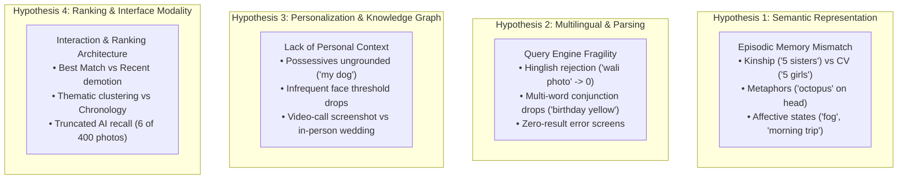

# Cross-Source Synthesis & Multi-Layer Evidence Analysis: AI-Powered Photo Retrieval

> **Baseline Specifications:** [problemstatement.md](file:///d:/graduation%20project%203/problemstatement.md)  
> **Source Documents & Datasets:**  
> - **Play Store:** [raw_reviews_dataset.json](file:///d:/graduation%20project%203/raw_reviews_dataset.json) | [evidence_dataset.json](file:///d:/graduation%20project%203/evidence_dataset.json) | [research_summary.md](file:///d:/graduation%20project%203/research_summary.md)  
> - **Reddit:** [reddit_raw_dataset.json](file:///d:/graduation%20project%203/reddit_raw_dataset.json) | [reddit_evidence_dataset.json](file:///d:/graduation%20project%203/reddit_evidence_dataset.json) | [reddit_research_summary.md](file:///d:/graduation%20project%203/reddit_research_summary.md)  
> - **1:1 Interviews:** [interview_raw_dataset.json](file:///d:/graduation%20project%203/interview_raw_dataset.json) | [interview_evidence_dataset.json](file:///d:/graduation%20project%203/interview_evidence_dataset.json) | [interview_research_summary.md](file:///d:/graduation%20project%203/interview_research_summary.md)  

---

## Layer 1 — Raw Evidence Overview

| Dimension | Source A: Google Play Store | Source B: Reddit Community Threads | Source C: 1:1 User Interviews |
| :--- | :--- | :--- | :--- |
| **Data Nature** | Unsolicited public consumer reviews (short-to-medium text, reactive) | Unsolicited long-form forum posts and comments (detailed, technical, investigative) | In-person qualitative user testing with task-based retrieval protocol & debriefs |
| **Primary Scope** | Mobile app store feedback (`com.google.android.apps.photos`) | r/googlephotos and related Android/Google communities | 6 distinct participants (Samidha, Maa, Durrani, Abhilasha, Rehan, Priya) |
| **Total Scraped Volume** | 1,500 raw reviews collected across all rating tiers (1★ to 5★) | 52 raw discussion threads and comment chains | 25 distinct retrieval scenarios across 6 candidates (45 individual attempts) |
| **Strictly Relevant Evidence** | **50 pristine evidence records** (strictly meeting problem statement criteria) | **38 pristine evidence records** (concrete retrieval situations with specific queries/photos) | **25 structured scenario records** (100% verified, observable retrieval workflows) |
| **Primary Context** | App updates, feature removals, daily browsing, multi-year backup libraries | Power users, 50k+ photo libraries, cross-device workflows, OCR tracking, Ask Photos rollout | Real-time memory retrieval from personal smartphone galleries under observation |

---

## Layer 2 — Within-Source Analysis

```
                              ┌──────────────────────────────────────────────────────────┐
                              │                 LAYER 2: WITHIN-SOURCE                   │
                              └──────────────────────────────────────────────────────────┘
                                        │                           │
                   ┌────────────────────┼───────────────────────────┼────────────────────┐
                   ▼                                                ▼                    ▼
       ┌────────────────────────┐                      ┌────────────────────────┐   ┌────────────────────────┐
       │      PLAY STORE        │                      │         REDDIT         │   │     1:1 INTERVIEWS     │
       ├────────────────────────┤                      ├────────────────────────┤   ├────────────────────────┤
       │ Clues: Dates, faces,   │                      │ Clues: OCR text, rare  │   │ Clues: Food props,     │
       │ broad objects, places  │                      │ species, compound      │   │ clothing colors, event │
       │ Failures: Face merging,│                      │ names, body poses      │   │ milestones, Hinglish   │
       │ timeline collapse,     │                      │ Failures: Truncation   │   │ Failures: Hinglish 0-  │
       │ 0-results on basic NL  │                      │ (6 of 400), OCR drop,  │   │ results, semantic gap, │
       │ Outcomes: Hours of     │                      │ non-chronological tiles│   │ deep paging (grid 17)  │
       │ manual scroll, churn   │                      │ Outcomes: Loss of      │   │ Outcomes: 36% 1st try, │
       │ to third-party apps    │                      │ trust, APK rollback    │   │ 60% reformulate, rage  │
       └────────────────────────┘                      └────────────────────────┘   └────────────────────────┘
```

### 1. Google Play Store Reviews

#### Clue Types Used
* **Calendar Dates & Temporal Markers:** Exact years (`2018`, `2021`), month/year combinations, or chronological eras (*"photos from 5 years ago"*).
* **Person & Face Identifiers:** People names, family roles (*"my mom"*, *"my son"*), face groups.
* **Geographic Locations:** City/country names (*"Goa trip"*, *"Paris"*), landmark tags.
* **Broad Object / Animal Categories:** `dog in a hat`, `rollercoaster`, `receipts`, `cars`.
* **Basic Conversational Intent:** *"photos of my family at the beach"*, *"pictures of my daughter playing"*.

#### Failure Stages
* **Face Recognition & Grouping:** Side profiles not detected; faces in dim lighting ignored; faces of people of color misidentified; disparate people merged into one profile; inability to manually assign a face tag.
* **Chronological Sorting & Navigation:** Search results presented in arbitrary or non-chronological order; inability to jump directly to a date; timeline scrubbers breaking inside search views.
* **Query Processing & System Stability:** Search bar returning generic error messages (*"Something went wrong"*) or freezing on large galleries.
* **Volume Overload:** Large photo libraries (10,000–60,000+ items) rendering keyword retrieval ineffective due to unranked result floods.

#### Observed Outcomes
* **Hours of Manual Scrolling:** Users give up on search and scroll back through years of chronological media manually.
* **Churn to Alternative Applications:** Explicit migration to Apple Photos, Amazon Photos, OneDrive, or local open-source galleries (e.g., Simple Gallery).
* **Frustration & Low Ratings:** 1-star and 2-star reviews driven by broken retrieval expectations after updates.
* **Isolated Positive Utility:** Occasional high satisfaction reported by users whose primary retrieval task is viewing automatically grouped faces of close family.

---

### 2. Reddit Community Discussions

#### Clue Types Used
* **Embedded Text in Images (OCR):** Exact strings on physical documents, utility bills (`Progressive`), clothing brand labels (`Trina Turk`), or social media screenshot text (`LES PIRES REACTIONS TWITTER`).
* **Specific Fine-Grained Entities:** Precise animal species (`kookaburra`), specific vehicle models (`yellow truck`), aircraft types.
* **Multi-Subject Compound Queries:** Combining two named individuals (`Bob and Sue`), parent + child, or person + specific pet.
* **Visual Body Poses / Actions:** Natural language descriptions of physical stance (*"picture of myself with my arms crossed"*).
* **Conversational Ask Photos Prompts:** Conversational requests directed at the Gemini integration (*"ask for birds"*, *"find pictures from my trip"*).

#### Failure Stages
* **Truncated Recall ("The Few Photos" Bug):** In libraries with 50,000+ items, the new AI/Ask Photos engine returns an artificially capped subset (e.g., returning only 6 dog photos when hundreds exist; 6 of 400+ birds; 19 of hundreds of planes).
* **OCR / Text-in-Image Regression:** Conversational models treat embedded text searches as thematic prompts rather than searching pixel OCR data, returning zero results or irrelevant semantic approximations.
* **Destruction of Chronological Context:** AI search groups photos into collapsing thematic clusters and non-chronological tiles, preventing users from seeing the photos taken immediately before or after an event.
* **Safety / Moderation Censorship:** Searches containing benign words that trigger safety filters (e.g., `fat face`, `devil`) silently return 0 results without user feedback.
* **Loss of Classic Search Access:** Deprecation or replacement of standard keyword search with conversational UI, preventing direct filtering.

#### Observed Outcomes
* **Loss of Trust in Cloud Storage Integrity:** Users conclude that unretrieved photos were deleted, lost, or corrupted during cloud backup.
* **Workarounds & Rollbacks:** Sideloading older APK versions of Google Photos; abandoning mobile search to use the desktop web interface where legacy search remains active.
* **Severe Personal/Business Blockers:** Inability to retrieve time-sensitive records for tax filings, expense reimbursements, or insurance claims.
* **Isolated Natural Language Validation:** A documented success case where a descriptive physical action query (*"arms crossed"*) succeeded when all date and location metadata had been forgotten.

---

### 3. 1:1 User Interviews

#### Clue Types Used
* **Salient Physical Props & Food Items:** `Cake` (for birthday), `papaya` (uncle feeding pet), `white bike` (brother at wedding), `ring box` (engagement joke).
* **Clothing Colors as Disambiguators:** Appending outfit colors to narrow broad queries: `yellow suit`, `white top`, `mustache`, `blue outfit`, `Diwali black`, `family yellow`.
* **Cultural Milestones & Event Names:** `wedding`, `HALDI`, `CEREMONY`, `diwali`, `holi`, `farewell`, `engagement`.
* **Multilingual & Code-Mixed Expressions (Hinglish):** Conversational sentences and modifiers: `rohtang ki ice wali photo`, `marble cake wali photo`, `durga ke sath picture jo meri maid hai`.
* **Affective & Sensory Memory:** Mood and weather sensations: `fog`, `morning trip`, cold atmosphere.
* **Visual Metaphors & Resemblances:** Searching for how an object *looked* rather than what it was (`octopus` for a tentacle-like prop on an uncle's head).
* **Possessive & Relational Pronouns:** Kinship and ownership phrases: `5 sisters`, `my dog`, `my photo with my cousin`.

#### Failure Stages
* **Query Parsing & Colloquial Rejection:** Natural Hinglish syntax and particles (`ki`, `wali`, `ke sath`) trigger immediate zero-result error screens (*"No results found"*).
* **Semantic Kinship vs. Computer Vision Mismatch:** Social relationship terms (`5 sisters`) return 0 results, while machine-level demographic labels (`5 girls`) return the target photo at position #1.
* **Personal Ownership Blindness:** Possessive modifiers (`my dog`) are parsed identically to generic nouns (`dog`), returning friend's pets instead of the user's pet.
* **Infrequent Contact Face Indexing Barrier:** Faces photographed only once or twice (building watchman, housemaid) fall below facial clustering thresholds and remain unindexed in People tabs.
* **Ranking Demotion & Deep Paging:** Target photos omitted from "Best Match" and buried in "Most Recent" or behind "View More" (requiring up to 17 grids of manual scrolling).
* **Context Inversion:** Search for an in-person wedding returning a screenshot of a virtual video call from the same event.

#### Observed Outcomes
* **First-Attempt Success Rate:** **36.0%** (9 of 25 scenarios).
* **Required Reformulation / Deep Scroll Rate:** **60.0%** (15 of 25 scenarios).
* **Search Abandonment (Rage-Quit):** **4.0%** (1 complete session exit after 6 failed query attempts).
* **Forced Workarounds:** Stripping colloquial particles; splitting compound words (`sun and set`); substituting visual proxies (`clouds` for `fog`); relying on manual face cluster browsing.

---

## Layer 3 — Cross-Source Synthesis

### 1. What Repeats Across Sources (Universal Patterns)

```
┌────────────────────────────────────────────────────────────────────────────────────────┐
│                                REPEATING ACROSS SOURCES                                │
├────────────────────────────────────────────────────────────────────────────────────────┤
│ 1. Complete Temporal/Spatial Amnesia: Users remember events, people, objects, and      │
│    feelings, but rarely recall calendar dates or GPS coordinates.                      │
├────────────────────────────────────────────────────────────────────────────────────────┤
│ 2. Single Generic Keywords Cause Catastrophic Result Flooding: Queries like "dog",     │
│    "yellow", or "document" return unmanageable volume without specificity.             │
├────────────────────────────────────────────────────────────────────────────────────────┤
│ 3. Deep Manual Scrolling is the Universal Fallback: When search fails or ranks poorly, │
│    users revert to scrolling through grids (from 3 to 17 grids, or multi-year rolls).  │
├────────────────────────────────────────────────────────────────────────────────────────┤
│ 4. Visual Color Serves as the Primary Human Disambiguator: When generic categories     │
│    flood results, users across sources intuitively append color to isolate targets.    │
└────────────────────────────────────────────────────────────────────────────────────────┘
```

* **Complete Temporal and Spatial Amnesia:** In 100% of the interview scenarios and in the vast majority of Play Store and Reddit complaints, users cannot remember the exact date, month, or GPS coordinates of a photo. They remember *who was there*, *what they were doing*, *what visual props were present*, or *what the atmosphere was*.
* **Single Generic Keywords Cause Catastrophic Result Flooding:** Searching a broad category (`dog`, `yellow`, `ticket`, `document`, `baby`) returns either hundreds of unrelated photos or displays items chronologically without distinguishing relevance.
* **Deep Manual Scrolling is the Universal Fallback:** Across all three sources, when search fails to place the target in the top positions, users are forced into manual scrolling—whether scanning 17 grids deep in the mobile search results or scrolling through 10 years of camera rolls.
* **Visual Color Serves as the Primary Human Disambiguator:** When high-level concepts fail, users across sources instinctively append clothing or object color (`Diwali black`, `white top`, `family yellow`, `yellow suit`, `white bike`) as their primary filtering mechanism.

---

### 2. What Conflicts Between Sources (Contradictions & Diverging Behaviors)

| Dimension | Google Play Store & Reddit (Unsolicited Reports) | 1:1 In-Person User Interviews | Nature of Conflict |
| :--- | :--- | :--- | :--- |
| **Attitude Toward AI & Conversational Search** | **Strong hostility:** *"AI ruined search"*, *"AI slop"*, *"give back classic search"*, *"Ask Photos is the worst feature"*. Users demand simple keyword matching. | **Natural conversational expectation:** Users instinctively input conversational, relational sentences (`5 sisters`, `durga ke sath picture jo meri maid hai`, `my dog`) and expect the system to understand. | **Implementation Failure vs. Conceptual Need:** Unsolicited users react against a specific buggy AI rollout (Ask Photos truncating results and destroying chronological sorting), whereas interview participants demonstrate that users genuinely think and articulate memories in conversational natural language. |
| **Recall / Output Volume** | Complain of **severe under-retrieval / truncation:** Ask Photos returns only 6 photos out of 400+ known images ("The Few Photos" bug). | Complain of **over-generation and lack of precision:** Standard search returns too many irrelevant photos (friend's dogs, random yellow objects, hundreds of documents). | **Engine Difference:** Reddit users are evaluating the new generative AI search tier (Ask Photos/Gemini), which caps recall; interview participants were using the legacy client search bar, which over-generates based on broad vision tags. |
| **Chronological Organization** | Demand that results **remain strictly chronological**; view thematic clustering as destructive. | Are comfortable with **relevance-based "Best Match"**, provided the target photo appears in the first 1–2 grids. | **Task Context:** Power users managing large archives need chronological timeline anchors; task-focused searchers looking for a single specific photo prioritize immediate relevance ranking. |

---

### 3. What is Unique to 1:1 Interviews

* **Real-Time Micro-Workarounds:** Direct observation captured behaviors that users never think to write in reviews, such as splitting compound words (`sun and set` vs. `sunset`), bouncing back and forth between the People tab and search bar, and clicking through "View More" pagination.
* **Multilingual & Code-Mixed Realities (Hinglish):** Live testing captured how non-Western bilingual users naturally query photo libraries using vernacular grammar (`rohtang ki ice wali photo`, `marble cake wali photo`), exposing a total zero-result failure in standard search engines.
* **Metaphorical Memory Encoding:** Documented that human memory stores *how things appeared* (an uncle with *"octopus tentacles on his head"*) rather than taxonomic ground truth, revealing a fundamental divergence between human episodic memory and literal object detectors.
* **Emotional vs. Machine Concepts:** Direct participant articulation of the emotional gap: *"the app doesn't know it's mine emotionally, just that it's a dog."*

---

### 4. What is Unique to Unsolicited User Reports (Play Store & Reddit)

* **Longitudinal Scale & Multi-Year Depletion:** Evidence from users with massive, realistic libraries (20,000 to 60,000+ photos) spanning 10–15 years across multiple upgraded devices, showing how search behavior degrades as library volume compounds over a lifetime.
* **Real-World High-Stakes Utility:** Documented failures involving critical documents: retrieval of flight boarding passes, insurance claim receipts (`Progressive`), tax documents, and legal proof, where retrieval failure carries financial or legal consequences.
* **System Update Impact & Regression Tracking:** Direct before-and-after evidence documenting how specific app updates degraded previously functional retrieval habits (e.g., replacement of classic search with Ask Photos, breaking of OCR text search).
* **Safety & Moderation Layer Interferences:** Discovery that backend safety filters silently suppress queries containing benign words (`fat face`, `devil`) without notifying the user that a filter was applied.

---

## Layer 4 — Hypotheses & Open Questions (Why Declaring a Root Problem is Premature)

> [!IMPORTANT]
> **Prematurity Warning:**  
> Declaring a single "root problem" at this stage would be an error. The evidence demonstrates multiple competing breakdowns that cannot yet be collapsed into a single cause without further empirical testing.

### Competing Hypotheses for the Core Breakdown



1. **Hypothesis 1: The Semantic Representation Gap (Memory vs. Machine Labels)**  
   *Is the primary breakdown cognitive?* Human memory is episodic, relational, and metaphorical, while photo indexers are trained on literal, third-person object classifiers. Under this view, search fails because users describe memories, but systems only tag visual objects.
2. **Hypothesis 2: The Parsing and Language Fragility Problem**  
   *Is the primary breakdown linguistic?* The search engine functions adequately for canonical English unigrams (`farewell`, `rafting`), but catastrophically fails on everyday code-mixed phrasing (`Hinglish`), compound modifiers, and multi-term conjunctions, throwing zero-result errors.
3. **Hypothesis 3: The Lack of a Personal Identity & Knowledge Graph**  
   *Is the primary breakdown contextual?* The app treats photo libraries as generic public image databases rather than a personal life archive. It possesses no model of personal ownership (`my dog`), kinship relations (`sisters`, `cousins`), or social importance, causing frequent contacts to dominate and infrequent contacts (watchmen, maids) to disappear.
4. **Hypothesis 4: The Interface and System Transition Dilemma**  
   *Is the primary breakdown architectural/UI?* Classic keyword search floods users with noise and buries targets 17 grids deep; meanwhile, the new generative AI layer (Ask Photos) arbitrarily truncates recall (6 photos of 400), breaks OCR text search, and scrambles chronological navigation.

---

### Key Open Questions Requiring Further Investigation

* **Question 1 (Recall vs. Relevance):** Does a generative conversational interface inherently compromise exhaustive recall, or is the "few photos" truncation bug an artifact of early LLM context-window and token constraints?
* **Question 2 (Personalization vs. Privacy):** Can personal ownership (`my dog`, family kinship) be resolved through local on-device knowledge graphs without requiring invasive server-side profiling?
* **Question 3 (Multilingual Ingestion):** Why do code-mixed queries (Hinglish) trigger complete zero-result dropouts even when the underlying images contain obvious visual matches?
* **Question 4 (Interface Dual-Mode):** Can a photo retrieval interface successfully support both rapid, zero-latency chronological exploration and fuzzy, conversational natural-language queries without one degrading the other?
