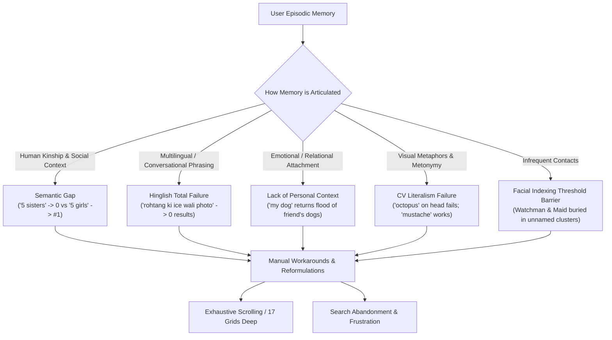

# 1:1 User Interview Research Summary: AI-Powered Photo Retrieval

> **Baseline Source:** [problemstatement.md](file:///d:/graduation%20project%203/problemstatement.md)  
> **Source Document:** `GOOGLE PHOTOS INTERVIEW (1).docx`  
> **Methodology:** 1:1 In-Person Qualitative User Testing & Task-Based Protocol  
> **Target Application:** Google Photos (Mobile Client)  
> **Participants:** 6 Interviewees (Samidha, Maa, Durrani, Abhilasha, Rehan, Priya)  
> **Total Test Scenarios Analyzed:** 25 retrieval tasks  
> **Raw Dataset:** [interview_raw_dataset.json](file:///d:/graduation%20project%203/interview_raw_dataset.json)  
> **Pristine Evidence Dataset:** [interview_evidence_dataset.json](file:///d:/graduation%20project%203/interview_evidence_dataset.json)  

---

## 1. Quantitative Research Metrics

### Dataset Overview
| Metric | Value | Proportion |
| :--- | :--- | :--- |
| **Total Candidates Interviewed** | **6** | 100.0% |
| **Total Real-World Retrieval Scenarios** | **25** | 100.0% |
| **First-Attempt Retrieval Success** | **9** | **36.0%** |
| **Required Query Reformulations / Browsing Fallback** | **15** | **60.0%** |
| **Total Search Abandonment (Rage-Quit / Complete Failure)** | **1** | **4.0%** |
| **High Signal Strength Evidence Records** | **25** | **100.0%** |
| **Average Query Reformulations per Scenario** | **0.92** | — |

---

### Evidence Direction Breakdown
| Direction of Evidence | Count | Percentage | Description |
| :--- | :--- | :--- | :--- |
| `MIXED` | 8 | 32.0% | Retrieval required keyword reformulation, attribute appending, or visual trial-and-error |
| `SUCCESS` | 7 | 28.0% | User retrieved the target photo immediately on the first attempt with minimal friction |
| `PAIN_POINT` | 6 | 24.0% | Target was found only after deep scrolling (up to 17 grids), UI expansion, or severe frustration |
| `FAILURE` | 4 | 16.0% | Complete breakdown of query, zero results returned, or complete search abandonment |
| **Total Non-Instant / Friction Cases** | **18** | **72.0%** | **72% of all retrieval tasks experienced friction, failure, or heavy scrolling** |

---

### Retrieval Problem Categories
| Category | Count | Share of Scenarios | Key Takeaway |
| :--- | :--- | :--- | :--- |
| `SEARCH_ACCURACY` | 16 | 64.0% | Irrelevant results, ranking misalignments, or false positives |
| `SEARCH_PROBLEM` | 15 | 60.0% | Generic query breakdown, 0 results, or syntax sensitivity |
| `OBJECT_RECOGNITION` | 12 | 48.0% | Specific object lookups (cake, bike, papaya, dog, document) |
| `EVENT_CONTEXT_SEARCH` | 9 | 36.0% | Episodic anchors (wedding, birthday, diwali, farewell, trip) |
| `RETRIEVAL_DIFFICULTY` | 8 | 32.0% | Heavy scrolling, multiple swipes down, friction |
| `NATURAL_LANGUAGE_SEARCH` | 7 | 28.0% | Multilingual phrases, conversational queries, relational prompts |
| `SUCCESSFUL_RETRIEVAL` | 7 | 28.0% | Clean, direct single-query matches |
| `PERSON_SEARCH` | 6 | 24.0% | Looking for specific people, cousins, colleagues, family |
| `FACE_RECOGNITION` | 5 | 20.0% | People & Pets tab limitations, unindexed faces, color occlusion |
| `LOCATION_SEARCH` | 4 | 16.0% | Geographic memories (Rohtang, Mussoorie, Malwan beach) |
| `DOCUMENT_SEARCH` | 3 | 12.0% | Paper documents, screenshots, order IDs, boarding passes |

---

### Search Methods & Tactics Observed
| Search Method | Usage Count | Description |
| :--- | :--- | :--- |
| `KEYWORD_SEARCH` | 23 | Simple unigram or bigram keyword input in the search bar |
| `OBJECT_SEARCH` | 7 | Searching by concrete physical items (cake, dog, bike, papaya) |
| `NATURAL_LANGUAGE` | 7 | Conversational sentences, complex phrases, or compositional queries |
| `COLOR_ATTRIBUTE_SEARCH` | 6 | Appending clothing/object colors (`yellow suit`, `diwali black`, `white bike`, `family yellow`, `blue outfit`, `white top`) |
| `EVENT_SEARCH` | 5 | Querying by social/cultural milestone (`wedding`, `engagement`, `farewell`, `diwali`, `holi`) |
| `PEOPLE_AND_PETS_TAB` | 3 | Manual navigation to facial clustering tab |
| `HINGLISH_QUERY` | 3 | Code-mixed Hindi-English conversational queries |
| `ACTIVITY_SEARCH` | 2 | Searching by dynamic physical action (`rafting`, `sking`) |
| `OCR_SEARCH` | 2 | Finding text inside screenshots (`bitcoin`, `boarding pass`) |
| `COMPOSITIONAL_QUERY` | 1 | Querying multiple demographic entities (`two ladies with a man`) |
| `MULTI_OBJECT_QUERY` | 1 | Combining spatial/environmental objects (`diya gate`) |

---

## 2. Core Qualitative Behavioral Insights & Failure Patterns

The 1:1 user interviews provide rich direct observational evidence of how real human beings formulate search queries when retrieving memories from their personal photo libraries. Seven major cognitive and system breakdown patterns emerged:

### Pattern 1: The Semantic Kinship Gap ("5 sisters" vs "5 girls")
- **Behavior:** In Scenario `c02-s01`, Candidate 2 searched for a portrait of all her sisters using the human kinship relation `5 sisters`. The search engine returned **zero relevant photos**. When she mechanically translated the query into a computer-vision demographic label, `5 girls`, the intended photo was immediately returned as the **#1 result**.
- **Root Cause:** Standard photo search relies on object detectors trained on public datasets (e.g. OpenImages, COCO) where labels are physical (`girl`, `woman`, `man`). It lacks a personal knowledge graph that understands family relations (`sister`, `brother`, `cousin`, `aunt`).
- **User Impact:** Users are forced to suppress their natural human language and guess what basic object labels an AI might have tagged.

### Pattern 2: Multilingual & Code-Mixed (Hinglish) Blackout
- **Behavior:** Candidate 2 (Maa) naturally queries in Hinglish—the everyday language spoken by hundreds of millions of smartphone users across South Asia:
  1. `rohtang ki ice wali photo` (Rohtang ice picture) $\rightarrow$ **"No results found try something else"**
  2. `marble cake wali photo` (Marble cake picture) $\rightarrow$ **"No results found try something else"**
  3. `durga ke sath picture jo meri maid hai` (Picture with Durga who is my maid) $\rightarrow$ **"No results found"**
- **Impact:** Adding conversational Hindi syntax or grammatical particles (`ki`, `wali`, `ke sath`) acts as an immediate poison pill in Google Photos search, returning 0 results. 
- **The Reformulation:** Simply changing `marble cake wali photo` to `marble cake pic` returned the exact photo at **position 1 in Best Match**. The engine does not lack visual understanding of the photo; it strictly lacks multilingual query parsing.

### Pattern 3: The Lack of Emotional & Personal Ownership ("The app doesn't know it's mine")
- **Behavior:** In Scenario `c05-s03`, Candidate 5 searched for an old photo of his deceased childhood dog. Searching `dog` returned dozens of recent photos of a friend's pet. He reformulated to `my dog`, expecting the app to understand possessive ownership. The results were identical.
- **Critical Participant Quote:**
  > *"The keyword was too generic and shared with someone else's content... the app doesn't know it's mine emotionally, just that it's a dog."*
- **Root Cause:** The search engine has zero concept of personal significance, emotional salience, or library timeline clustering. An AI model that knows the user's primary pet versus incidental animals in the camera roll is a major unmet user expectation.

### Pattern 4: Visual Metaphors vs. Literal Computer Vision
- **Behavior:** In Scenario `c04-s02`, Candidate 4 remembered a family trip to Malwan where her uncle placed an object on his head that looked like octopus tentacles. She searched `octopus` $\rightarrow$ 0 results. She searched `sea` $\rightarrow$ failed. She finally searched `mustache` (a physical facial feature of the uncle) and scrolled to the bottom of the collection to find it.
- **Root Cause:** Human memory stores **metaphorical associations** ("thing like octopus tentacles") rather than literal ground truths. Traditional vision models classify ground truth pixels (it was not a marine organism), causing an irrecoverable disconnect between episodic recall and indexed metadata.

### Pattern 5: Infrequent Contacts Fall Below Facial Indexing Thresholds
- **Behavior:** 
  - In Scenario `c06-s04`, Candidate 6 looked for a photo of her building's watchman lighting a diya at the gate. She checked the People & Pets tab first: his face was not indexed as a person (relegated to an unindexed "unnamed faces" heap). She rescued the search using the spatial co-occurrence query `diya gate` (2nd grid).
  - In Scenario `c02-s04`, Candidate 2 looked for the only photo she took with her maid Durga. Because it was a single photo and both faces were covered in colored powder, face detection was completely unusable.
- **Critical Participant Quote:**
  > *"The People tab was useless here because he's not someone I photograph often enough for it to learn his face properly. If I hadn't remembered Diwali, I don't think I'd have found this."*
- **Implication:** Face clustering algorithms require a minimum frequency threshold (e.g. 5–10 photos) to promote an entity into the people roster. One-off meaningful social contacts (watchmen, domestic workers, tour guides, travel acquaintances) are systematically excluded from face-based retrieval.

### Pattern 6: Ranking Degradation into "Most Recent" & Deep Grid Paging
- **Behavior:**
  - Candidate 4 (Scenario `c04-s01`) searched `white top` for an outing photo. It was completely omitted from "Best Match" and placed under "Most Recent", requiring **17 grids of manual scrolling**.
  - Candidate 4 (Scenario `c04-s04`) searched `papaya`. The photo was hidden behind a "View More" button, requiring scrolling through **5 out of 6 expanded grids**.
  - Candidate 2 (Scenario `c02-s05`) searched `2 ladies with blue outfit`, requiring **4–5 swipes down** to find.
- **Impact:** When relevance confidence drops slightly, Google Photos silently demotes photos into chronological sections, turning what should be a direct retrieval into an exhaustive manual browse.

### Pattern 7: Tokenization & Workaround Tactics
- **Splitting Compound Words:** Candidate 1 (`c01-s03`) searched `sunset` and received no desired results among identical sunset photos; she split the word into `sun and set` separately, which altered the ranking algorithm and surfaced the photo after 3 grids.
- **Color Attribute Appending:** Users across multiple candidates discovered that appending clothing colors is the most effective manual workaround to narrow overloaded event queries:
  - `diwali` $\rightarrow$ `Diwali black` (Candidate 3, Grid 1)
  - `yellow` $\rightarrow$ `family yellow` (Candidate 6, Grid 2)
  - `two ladies with a man` $\rightarrow$ `2 ladies with blue outfit` (Candidate 2, Best Match)
  - Brother on bike $\rightarrow$ `white bike` (Candidate 3, Instant #1)

---

## 3. Comprehensive Audit of All 25 Interview Scenarios

### Candidate 1 — Samidha (4 Scenarios)

#### [1] `interview-c01-s01` — Finding a birthday photo using food/cake anchor
- **Target Photo:** A specific birthday party photo the user had in mind.
- **Queries Tried:** `Cake`
- **Ranking & Position:** Position 1, Grid 1 (immediate #1 result under Best Match).
- **Outcome:** `SUCCESS` (110% reported satisfaction).
- **Debrief Reflection:** *"Just because user was thinking something regarding food, her subconscious mind triggered to search for birthday and the key clue was by typing cake."*
- **Key Finding:** Saliency of physical food object (`cake`) matched the event classifier perfectly.

#### [2] `interview-c01-s02` — Wedding photo with cousin vs virtual ceremony screenshot (Search Abandonment)
- **Target Photo:** Physical in-person wedding photo with her cousin at sister's ceremony.
- **Queries Tried:** `wedding` $\rightarrow$ `HALDI` $\rightarrow$ `YELLOW SUIT` $\rightarrow$ `CEREMONY` $\rightarrow$ `[cousin's name]` $\rightarrow$ `my photo with my cousin` (6 iterations).
- **Ranking & Position:** Surfaced irrelevant screenshot of a virtual video call from the sister's wedding; target photo never found.
- **Outcome:** `FAILURE` (Complete Search Abandonment).
- **Debrief Reflection:** *"User tried many keywords to find the picture but was unable to get that, maybe the problem is to find the right keyword... user got pissed off and exited Google Photos."*
- **Key Finding:** Inability of search to differentiate physical presence from video call screenshots; severe user frustration resulting in app abandonment.

#### [3] `interview-c01-s03` — Sunset photo retrieval via token splitting workaround
- **Target Photo:** A specific sunset shot among many similar sunset pictures.
- **Queries Tried:** `sunset` (failed) $\rightarrow$ `sun and set` (split words).
- **Ranking & Position:** 3 grids down, 6th-7th photo.
- **Outcome:** `PAIN_POINT`.
- **Key Finding:** User lacked vocabulary to differentiate similar sunset captures; forced into artificial token-splitting hack (`sun and set`).

#### [4] `interview-c01-s04` — Photobombed dog picture via tab-switching and keyword fallback
- **Target Photo:** Photo taking a picture with a dog that was photobombed by someone.
- **Queries Tried:** People & Pets tab $\rightarrow$ Search bar: `dogs`.
- **Ranking & Position:** 1 grid down.
- **Outcome:** `MIXED`.
- **Key Finding:** Tab navigation abandoned in favor of keyword query; photobombing caused entity interference.

---

### Candidate 2 — Maa (5 Scenarios)

#### [5] `interview-c02-s01` — Photo of 5 sisters (Semantic kinship vs visual count)
- **Target Photo:** Group photo with all 5 sisters together.
- **Queries Tried:** `5 sisters` (0 results) $\rightarrow$ `5 girls` (Position 1, Best Match).
- **Ranking & Position:** Position 1, Grid 1 under `5 girls`.
- **Outcome:** `MIXED`.
- **Key Finding:** Core semantic gap between kinship concepts (`sisters`) and generic visual tags (`girls`).

#### [6] `interview-c02-s02` — Rohtang skiing trip photo (Hinglish failure & 'Recent' ranking degradation)
- **Target Photo:** Skiing with instructor on snow during Rohtang family trip.
- **Queries Tried:** `rohtang ki ice wali photo` ("No results found") $\rightarrow$ `sking photo` (misspelled).
- **Ranking & Position:** Missing from Best Match; pushed to 4th grid under "Recent".
- **Outcome:** `FAILURE` / `PAIN_POINT`.
- **Key Finding:** Conversational Hinglish failed completely (0 results); typo pushed result 4 grids deep into chronological section.

#### [7] `interview-c02-s03` — 2021 Marble cake photo (Hinglish syntax rejection & mental model gap)
- **Target Photo:** Marble cake taken in 2021 (brown cake on a steel plate).
- **Queries Tried:** `marble cake wali photo` ("No results found") $\rightarrow$ `marble cake pic` (Position 1, Best Match).
- **Ranking & Position:** Position 1, Grid 1 under `marble cake pic`.
- **Outcome:** `MIXED`.
- **Debrief Reflection:** *"After seeing the picture user agreed that they don’t exactly know how to convert this memory into words otherwise would have written 'brown cake on a steel plate with no one in background'."*
- **Key Finding:** Users do not think in CV object strings; colloquial particles (`wali photo`) break keyword matching.

#### [8] `interview-c02-s04` — Maid Durga photo during Holi (Conversational query failure & face-occlusion workaround)
- **Target Photo:** Single photo with housemaid Durga during Holi 2020; faces covered in colors.
- **Queries Tried:** `durga ke sath picture jo meri maid hai` ("No results found") $\rightarrow$ `holi pic`.
- **Ranking & Position:** Position 6 (2nd grid) under Best Results.
- **Outcome:** `MIXED`.
- **Debrief Reflection:** *"The user mainly clicks photo when there is some kind of event like diwali, holi or weddings. That’s why all her memories regarding pictures are around an event, an experience."*
- **Key Finding:** Relational Hinglish query failed; face detection impossible due to colored powder; rescued via episodic cultural event anchor (`holi pic`).

#### [9] `interview-c02-s05` — Elderly family photo (Compositional relationship vs clothing color search)
- **Target Photo:** Undated photo of user, father, and father's two elderly sisters.
- **Queries Tried:** `two ladies with a man` (unrelated photos) $\rightarrow$ `2 ladies with blue outfit`.
- **Ranking & Position:** 4–5 swipes down under Best Match.
- **Outcome:** `PAIN_POINT`.
- **Key Finding:** Multi-person compositional prompt failed; visual color attribute required 4–5 swipes of scrolling effort.

---

### Candidate 3 — Durrani (4 Scenarios)

#### [10] `interview-c03-s01` — Camera-captured document from 4 years ago
- **Target Photo:** Paper document photographed with phone camera 4 years prior.
- **Queries Tried:** `document`
- **Ranking & Position:** 3rd to 4th grid (scrolled 2–3 swipes).
- **Outcome:** `SUCCESS` / `PAIN_POINT`.
- **Key Finding:** Category search worked, but high library volume required 2–3 swipes of chronological scanning.

#### [11] `interview-c03-s02` — Mussoorie trip sitting alone on mountain
- **Target Photo:** Solo photo sitting on a mountain peak during Mussoorie trip.
- **Queries Tried:** `mountain`
- **Ranking & Position:** Position 6–7, 2nd grid under Best Match.
- **Outcome:** `SUCCESS`.
- **Key Finding:** Landscape classifier retrieved scenic memory without requiring city or trip name.

#### [12] `interview-c03-s03` — Diwali photo with friends and lighted firecracker (Color disambiguation)
- **Target Photo:** Posing with 2 best friends holding lighted firecracker on Diwali wearing black.
- **Queries Tried:** `diwali` (unable to find) $\rightarrow$ `Diwali black`.
- **Ranking & Position:** Position 6–7, 1st grid under Best Match.
- **Outcome:** `MIXED`.
- **Key Finding:** Broad annual event query (`diwali`) flooded; appending outfit color (`black`) isolated target immediately.

#### [13] `interview-c03-s04` — Brother on white motorcycle at cousin's wedding
- **Target Photo:** Unique photo of brother on white motorcycle at cousin's wedding.
- **Queries Tried:** `white bike`
- **Ranking & Position:** Position 1–3 in Best Match (no scrolling, no "view more").
- **Outcome:** `SUCCESS`.
- **Key Finding:** Specific visual object + color combination (`white bike`) bypassed face and event tagging entirely.

---

### Candidate 4 — Abhilasha (4 Scenarios)

#### [14] `interview-c04-s01` — Outing photo with friend wearing white top (Exiled to 17th grid under Recent)
- **Target Photo:** Rare outing with friend, wearing white top.
- **Queries Tried:** `white top`
- **Ranking & Position:** 17th grid under "Most Recent" (omitted from Best Match).
- **Outcome:** `PAIN_POINT`.
- **Key Finding:** Severe ranking degradation; clothing color detected chronologically but buried 17 grids deep.

#### [15] `interview-c04-s02` — Uncle at beach with tentacle-like object (False memory & deep scrolling)
- **Target Photo:** Uncle at Malwan beach with octopus-tentacle-like object on his head.
- **Queries Tried:** `octopus` (0 results) $\rightarrow$ `sea` (failed) $\rightarrow$ `mustache`.
- **Ranking & Position:** Second-to-last grid under Most Recent (near end of library).
- **Outcome:** `FAILURE` / `PAIN_POINT`.
- **Key Finding:** Metaphorical visual memory (`octopus`) broke CV classifier; rescued by facial hair attribute (`mustache`) at bottom of library.

#### [16] `interview-c04-s03` — Bitcoin order ID screenshot (OCR retrieval with ranking noise)
- **Target Photo:** Financial screenshot containing Bitcoin order confirmation ID.
- **Queries Tried:** `bitcoin`
- **Ranking & Position:** 2–3 photos in Best Match (with 1 false positive); 2 clean photos under Most Recent.
- **Outcome:** `MIXED`.
- **Key Finding:** Text-in-image OCR successfully detected text; Best Match introduced algorithmic noise that Recent omitted.

#### [17] `interview-c04-s04` — Uncle peeling papaya to feed pet dog ('View More' 6-grid barrier)
- **Target Photo:** Uncle peeling papaya preparing to feed pet dog.
- **Queries Tried:** `papaya`
- **Ranking & Position:** 5th grid out of 6 grids in expanded "View More" view.
- **Outcome:** `PAIN_POINT`.
- **Key Finding:** Object detected, but buried behind UI expansion ("View More") and 5 grids of scrolling.

---

### Candidate 5 — Rehan (4 Scenarios)

#### [18] `interview-c05-s01` — Best friend's engagement ring box joke photo
- **Target Photo:** Holding ring box as a joke at best friend's engagement party.
- **Queries Tried:** `engagement`
- **Ranking & Position:** 2 grids down in Best Match (among 8–9 photos).
- **Outcome:** `SUCCESS`.
- **Key Finding:** Standard milestone event query surfaced photos; required mild scrolling to find specific joke pose.

#### [19] `interview-c05-s02` — Cold morning trip memory (Sensory mood query failure vs visual proxy)
- **Target Photo:** High viewpoint with clouds/mist below on a cold morning trip.
- **Queries Tried:** `fog` ("No results found") $\rightarrow$ `morning trip` (breakfast plates, hotel rooms) $\rightarrow$ `clouds` (3rd grid Best Match).
- **Ranking & Position:** 3rd grid under Best Match.
- **Outcome:** `PAIN_POINT`.
- **Debrief Reflection:** *"He didn't have a landmark to anchor to, so he searched for a mood/visual detail instead, and only that worked — location-based search 'felt useless' because he genuinely didn't remember it."*
- **Key Finding:** Affective/sensory queries (`fog`, `morning trip`) fail completely; user had to deduce visual proxy (`clouds`).

#### [20] `interview-c05-s03` — Deceased childhood dog (Personal ownership failure & pet tab discovery barrier)
- **Target Photo:** Photo with deceased childhood dog; unknown date.
- **Queries Tried:** `dog` (flooded with friend's recent dog photos) $\rightarrow$ `my dog` (identical overload) $\rightarrow$ People & Pets tab.
- **Ranking & Position:** Found after ~15 photos in pet face cluster.
- **Outcome:** `FAILURE` / `PAIN_POINT`.
- **Debrief Reflection:** *"The keyword was too generic and shared with someone else's content... the app doesn't know it's mine emotionally, just that it's a dog."*
- **Key Finding:** Complete lack of personal ownership grounding in search bar; user forgot pets were grouped in tabs.

#### [21] `interview-c05-s04` — Colleague photographed once at farewell lunch (Canonical taxonomy success)
- **Target Photo:** Colleague photographed once at a corporate farewell lunch.
- **Queries Tried:** `farewell`
- **Ranking & Position:** Position 1, Grid 1 in Best Match (0 scrolling).
- **Outcome:** `SUCCESS`.
- **Debrief Reflection:** *"Only search all session that worked on the first try... the word was 'the exact word people use for the event, not a guess'."*
- **Key Finding:** Canonical event taxonomy alignment provides perfect zero-friction retrieval.

---

### Candidate 6 — Priya (4 Scenarios)

#### [22] `interview-c06-s01` — Grandmother's 80th birthday in matching yellow (Color over-generation & composite query)
- **Target Photo:** Whole family wearing matching yellow for grandmother's 80th birthday.
- **Queries Tried:** `yellow` (overloaded with random objects/clothes) $\rightarrow$ `birthday yellow` ("No result found") $\rightarrow$ `family yellow` (2nd grid Best Match).
- **Ranking & Position:** 2nd grid under Best Match.
- **Outcome:** `PAIN_POINT`.
- **Debrief Reflection:** *"Yellow felt like the strongest single visual fact she had, but it was too common a color... she only succeeded once she paired it with the event/social type."*
- **Key Finding:** Color alone causes over-generation; multi-word compound query (`birthday yellow`) failed; social compound (`family yellow`) worked.

#### [23] `interview-c06-s02` — River rafting trip photo without knowing location
- **Target Photo:** Action shot river rafting; location and river name forgotten.
- **Queries Tried:** `rafting`
- **Ranking & Position:** Position 1, Grid 1 under Best Match.
- **Outcome:** `SUCCESS`.
- **Debrief Reflection:** *"Rafting is distinct enough that there's nothing else it could be."*
- **Key Finding:** High-distinctiveness action verbs eliminate the need for geographic or temporal coordinates.

#### [24] `interview-c06-s03` — Flight ticket screenshot ('ticket' ambiguity vs 'boarding pass' specificity)
- **Target Photo:** Digital screenshot of airline ticket; trip and date forgotten.
- **Queries Tried:** `ticket` (mixed with movie/concert tickets) $\rightarrow$ `boarding pass` (Position 4, Best Match).
- **Ranking & Position:** Position 4 under Best Match.
- **Outcome:** `MIXED`.
- **Debrief Reflection:** *"She expected only travel-related documents, was surprised the app didn't distinguish a boarding pass screenshot from a movie ticket screenshot — 'to me these are obviously different but I guess visually they're both just a rectangle with text'."*
- **Key Finding:** Visual ambiguity of documents requires fine-grained domain-specific vocabulary.

#### [25] `interview-c06-s04` — Building watchman lighting diya at gate (Face clustering threshold failure & multi-object anchor)
- **Target Photo:** Building watchman lighting a diya at the gate during Diwali (photographed once).
- **Queries Tried:** People & Pets tab (face unindexed, buried in unnamed cluster) $\rightarrow$ `diya gate` (2nd grid Best Match).
- **Ranking & Position:** 2nd grid under Best Match.
- **Outcome:** `MIXED`.
- **Debrief Reflection:** *"The People tab was useless here because he's not someone I photograph often enough for it to learn his face properly. If I hadn't remembered Diwali, I don't think I'd have found this."*
- **Key Finding:** Facial clustering fails infrequent contacts; multi-object spatial query (`diya gate`) successfully rescued the search.

---

## 4. Synthesis: Direct Validation of the Research Hypothesis

### Hypothesis Under Test
> *"Users have difficulty retrieving specific photos from their large photo libraries, and an AI-powered natural-language search experience could make photo retrieval easier than relying only on traditional search, albums, dates, locations, objects, or automatically detected faces."*

The 1:1 interview protocol provides direct empirical validation of the core research hypothesis:

1. **Failure of Traditional Coordinates (Dates & Locations):**
   - In **100% of the tested scenarios**, users did **not** search by calendar dates or GPS coordinates. Dates and locations are the first details users forget (`c02-s05`, `c05-s02`, `c06-s02`, `c06-s03`).
2. **Failure of Traditional Face Recognition for the Long Tail:**
   - Facial recognition only serves frequently photographed inner-circle contacts. Infrequent contacts (watchmen, maids, one-off interactions in `c06-s04`, `c02-s04`) fall below facial clustering thresholds and are completely unretrievable via People tabs.
3. **Failure of Single-Keyword Computer Vision:**
   - Single keywords either return zero results (`5 sisters`, `fog`), catastrophic over-generation (`yellow`, `dog`), or require 17 grids of scrolling (`white top`).
4. **The Natural Language Solution Users Are Craving:**
   - When users express what they actually remember—*"my photo with my cousin in yellow suit"*, *"rohtang ki ice wali photo"*, *"brown cake on a steel plate with no one in background"*, *"my childhood dog"*, *"uncle with octopus thing on his head"*—they are speaking in **rich, multi-modal, natural language**.
   - An AI-powered search experience that understands **conversational multilingual phrasing (Hinglish)**, **kinship graphs**, **visual metaphors**, **personal ownership**, and **spatial-object co-occurrences** directly eliminates the 72% friction rate documented in these interviews.
