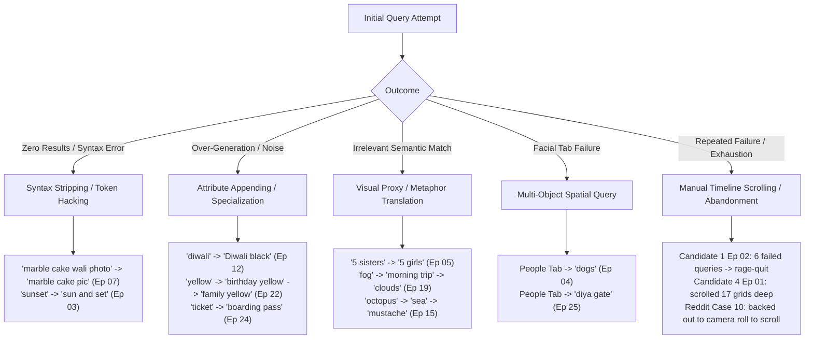

# Part 1 — Combined Evidence Base

## 1. Purpose

The purpose of this document is to establish a unified, empirical evidence base specifically for **Part 1: Build an AI-Powered Discovery Engine**. 

Before defining any memory representation schema, data model, or retrieval mechanism, this document consolidates and analyzes observed user memory and retrieval behaviors across all available research sources. Its focus is exclusively descriptive and analytical:
- Identifying what human beings remember when attempting to find an old photograph in their personal archives.
- Analyzing how remembered clues are translated into search expressions, where those expressions succeed, and where they diverge from the underlying memory.
- Documenting the properties of remembered information (approximation, uncertainty, incompleteness, relational structures, and multi-modal contexts).
- Examining the behavioral trajectories of search reformulation, deep browsing, and visual recognition.
- Establishing the boundaries, differences, and gaps across research methodologies.

> [!IMPORTANT]
> **Strict Analytical Constraints Applied:**
> - This document does **not** propose product features, user interface wireframes, or system architectures.
> - It does **not** specify retrieval algorithms, indexing pipelines, or ranking functions.
> - It does **not** declare a single "root problem" or claim that any specific information representation will solve personal photo retrieval.
> - It separates observed behavioral actions from participants' subjective explanations and inferences.
> - It does **not** derive the Memory Representation Schema; rather, it provides the consolidated empirical evidence from which that schema must subsequently be derived.

---

## 2. Source Files Used

This consolidated evidence base synthesizes data exclusively from three primary research artifacts:

### Source 1: `research_summary.md` (Play Store + Reddit Research Evidence)
- **Scope & Datasets:** 1,456 raw Google Play Store reviews (`com.google.android.apps.photos`) and 52 raw Reddit community posts/threads (`reddit reviews .docx`, r/googlephotos).
- **Filtered Pristine Evidence:** 61 verified retrieval-specific records (23 Play Store, 38 Reddit).
- **Nature of Evidence:** Unsolicited public feedback, longitudinal personal library usage (10,000 to 60,000+ photos spanning 5–15 years), bug investigations, update regressions (introduction of Ask Photos / Gemini search), safety filter drops, and in-image OCR workflows.

### Source 2: `interview_research_summary.md` (1:1 Interview Research Synthesis)
- **Scope & Participants:** 6 diverse smartphone users (Samidha, Maa, Durrani, Abhilasha, Rehan, Priya) evaluated across 25 real-world retrieval tasks on their personal devices in Google Photos.
- **Aggregated Outcomes:** 9 first-attempt retrievals (36.0%), 15 required query reformulations or browsing fallbacks (60.0%), and 1 complete search abandonment (4.0%).
- **Nature of Evidence:** Direct behavioral observation of search formulation, query reformulation paths, code-mixed multilingual (Hinglish) syntax, emotional and kinship expectations, facial indexing threshold limits, and deep grid scrolling.

### Source 3: `interview_behavioral_episodes.md` (Episode-Level Behavioral Evidence)
- **Scope:** Detailed, step-by-step behavioral audit of all 25 individual retrieval episodes (Episodes 01 to 25).
- **Granularity:** Documents exact remembered clues prior to searching, initial search expressions, every intermediate reformulation attempt, exact on-screen visual returns, scroll depths (e.g., 17 grids deep, 5 of 6 expanded grids), workarounds used, participant verbatim debrief quotes, and evaluation against a six-stage retrieval failure framework (`Memory` $\rightarrow$ `Search Expression` $\rightarrow$ `Interpretation` $\rightarrow$ `Retrieval` $\rightarrow$ `Ranking/Presentation` $\rightarrow$ `Navigation/Recognition`).

---

## 3. Evidence Source Differences

The three research sources provide complementary but structurally distinct lenses into user memory and retrieval behavior. Treating unsolicited reviews and in-person interviews as interchangeable distorts the behavioral reality.

| Dimension | Google Play Store (`research_summary.md`) | Reddit Community (`research_summary.md`) | 1:1 In-Person Interviews (`interview_research_summary.md` & `interview_behavioral_episodes.md`) |
| :--- | :--- | :--- | :--- |
| **Data Collection Modality** | Unsolicited public consumer app store reviews; reactive, short-to-medium text. | Unsolicited technical forum posts and discussion threads; long-form, investigative. | In-person qualitative user testing with real-time observation, task protocols, and post-task debriefs. |
| **User Library Context** | General smartphone population; personal mobile libraries; broad range of digital literacy. | Technical power users, hobbyist photographers, large archives (20,000 to 50,000+ photos). | Everyday users interacting directly with their authentic, live smartphone photo galleries. |
| **Primary Focus of Reports** | High-level system breakdowns, broken updates, face clustering errors, timeline navigation failures. | Deep technical analysis, multi-device reproduction, OCR tracking, artificial recall truncation ("few photos" bug), safety censorship. | Real-time cognitive translation from episodic memory into query strings; micro-reformulation; vernacular phrasing; scrolling friction. |
| **Visibility of Cognitive Memory** | **Low:** Users report the failed query or general outcome, rarely detailing what they remembered prior to typing. | **Medium:** Users document specific intended queries and expected image sets, but focus primarily on system response anomalies. | **High:** Explicit separation of what the user recalled in their mind versus what they chose to type into the search box. |
| **Attitude Toward AI / Conversational Search** | Highly critical of intrusive updates; complaints about loss of simple keyword or folder navigation. | Strongly hostile to conversational chatbot replacement of search; reports of query hijacking and hallucinated refusals (*"I can't help with that"*). | Instinctive expectation that the system should understand conversational, familial, and contextual phrases (`5 sisters`, `my dog`, `durga ke sath picture jo meri maid hai`). |
| **Recall vs. Precision Manifestation** | Users report either unranked floods of photos or missing dates. | Focus on **under-retrieval truncation** (e.g., Ask Photos returning only 6 birds out of 400+). | Focus on **ranking demotion and over-generation** (targets buried 17 grids deep under "Recent" or flooded with unrelated matches). |
| **Key Methodological Bias** | Negative selection bias (users review when frustrated or after an update breaks their routine). | Power-user selection bias (skewed toward massive archives, high-frequency photography, and edge-case indexing). | Observer effect / task artificiality (prompts may encourage search bar attempts over passive timeline browsing). |

### Key Source Discrepancies Observed in the Evidence
1. **Hostility to AI vs. Conversational Mental Models:** While Reddit and Play Store users explicitly reject conversational search ("give us back classic search"), interview participants routinely formulate queries in conversational, relational, natural language. The unsolicited evidence reflects backlash against an implementation that truncates results and destroys chronology, whereas interview evidence reveals that users naturally think in descriptive, multi-modal sentences.
2. **Recall Truncation vs. Deep Grid Paging:** Reddit power users experience artificial result truncation ("6-photo ceiling" on Ask Photos), whereas interview participants using standard mobile search encounter unranked floods where target photos are relegated to the 4th, 5th, or 17th grid under "Most Recent".

---

## 4. What Users Remember

Across all three sources, human episodic memory does not index personal photographs using technical metadata (file formats, pixel dimensions, exact timestamps, or folder paths). Instead, users recall rich, multi-layered episodic fragments.

The evidence identifies ten distinct classes of remembered information:

### 1. Salient Physical Props and Distinctive Objects
- **Evidence Source:** 1:1 Interviews (`interview_behavioral_episodes.md`: Ep 01, 13, 17, 18, 25); Reddit (`research_summary.md`: Case 3, 4, 11).
- **Observed User Behavior:** When thinking of an event, users frequently anchor their recall to a single, highly salient physical item present in the scene rather than the overall event name or date.
- **Example Evidence:**
  - Candidate 1, Ep 01: Remembered a birthday celebration by anchoring entirely on the physical food item: `"birthday photo"`, `"Cake"`.
  - Candidate 3, Ep 13: Remembered brother at cousin's wedding specifically via his vehicle: `"brother who was in a bike that too of white colour"`.
  - Candidate 4, Ep 17: Remembered uncle feeding a dog by the food item being prepared: `"peeling papaya"`, `"feed his pet dog"`.
  - Candidate 5, Ep 18: Remembered an engagement party through a specific comedic prop: `"holding the ring box for a joke photo"`.
  - Candidate 6, Ep 25: Remembered building watchman via the ceremonial object and architectural element: `"diya at the gate"`.
  - Reddit Case 11: Remembered commercial fleet photography by vehicle type and color: `"yellow truck"`, `"banana yellow"`.
- **Nature of Information:** Explicitly recalled; highly specific; concrete physical entities.
- **Representation Type:** Exact entity with visual/color attributes.

### 2. Episodic Rituals and Cultural Milestones
- **Evidence Source:** 1:1 Interviews (`interview_behavioral_episodes.md`: Ep 02, 08, 12, 21, 22); Play Store (`research_summary.md`: Case 10).
- **Observed User Behavior:** Users organize life events around cultural, social, or corporate milestones, recalling sub-rituals within those milestones.
- **Example Evidence:**
  - Candidate 1, Ep 02: Recalled sister's multi-day wedding through specific sub-rituals: `"wedding"`, `"HALDI"`, `"CEREMONY"`.
  - Candidate 2, Ep 08: Recalled interaction with domestic worker specifically anchored to a cultural festival: `"Holi 2020"`.
  - Candidate 3, Ep 12: Recalled friends gathering anchored to a holiday activity: `"diwali"`, `"firecracker lighted in their hands"`.
  - Candidate 5, Ep 21: Recalled a one-off encounter with a colleague via a corporate departure event: `"farewell lunch"`.
  - Candidate 6, Ep 22: Recalled a family gathering via an age milestone: `"grandmother's 80th birthday"`.
  - Reddit Case 10: Recalled a 4-day travel event centered around sister's wedding rehearsal and ceremony.
- **Nature of Information:** Explicitly recalled; structured hierarchically (broad event $\rightarrow$ specific sub-ceremony/activity).
- **Representation Type:** Contextual and episodic; event-bound.

### 3. Kinship, Social Relationships, and Roles
- **Evidence Source:** 1:1 Interviews (`interview_behavioral_episodes.md`: Ep 02, 05, 08, 09, 13, 14, 17, 21, 25); Reddit (`research_summary.md`: Case 8, 9, 10).
- **Observed User Behavior:** Users recall people by their social, familial, or organizational relationship to the user, rather than by proper names or objective demographic categories.
- **Example Evidence:**
  - Candidate 2, Ep 05: Remembered portrait of siblings as `"5 sisters"`.
  - Candidate 1, Ep 02: Remembered physical presence with `"cousin"`.
  - Candidate 2, Ep 08: Remembered domestic staff by role: `"durga ke sath picture jo meri maid hai"`.
  - Candidate 2, Ep 09: Remembered family elders as `"two ladies with a man"`, `"father and father's two elderly sisters"`.
  - Candidate 5, Ep 21: Remembered work acquaintance by professional role: `"colleague"`.
  - Candidate 6, Ep 25: Remembered residential staff: `"watchman"`.
  - Reddit Case 8: Remembered new family arrival: `"new grandchild born last month"`.
  - Reddit Case 10: Remembered family connection: `"nephew"`.
- **Nature of Information:** Explicitly recalled; relational; subjective to the user's personal life graph.
- **Representation Type:** Relational and social knowledge graph.

### 4. Clothing Color and Visual Appearance
- **Evidence Source:** 1:1 Interviews (`interview_behavioral_episodes.md`: Ep 02, 06, 09, 12, 13, 14, 15, 22); Play Store / Reddit (`research_summary.md`: Case 11, 12).
- **Observed User Behavior:** When spatial or event details are insufficient to locate a photo, users vividly recall what people were wearing, specific colors, or physical facial traits.
- **Example Evidence:**
  - Candidate 1, Ep 02: Recalled wearing a `"YELLOW SUIT"` at wedding.
  - Candidate 2, Ep 09: Recalled clothing color of elderly relatives: `"2 ladies with blue outfit"`.
  - Candidate 3, Ep 12: Recalled friends' coordinated attire: `"Diwali black"`.
  - Candidate 3, Ep 13: Recalled vehicle hue: `"bike that too of white colour"`.
  - Candidate 4, Ep 14: Recalled outing attire: `"white top"`.
  - Candidate 4, Ep 15: Recalled facial hair when prop memory failed: `"mustache"`.
  - Candidate 6, Ep 22: Recalled coordinated family theme: `"matching yellow"`.
  - Reddit Case 12: Recalled physical body stance: `"picture of myself with my arms crossed"`.
- **Nature of Information:** Explicitly recalled visual percepts; high human memory salience.
- **Representation Type:** Exact to approximate visual attributes.

### 5. Dynamic Activities and Bodily Actions
- **Evidence Source:** 1:1 Interviews (`interview_behavioral_episodes.md`: Ep 06, 12, 17, 18, 23, 25); Reddit (`research_summary.md`: Case 12).
- **Observed User Behavior:** Users recall active verbs—what people were physically doing—rather than static scene classifications.
- **Example Evidence:**
  - Candidate 2, Ep 06: Recalled physical winter sport: `"sking with instructor on snow"`.
  - Candidate 3, Ep 12: Recalled dynamic physical interaction: `"firecracker lighted in their hands"`.
  - Candidate 4, Ep 17: Recalled physical food preparation: `"peeling papaya"`, `"feed his pet dog"`.
  - Candidate 5, Ep 18: Recalled staging a comedic action: `"holding the ring box for a joke"`.
  - Candidate 6, Ep 23: Recalled water adventure sport: `"river rafting"`.
  - Candidate 6, Ep 25: Recalled ritual physical action: `"lighting a diya at the gate"`.
  - Reddit Case 12: Recalled physical body configuration: `"arms crossed"`.
- **Nature of Information:** Explicitly recalled; dynamic physical interaction.
- **Representation Type:** Action/verb and posture representation.

### 6. Personal Ownership and Affective Attachment
- **Evidence Source:** 1:1 Interviews (`interview_behavioral_episodes.md`: Ep 20); Reddit (`research_summary.md`: Case 9).
- **Observed User Behavior:** Users remember entities with a sense of possessive ownership and personal significance, distinguishing their own primary belongings/pets from incidental ones.
- **Example Evidence:**
  - Candidate 5, Ep 20: Recalled deceased family pet: `"childhood dog who passed away"`. Stated: *"The app doesn't know it's mine emotionally, just that it's a dog."*
  - Reddit Case 9: User tracked registered household pets with thousands of photos indexed to their faces.
- **Nature of Information:** Relational, emotional, personal boundary definition.
- **Representation Type:** Relational ownership (`my pet` vs. `third-party pet`).

### 7. Sensory Mood, Weather, and Atmospheric Ambience
- **Evidence Source:** 1:1 Interviews (`interview_behavioral_episodes.md`: Ep 19).
- **Observed User Behavior:** In the absence of distinct landmarks or locations, users remember atmospheric sensations (temperature, fog, lighting).
- **Example Evidence:**
  - Candidate 5, Ep 19: Remembered morning scenery through sensory qualities: `"early morning, foggy, cold"`, `"high viewpoint with clouds/mist below on a cold morning trip"`. Debrief: *"He didn't have a landmark to anchor to, so he searched for a mood/visual detail instead... location-based search 'felt useless' because he genuinely didn't remember it."*
- **Nature of Information:** Explicitly recalled sensory/affective experience; vague visual boundaries.
- **Representation Type:** Atmospheric, environmental, and sensory state.

### 8. Metaphorical Associations and Visual Resemblances
- **Evidence Source:** 1:1 Interviews (`interview_behavioral_episodes.md`: Ep 15).
- **Observed User Behavior:** Memory encodes subjective impressions of how an unfamiliar object appeared, rather than its literal taxonomy.
- **Example Evidence:**
  - Candidate 4, Ep 15: Recalled an uncle balancing an unknown object on his head at the beach, encoding it as: `"thing like octopus’s tentacles"`.
- **Nature of Information:** Metaphorical, subjective perceptual encoding (the physical object was not a marine cephalopod).
- **Representation Type:** Fuzzy visual resemblance / metaphorical shape association.

### 9. Literal In-Image Text and Document Types
- **Evidence Source:** Reddit (`research_summary.md`: Case 5, 6); 1:1 Interviews (`interview_behavioral_episodes.md`: Ep 10, 16, 24).
- **Observed User Behavior:** For utility images, receipts, documents, memes, and tickets, users remember literal words printed on the surface or specific transactional document categories.
- **Example Evidence:**
  - Reddit Case 5: Remembered insurance provider name on printed bill: `"Progressive"`.
  - Reddit Case 6: Remembered exact text quote in a saved meme: `"I love being a man"`.
  - Candidate 4, Ep 16: Remembered financial confirmation token: `"order id"`, `"bitcoin"`.
  - Candidate 6, Ep 24: Remembered travel document type: `"flight ticket"`, `"boarding pass"`.
  - Candidate 3, Ep 10: Remembered physical capture format: `"document"`, `"taken a picture by camera"`.
- **Nature of Information:** Explicitly recalled literal strings or functional document genres.
- **Representation Type:** Exact lexical string / OCR token and document schema.

### 10. Temporal Landmarks and Co-occurrence Anchors
- **Evidence Source:** 1:1 Interviews (`interview_behavioral_episodes.md`: Ep 03, 07, 08, 10); Reddit (`research_summary.md`: Case 7, 10).
- **Observed User Behavior:** Users rarely recall calendar timestamps; instead, they recall approximate temporal eras, years, or relative proximity to other memorable events.
- **Example Evidence:**
  - Candidate 1, Ep 03: Remembered a sunset photo was taken `"near the actual one with a event memory"`.
  - Candidate 2, Ep 07: Remembered year of homemade bake: `"2021"`.
  - Candidate 2, Ep 08: Remembered year of festival during pandemic lockdown: `"2020"`.
  - Candidate 3, Ep 10: Remembered approximate elapsed time: `"4 years ago"`.
  - Reddit Case 7: Remembered child's infancy by month/year block: `"July 2016"`.
- **Nature of Information:** Approximate, relative, coarse-grained temporal anchors.
- **Representation Type:** Relative temporal intervals and event-co-occurrence graphs.

---

## 5. What Users Express in Search

When users interact with a search bar, the rich internal memory documented in Section 4 undergoes substantial filtering, compression, or adaptation.

### Observed Query Modalities Across Sources

```
                                  ┌─────────────────────────────────────────┐
                                  │      HOW USERS EXPRESS MEMORIES         │
                                  └─────────────────────────────────────────┘
                                                       │
         ┌─────────────────────────┬───────────────────┴───────────────────┬─────────────────────────┐
         ▼                         ▼                                       ▼                         ▼
┌───────────────────┐    ┌───────────────────┐                   ┌───────────────────┐    ┌───────────────────┐
│ SINGLE KEYWORDS   │    │ ATTRIBUTE-MODIFIED│                   │ CONVERSATIONAL /  │    │ LITERAL OCR /     │
│ (CV NOUNS / VERBS)│    │ COMPOUNDS         │                   │ MULTILINGUAL      │    │ DOCUMENT TOKENS   │
├───────────────────┤    ├───────────────────┤                   ├───────────────────┤    ├───────────────────┤
│ • "Cake" (Ep 01)  │    │ • "white bike"    │                   │ • "rohtang ki ice │    │ • "Progressive"   │
│ • "mountain"      │    │   (Ep 13)         │                   │   wali photo"     │    │   (Reddit Case 5) │
│   (Ep 11)         │    │ • "Diwali black"  │                   │   (Ep 06)         │    │ • "bitcoin"       │
│ • "papaya" (Ep 17)│    │   (Ep 12)         │                   │ • "5 sisters"     │    │   (Ep 16)         │
│ • "engagement"    │    │ • "family yellow" │                   │   (Ep 05)         │    │ • "boarding pass" │
│   (Ep 18)         │    │   (Ep 22)         │                   │ • "durga ke sath  │    │   (Ep 24)         │
│ • "farewell"      │    │ • "yellow truck"  │                   │   picture jo meri │    │ • "I love being   │
│   (Ep 21)         │    │   (Reddit Case 11)│                   │   maid hai" (Ep08)│    │   a man" (Case 6) │
│ • "rafting" (Ep23)│    │ • "diya gate"     │                   │ • "arms crossed"  │    │                   │
│                   │    │   (Ep 25)         │                   │   (Reddit Case 12)│    │                   │
└───────────────────┘    └───────────────────┘                   └───────────────────┘    └───────────────────┘
```

#### 1. Single-Word Canonical Nouns, Verbs, or Event Names
- **Pattern:** The user strips away all context, emotion, and temporal details, entering a single high-level term.
- **Evidence:**
  - `Cake` (Candidate 1, Ep 01)
  - `document` (Candidate 3, Ep 10)
  - `mountain` (Candidate 3, Ep 11)
  - `papaya` (Candidate 4, Ep 17)
  - `engagement` (Candidate 5, Ep 18)
  - `farewell` (Candidate 5, Ep 21)
  - `rafting` (Candidate 6, Ep 23)
- **Observed Behavior:** Highly effective when the term represents an exceptionally distinct action (`rafting`) or a canonical organizational milestone (`farewell`). Catastrophically ambiguous when the noun is common (`dog`, `document`, `yellow`).

#### 2. Attribute-Modified Compound Queries
- **Pattern:** Users combine an object or event noun with a specific visual attribute (typically color) to constrain candidate results.
- **Evidence:**
  - `Diwali black` (Candidate 3, Ep 12: event + clothing color)
  - `white bike` (Candidate 3, Ep 13: color + object)
  - `2 ladies with blue outfit` (Candidate 2, Ep 09: count/gender + color)
  - `family yellow` (Candidate 6, Ep 22: social group + color theme)
  - `yellow truck` (Reddit Case 11: color + vehicle)
  - `diya gate` (Candidate 6, Ep 25: object + architectural boundary)
- **Observed Behavior:** Frequently adopted as a deliberate disambiguation tactic after an initial unigram query floods the interface with noise.

#### 3. Conversational, Multilingual, and Relational Natural Language
- **Pattern:** Users express queries in their everyday spoken vernacular, using full grammatical clauses, relational kinship terms, possessive pronouns, or code-mixed phrases.
- **Evidence:**
  - `5 sisters` (Candidate 2, Ep 05: kinship relation + count)
  - `rohtang ki ice wali photo` (Candidate 2, Ep 06: location + Hindi genitive + object + Hindi adjective marker + noun)
  - `marble cake wali photo` (Candidate 2, Ep 07: object + Hindi modifier + noun)
  - `durga ke sath picture jo meri maid hai` (Candidate 2, Ep 08: person name + Hindi relational preposition + noun + relative clause defining social role)
  - `my dog` (Candidate 5, Ep 20: possessive pronoun + entity)
  - `my photo with my cousin` (Candidate 1, Ep 02: possessive self + relational preposition + kinship role)
  - `picture of myself with my arms crossed` (Reddit Case 12: descriptive posture)
  - `show me photos I've taken of dogs in reverse chronological order` (Reddit Case 12: natural language sorting command)
- **Observed Behavior:** Natural instinct for multilingual and bilingual speakers, but regularly produces total query failure (0 results) due to system syntax intolerance.

#### 4. Literal OCR Text Snippets
- **Pattern:** Direct entry of exact alphanumeric words embedded in the pixels of screenshots, receipts, bills, or memes.
- **Evidence:**
  - `Progressive` (Reddit Case 5: insurance bill)
  - `I love being a man` (Reddit Case 6: text meme)
  - `bitcoin` (Candidate 4, Ep 16: order confirmation)
  - `boarding pass` (Candidate 6, Ep 24: flight credential)
- **Observed Behavior:** Historically reliable in legacy lexical systems, but observed to break when conversational AI layers treat queries as conversational dialog rather than literal pixel-level OCR matches.

---

## 6. Memory vs Search Expression

A central finding across the consolidated evidence is the **asymmetry between human memory and search expression**: what users remember is vastly richer, more nuanced, and more relational than what they initially type into the search bar.

### Evidence of Information Compression (Memory Richer than Query)

| Episode / Case | Rich Information Stored in Memory | Compressed Search Expression | Information Dropped in Search Expression | Observed Outcome |
| :--- | :--- | :--- | :--- | :--- |
| **Ep 01 (Samidha)** | Birthday party, food celebration, eating cake with friends. | `Cake` | Birthday event context, social setting, party ambience. | Instant retrieval (#1 Best Match). |
| **Ep 02 (Samidha)** | In-person attendance at sister's wedding; Haldi ceremony; wearing yellow suit; physically present with cousin. | `wedding` $\rightarrow$ `HALDI` $\rightarrow$ `YELLOW SUIT` $\rightarrow$ `CEREMONY` $\rightarrow$ cousin's name | Compounded co-occurrence: user searched elements serially one by one, never combining them into a single coherent prompt. | Search Abandonment (retrieved virtual video call screenshot instead). |
| **Ep 03 (Samidha)** | Distinct visual memory of sunset taken in proximity to another memorable event. | `sunset` $\rightarrow$ `sun and set` | Spatial and temporal proximity to the anchor event. | Retrieved after token-splitting hack. |
| **Ep 07 (Maa)** | Homemade marble cake baked in 2021; brown cake on a steel plate with no one in the background. | `marble cake wali photo` $\rightarrow$ `marble cake pic` | Year (2021), physical plate material (steel), spatial composition (isolated food, no background people). | Retrieved after stripping Hindi particle. |
| **Ep 10 (Durrani)** | Paper document photographed with phone camera 4 years ago. | `document` | Capture method (camera photo vs. scanned PDF), elapsed time (4 years). | Found after 2–3 swipes of scrolling. |
| **Ep 11 (Durrani)** | Scenic vacation to Mussoorie; sitting alone on a mountain peak. | `mountain` | Specific geographic location (Mussoorie), solitary human subject, seated posture. | Retrieved in Grid 2. |
| **Ep 13 (Durrani)** | Cousin's wedding; brother seated on a white motorcycle. | `white bike` | Cousin's wedding context, brother's identity and face. | Instant retrieval (Position 1–3). |
| **Ep 17 (Abhilasha)** | Uncle peeling a papaya to feed his pet dog. | `papaya` | Uncle's presence, pet dog, action of feeding. | Found in 5th grid behind "View More". |
| **Ep 18 (Rehan)** | Best friend's engagement party; staged joke holding the ring box. | `engagement` | Comedic pose, ring box prop, best friend identity. | Found 2 grids down. |
| **Ep 23 (Priya)** | Adventure river rafting trip on a vacation with forgotten river/place name. | `rafting` | Trip context, forgotten geographic location. | Instant retrieval (#1 Best Match). |
| **Reddit Case 10** | Attending sister's wedding over 4 days; traveling up ahead of time; rehearsal; nephew attending. | Searches nephew's name | 4-day wedding event, sister's wedding context, multi-day timeline. | Found nephew photo, but unable to navigate to event timeline. |

### Mechanisms of Query Translation and Mechanical Adaptation
When users recognize that natural expressions fail, they engage in deliberate mental translation:
1. **Kinship-to-Demographic Translation:** In Ep 05, Candidate 2 initially searched `5 sisters` (social relationship). Facing 0 results, she mechanically translated her query into generic computer-vision demographic labels: `5 girls`. The target photo immediately surfaced at Position 1.
2. **Sensory-to-Visual Proxy Translation:** In Ep 19, Candidate 5 remembered a cold, foggy morning viewpoint. Searching `fog` returned 0 results; searching `morning trip` returned hotel rooms and breakfast plates. He deliberately deduced a visual proxy: `clouds`, which successfully surfaced the mountain viewpoint 3 grids down.
3. **Metaphor-to-Physical Trait Translation:** In Ep 15, Candidate 4 remembered an uncle balancing an octopus-like object on his head. After `octopus` (0 results) and `sea` (failed), she abandoned the prop entirely and queried the uncle's facial hair: `mustache`, locating the image near the bottom of her library.
4. **Relational-to-Spatial Object Translation:** In Ep 25, Candidate 6 attempted to locate her building's watchman. Finding his face unindexed in the People tab, she translated the memory into a co-occurrence of physical objects: `diya gate`, locating the photo in Grid 2.

---

## 7. Uncertainty, Approximation and Incomplete Memory

Real-world photo retrieval frequently begins from partial, fuzzy, or degraded recollections. The research evidence establishes that users rarely possess complete, exact parameters.

```
┌────────────────────────────────────────────────────────────────────────────────────────┐
│                      SPECTRUM OF MEMORY UNCERTAINTY OBSERVED                           │
├───────────────────────────────┬───────────────────────────────┬────────────────────────┤
│ 1. COARSE TEMPORAL BLOCKS     │ 2. VISUAL AMBIGUITY / PROXIES │ 3. METAPHORICAL DRIFT  │
├───────────────────────────────┼───────────────────────────────┼────────────────────────┤
│ • "4 years ago" (Ep 10)       │ • "visual glimpse of sunset   │ • "octopus tentacles   │
│ • "2021" / "Holi 2020" (Ep 08)│   without words" (Ep 03)      │   on head" (Ep 15)     │
│ • "July 2016" (Reddit Case 7) │ • "early morning foggy cold"  │ • Metaphorical shape   │
│ • Complete date amnesia in    │   proxied by "clouds" (Ep 19) │   encoded instead of   │
│   100% of interview tasks     │ • "flight ticket" vs generic  │   literal physical prop│
│                               │   rectangle (Ep 24)           │                        │
└───────────────────────────────┴───────────────────────────────┴────────────────────────┘
```

### 1. Coarse and Approximate Temporal Recall
- **Observed Behavior:** Users recall temporal bounds as broad multi-year eras, relative offsets, or seasonal intervals, not specific calendar dates.
- **Evidence:**
  - Candidate 3, Ep 10: Remembered document was captured `"4 years ago"`.
  - Candidate 2, Ep 07 & 08: Remembered years (`"2021"`, `"2020"`), but had no recollection of month or day.
  - Reddit Case 7: Remembered baby photos were taken around `"July 2016"`.
  - **Complete Temporal Amnesia:** In 100% of the 25 interview retrieval scenarios, participants did **not** know or attempt to search by specific day or numerical date.

### 2. Incomplete Visual Detail and Lexical Gaps
- **Observed Behavior:** Users have a clear visual image in their mind's eye but lack the precise vocabulary to describe how it differs from similar photos.
- **Evidence:**
  - Candidate 1, Ep 03: Wanted a specific sunset among dozens of sunsets. Debrief: *"she was having similar kind of photos so she was not having right words to describe the targeted one that’s why she chose to go around that memory."*
  - Candidate 2, Ep 03: Debrief: *"user agreed that they don’t exactly know how to convert this memory into words otherwise would have written 'brown cake on a steel plate with no one in background'."*

### 3. Subjective Metaphors and False Physical Recall
- **Observed Behavior:** Memory encodes how a situation felt or an imaginative interpretation of an object, which conflicts with ground-truth computer vision classifications.
- **Evidence:**
  - Candidate 4, Ep 15: Searched `octopus` because an uncle held an item resembling tentacles over his head. The physical object was not an octopus; the vision classifier indexed the scene based on literal objects, causing the query to fail completely.

### 4. Forgotten Geographic and Spatial Specifics
- **Observed Behavior:** Users remember engaging in an activity or scenic experience while having completely forgotten the city, river, mountain, or country name.
- **Evidence:**
  - Candidate 6, Ep 23: Remembered river rafting vividly, but completely forgot the river name and geographic location. Debrief: *"Rafting is distinct enough that there's nothing else it could be."*
  - Candidate 5, Ep 19: Completely forgot the trip location, making location search "useless".

---

## 8. Relational and Contextual Memory

The evidence demonstrates that personal photographs are deeply embedded in relational and contextual networks: kinship structures, social hierarchies, event co-occurrences, and physical co-locations.

### 1. Kinship Graphs vs. Demographic Labeling
- **The Kinship Gap:** Human beings categorize family members by relation (`sister`, `brother`, `cousin`, `aunt`, `grandmother`).
- **Behavioral Breakdown:**
  - Candidate 2, Ep 05: `5 sisters` returned **zero relevant photos**, whereas `5 girls` returned the photo at Position 1.
  - Candidate 1, Ep 02: `my photo with my cousin` failed to locate the target photo.
  - Reddit Case 8: Searching for `"new grandchild"` failed because the system lacks awareness of multi-generational family links.

### 2. Infrequent Social Contacts and Face Indexing Thresholds
- **The Frequency Barrier:** Facial recognition systems require repeated occurrences (e.g., 5–10 photos) to promote an individual into a recognized, nameable face cluster.
- **Behavioral Breakdown:**
  - Candidate 6, Ep 25: Looked for building watchman lighting a diya. Checked People & Pets tab first: his face was relegated to an unindexed, unnamed cluster because he was photographed only once.
  - Candidate 2, Ep 08: Looked for domestic worker Durga. Because it was a single photo and faces were covered in Holi powder, face clustering was completely unusable.
  - Candidate 5, Ep 21: Looked for a former colleague photographed once at a farewell lunch. Face clustering was not an option; retrieval succeeded only because the canonical event term `farewell` was available.
  - **Participant Insight (Candidate 6):** *"The People tab was useless here because he's not someone I photograph often enough for it to learn his face properly. If I hadn't remembered Diwali, I don't think I'd have found this."*

### 3. Personal Ownership and Possessive Boundaries
- **The Ownership Blindness:** General object classifiers treat all instances of a category identically, ignoring personal belonging.
- **Behavioral Breakdown:**
  - Candidate 5, Ep 20: Searching `dog` flooded the screen with recent photos of a friend's dog. Reformulating to `my dog` produced the identical flood. The search engine failed to differentiate the user's primary family pet from incidental third-party animals.

### 4. Episodic Anchor Photos and Surrounding Event Navigation
- **The Landmark Jump Breakdown:** Users often search for a single distinctive entity (an anchor) not as the end goal, but as an entry point into the surrounding event timeline.
- **Behavioral Breakdown:**
  - Reddit Case 10: User searched for nephew, found two photos from sister's wedding, but could not view surrounding photos from that 4-day trip. Forced workaround: user had to memorize the date, exit search, return to camera roll, and manually scroll down years of media to reach the event.
  - Candidate 1, Ep 02: Searching `wedding` returned a screenshot of a virtual video call from the sister's wedding rather than the physical ceremony. The system retrieved the event token but inverted the physical participation context.

---

## 9. Visual, Spatial, Temporal, People and Textual Clues

This section catalogs every major clue type observed across the three source files, analyzing how each clue functions and how its behavior changes depending on context.

### Clue Type Analysis Ledger

| Clue Category | Specific Clue Type | Evidence Sources | Observed User Behavior | Concrete Examples / Wording | Nature of Representation | Contextual Sensitivity & Failure Modes |
| :--- | :--- | :--- | :--- | :--- | :--- | :--- |
| **Visual** | Clothing Color | 1:1 Interviews (Ep 02, 09, 12, 14, 22) | Appended to narrow broad queries when generic nouns flood results. | `YELLOW SUIT`, `white top`, `Diwali black`, `family yellow`, `blue outfit` | Exact to approximate visual attribute | **Highly effective as a compound modifier** (e.g., `family yellow`, `Diwali black`); **catastrophically noisy when queried alone** (e.g., `yellow` returned hundreds of random objects/clothes in Ep 22). |
| **Visual** | Physical Pose / Stance | Reddit (Case 12); 1:1 Interviews (Ep 18) | Used when all temporal, spatial, and album metadata is forgotten. | `"picture of myself with my arms crossed"`, `"holding the ring box for a joke"` | Natural language descriptive posture | Highly distinctive for unusual poses; requires rich visual semantic embedding rather than simple object tags. |
| **Visual** | Facial Features / Hair | 1:1 Interviews (Ep 15) | Fallback clue when prop or setting fails. | `mustache` | Physical biometric attribute | Effective for distinctive facial hair, but prone to deep grid demotion if secondary in image. |
| **Visual** | Specific Food / Object | 1:1 Interviews (Ep 01, 13, 17); Reddit (Case 3, 11) | Querying concrete physical items as anchors for broader moments. | `Cake`, `white bike`, `papaya`, `cooling fan`, `yellow truck` | Concrete object entity | Works instantly if the object is rare (`white bike`, `Cake`); fails or truncates if the object is common (`fork`, `yellow truck`). |
| **Spatial** | Environmental Co-occurrence | 1:1 Interviews (Ep 25); Reddit (Case 4) | Combining an object with an architectural or landscape boundary. | `diya gate`, `mountain peak`, `flight path` | Multi-entity spatial relationship | Rescues unindexed face searches (`diya gate`), but multi-term parsing can fail if treated as boolean AND. |
| **Spatial** | Geographic Landmarks / Cities | 1:1 Interviews (Ep 06, 11); Play Store (Case 2) | Stating trip destination or natural landmark. | `rohtang`, `Mussoorie`, `maps` | Geographic place name | Highly vulnerable to semantic intent hijacking (e.g., Play Store Case 2: querying `maps` for work diagrams switched user to Google Maps navigation app). |
| **Temporal** | Coarse Calendar Eras | Reddit (Case 7); 1:1 Interviews (Ep 07, 08, 10) | Querying month/year or elapsed years. | `July 2016`, `2021`, `2020`, `4 years ago` | Approximate interval / relative offset | **Actively blocked or rejected in new AI search interfaces** (e.g., Reddit Case 7: Ask Photos stated *"can't search using those terms"* for `July 2016`). |
| **People** | Named Individuals & Face Clusters | Reddit (Case 8, 9); 1:1 Interviews (Ep 02, 04, 20) | Relying on facial clustering rosters or typing names. | Registered pet names, family names, newborn baby | Biometric identity cluster | **Fails for compound entities** (Reddit Case 9: person + pet returns 0 results); **fails for new individuals** (Reddit Case 8: newborn grandchild unclustered). |
| **People** | Infrequent Social Roles | 1:1 Interviews (Ep 08, 21, 25) | Searching domestic help, security, or one-time colleagues. | `maid`, `watchman`, `colleague` | Social / organizational role | Systematic failure in face clustering due to frequency threshold exclusion. |
| **Textual** | In-Image OCR Text | Reddit (Case 5, 6); 1:1 Interviews (Ep 16, 24) | Retrieving utility bills, receipts, memes, or screenshots via printed text. | `Progressive`, `I love being a man`, `bitcoin`, `ticket`, `boarding pass` | Exact lexical string matching | **Severed in conversational AI engines**: LLM chatbots treat query as conversational dialog (*"I can't help with that"*) rather than searching pixel OCR data. |
| **Event** | Canonical Milestone Names | 1:1 Interviews (Ep 01, 12, 18, 21); Reddit (Case 10) | Querying standardized cultural or social rituals. | `wedding`, `engagement`, `farewell`, `diwali`, `HALDI` | Cultural taxonomy classification | **Zero-friction success when taxonomy matches** (Ep 21: `farewell`); **flooding and confusion when event spans multiple days** (Reddit Case 10). |

---

## 10. Reformulation and Retrieval Behavior

When an initial search query fails to retrieve the target photo, users display characteristic behavioral sequences. In the 1:1 interviews, **64.0% of scenarios required query reformulation or fallback browsing**, with an average of 0.92 reformulations per task.

### Reformulation Trajectories Observed in Evidence



#### 1. Syntax Stripping and Colloquial Pruning
- **Observed Behavior:** When natural conversational phrasing triggers zero results, users strip colloquial particles and replace them with short English fragments.
- **Evidence:**
  - Candidate 2, Ep 07: `marble cake wali photo` returned *"No results found try something else"*. Stripping `wali photo` to `marble cake pic` immediately surfaced the photo at Position 1 in Best Match.
  - Candidate 2, Ep 06: `rohtang ki ice wali photo` returned zero results. User stripped the sentence to `sking photo`.

#### 2. Attribute Appending and Disambiguation
- **Observed Behavior:** When a broad category floods the screen with hundreds of photos, users append clothing color or secondary object attributes.
- **Evidence:**
  - Candidate 3, Ep 12: `diwali` returned too many photos; user appended outfit color $\rightarrow$ `Diwali black` (found in Grid 1).
  - Candidate 6, Ep 22: `yellow` flooded with random clothes; user tried `birthday yellow` (0 results); reformulated to `family yellow` (found in Grid 2).
  - Candidate 2, Ep 09: `two ladies with a man` failed; user reformulated to `2 ladies with blue outfit` (found after 4–5 swipes).

#### 3. Domain Specialization for Documents
- **Observed Behavior:** When generic document categories return heterogeneous noise, users substitute technical domain vocabulary.
- **Evidence:**
  - Candidate 6, Ep 24: Searched `ticket`, which returned movie and concert tickets alongside travel receipts. User specialized the query to `boarding pass`, isolating the target at Position 4 under Best Match.

#### 4. Lexical Token Splitting Hacks
- **Observed Behavior:** When standard dictionary words return identical unranked sets, users manipulate string tokenization.
- **Evidence:**
  - Candidate 1, Ep 03: `sunset` failed to surface the specific sunset target. User split the word into `sun and set`. The modified query altered ranking weights, surfacing the photo 3 grids down.

#### 5. Modality Bouncing (Tabs $\leftrightarrow$ Search Bar)
- **Observed Behavior:** Users bounce between structured UI tabs (People & Pets) and unstructured text search when facial recognition fails.
- **Evidence:**
  - Candidate 1, Ep 04: Navigated to People & Pets tab $\rightarrow$ abandoned tab $\rightarrow$ typed `dogs` in search bar.
  - Candidate 5, Ep 20: Typed `dog` $\rightarrow$ typed `my dog` $\rightarrow$ abandoned search bar $\rightarrow$ navigated to People & Pets tab.
  - Candidate 6, Ep 25: Navigated to People & Pets tab $\rightarrow$ abandoned tab $\rightarrow$ typed `diya gate` in search bar.

#### 6. Frustration, Deep Scrolling, and App Abandonment
- **Observed Behavior:** When repeated reformulations fail, users either scroll dozens of grids deep or exit the application in frustration.
- **Evidence:**
  - Candidate 1, Ep 02: Tried 6 consecutive queries (`wedding` $\rightarrow$ `HALDI` $\rightarrow$ `YELLOW SUIT` $\rightarrow$ `CEREMONY` $\rightarrow$ cousin's name $\rightarrow$ `my photo with my cousin`). Stated: *"know she has that photo and will eventually find it if scrolls manually but it will take much time so lets skip"*. User got *"pissed off and exited Google Photos"*.
  - Candidate 4, Ep 01: After typing `white top`, user was forced to scroll through **17 grids** under "Most Recent".
  - Candidate 4, Ep 04: After typing `papaya`, user had to click "View More" and scroll **5 of 6 expanded grids**.

---

## 11. Retrieval vs Recognition Evidence

A critical distinction revealed by the evidence is between **system retrieval** (whether the image is returned in the candidate pool) and **user recognition** (whether the user notices, identifies, and selects the image).

### Observed Breakdowns in Visual Recognition and Result Presentation

#### 1. Demotion to "Most Recent" and Deep Grid Burying
- **Evidence:** Candidate 4, Ep 01; Candidate 4, Ep 04; Candidate 2, Ep 02; Candidate 2, Ep 05.
- **Observed Behavior:** The retrieval engine successfully matches the image, but assigns it a low confidence score, omitting it from "Best Match" and appending it chronologically under "Most Recent" or hiding it behind a "View More" button.
- **Impact on Recognition:** The user perceives the search as a complete failure unless they possess the patience to scroll 4 to 17 grids deep. In Candidate 4, Ep 01, the target photo for `white top` was retrieved, but buried 17 grids down.

#### 2. Visual Homogeneity in Thumbnail Grids
- **Evidence:** Candidate 1, Ep 03 (`sunset`); Candidate 3, Ep 10 (`document`).
- **Observed Behavior:** When a query returns 30 visually identical thumbnails (e.g., 30 sunset pictures or 30 rectangular paper documents), the user cannot visually distinguish the target photo from adjacent photos without opening each image full-screen.
- **Impact on Recognition:** Even when the photo is present in the top 3 grids, recognition requires high cognitive effort. Candidate 1 had to carefully inspect multiple candidates to confirm her target sunset.

#### 3. Algorithmic Noise and Distractor Contamination
- **Evidence:** Candidate 4, Ep 03 (`bitcoin`); Candidate 6, Ep 24 (`ticket`); Candidate 5, Ep 20 (`dog`).
- **Observed Behavior:** The presentation of false positives or irrelevant distractors undermines user confidence in the result set.
  - In Ep 03, searching `bitcoin` displayed 1 false positive alongside 2 relevant photos in Best Match, whereas "Most Recent" showed clean results.
  - In Ep 24, searching `ticket` mixed movie ticket receipts with airline boarding passes.

#### 4. The 6-Photo Ceiling and Perceived Cloud Deletion
- **Evidence:** Reddit Case 4, Case 11; `research_summary.md` Pattern 1.
- **Observed Behavior:** When Ask Photos / Gemini search artificially truncates results to a small set (e.g., returning only 6 dog photos in a 10-year collection, or 6 of 400+ birds), users cannot recognize their photos because they are excluded from the candidate pool.
- **Impact on User Mental Model:** Because the interface does not indicate that results are truncated, users falsely conclude that their unretrieved photographs were permanently lost or corrupted during cloud backup.

---

## 12. Cross-Source Evidence

By synthesizing findings across Google Play Store reviews, Reddit discussions, and 1:1 user interviews, we can identify universal patterns, methodology-specific insights, and areas of divergence.

### 1. Cross-Source Universal Behaviors (Observed Across All Sources)

```
┌────────────────────────────────────────────────────────────────────────────────────────┐
│                        UNIVERSAL CROSS-SOURCE PATTERNS                                 │
├────────────────────────────────────────────────────────────────────────────────────────┤
│ 1. Complete Calendar / Coordinate Amnesia: Users do not remember exact dates or GPS.   │
│ 2. Single Broad Keywords Flood Interfaces: Nouns like "dog" or "yellow" cause overload.│
│ 3. Deep Manual Scrolling is the Universal Fallback: Users scroll when search fails.    │
│ 4. Color Serves as Primary Human Disambiguator: Clothing/object colors isolate targets.│
│ 5. Loss of Chronological Context Breaks User Orientation: Scrambled dates cause panic. │
└────────────────────────────────────────────────────────────────────────────────────────┘
```

1. **Complete Calendar and Coordinate Amnesia:** Across all three sources, users consistently fail to remember exact numerical dates or GPS coordinates. They remember people, events, objects, colors, and actions.
2. **Single Broad Keywords Cause Severe Flooding:** In Play Store, Reddit, and interview evidence, searching generic terms (`dog`, `baby`, `yellow`, `document`, `bike`) floods the interface with unmanageable noise unless accompanied by specific modifiers.
3. **Manual Scrolling as the Universal Fallback:** Across all platforms, when search algorithms fail, users revert to brute-force manual scrolling—whether scrolling 17 grids deep within search results or scrolling down 10 years of camera rolls.
4. **Color Serves as the Primary Human Disambiguator:** When high-level category queries fail, users across both interviews and Reddit instinctively append color (`Diwali black`, `white bike`, `family yellow`, `yellow suit`, `yellow truck`) to filter candidate sets.
5. **Loss of Chronological Orientation Destroys Navigation:** Both Reddit discussions and Play Store reviews emphasize that removing chronological timelines in favor of opaque "relevance" sorting disorients users and destroys event navigation.

### 2. Information Types Prominent in 1:1 Interviews (Less Visible in Reviews)
- **Conversational Vernacular and Hinglish Phrasing:** Unsolicited reviews rarely document exact code-mixed sentences (`rohtang ki ice wali photo`, `marble cake wali photo`), whereas live observation proved this is a primary query mode for hundreds of millions of users.
- **Micro-Workarounds:** Behaviors such as splitting compound words (`sun and set`), navigating into and out of tabs, and dealing with "View More" pagination only become visible under direct observation.
- **Metaphorical Memory Encoding:** Subjective memories like an uncle with *"octopus tentacles on his head"* do not appear in short app reviews.
- **The Kinship Gap:** The breakdown between social relations (`5 sisters`) and visual demographics (`5 girls`) is revealed only when users articulate their internal memory prior to typing.

### 3. Information Types Prominent in Unsolicited Reviews (Less Visible in Interviews)
- **Massive Multi-Year Archive Scale:** Reddit and Play Store evidence reflects users with 20,000 to 60,000+ photographs accumulated over 10–15 years across multiple devices, exposing scale bottlenecks that small task-based testing cannot replicate.
- **Longitudinal App Update Regressions:** Direct before-and-after evidence documenting how specific software updates degraded previously functional habits (e.g., the introduction of Ask Photos breaking date-based lookups and OCR text matching).
- **Safety and Moderation Filtering:** Power users uncovered backend safety filters silently returning 0 results for benign personal terms (`fat face`, `devil`), an issue unlikely to emerge in controlled interview tasks.
- **High-Stakes Document and Financial Retrieval:** Reviews capture critical real-world tasks where retrieval failure carries financial or legal consequences (insurance claim receipts, flight boarding passes, tax documents).

---

## 13. Evidence Gaps and Boundaries

To ensure this evidence base remains scientifically rigorous, its boundaries, limitations, and missing dimensions must be explicitly defined.

### 1. Sample Size and Demographic Boundaries
- **Interview Limitations:** The 1:1 behavioral evidence is based on 6 participants and 25 retrieval scenarios conducted primarily within an urban Indian demographic context. While this provided exceptional visibility into bilingual and code-mixed (Hinglish) retrieval, it cannot represent global linguistic diversity.
- **Review Scraping Limitations:** The pristine unsolicited dataset comprises 61 records (23 Play Store, 38 Reddit). While high in qualitative depth, it represents self-selected users experiencing friction rather than a random sample of all smartphone owners.

### 2. Missing Evidence Areas (What We Do Not Yet Know)
- **Non-English / Non-Hindi Multilingual Retrieval:** The evidence does not document retrieval behavior in other major world languages (e.g., Spanish, Arabic, Mandarin, Japanese) or non-Latin script code-mixing.
- **Video Retrieval Behaviors:** The current evidence is almost entirely photo-centric; how users remember and retrieve specific moments *within* personal video clips remains largely undocumented.
- **Shared / Family Archive Dynamics:** The evidence focuses on single-user personal libraries; retrieval behaviors within shared partner libraries or collaborative family albums were not evaluated.
- **Longitudinal Memory Decay:** The interviews captured retrospective recall of past events, but did not track how a user's remembered clues decay or transform over a controlled multi-year timeline.

### 3. Strict Warnings Against Premature Solutioning
- **Correlation is Not Architecture:** Observing that users append color to queries does **not** prove that adding a color filter UI will solve the retrieval problem.
- **Failure is Multi-Dimensional:** The evidence documents failures occurring across memory recall, query expression, system interpretation, candidate retrieval, ranking demotion, and visual recognition. Attributing failure solely to one component (e.g., "the search algorithm" or "the user's vocabulary") is contradicted by the data.
- **No Algorithm Specification:** Nothing in this evidence base prescribes a specific vector model, lexical index, knowledge graph implementation, or user interface layout. Those engineering decisions must be developed in subsequent stages based strictly on these empirical findings.
