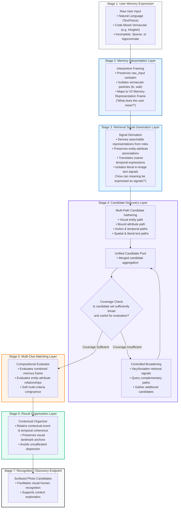

# Part 1 — Discovery Engine Architecture (Final)

## 1. Architecture Objective

The objective of the **Discovery Engine** in Part 1 is to define a conceptual intelligence pipeline anchored directly to the central project goal:

$$\mathbf{PROJECT\ ANCHOR:}\ \text{Increase the percentage of users who successfully retrieve a photo they remember but cannot precisely describe when they start searching.}$$

$$\text{HOW DOES THE DISCOVERY ENGINE TURN A NATURAL HUMAN MEMORY DESCRIPTION INTO A SET OF PHOTOS THAT THE USER CAN RECOGNIZE?}$$

Empirical research across real-world user testing and public user feedback indicates that existing commercial photo retrieval systems frequently break down when faced with everyday human memory expressions. In observed interactions:
- Users frequently encounter vocabulary mismatches when expressing social relationships (e.g., searching `"5 sisters"` returned zero results, whereas converting to `"5 girls"` retrieved the target at rank 1).
- Colloquial language and code-mixed vernacular particles (e.g., Hinglish `"marble cake wali photo"`) frequently trigger zero-result screens (*"No results found"*).
- Monolithic conversational interfaces frequently truncate candidate sets prematurely (e.g., returning only 6 photos across a multi-year library of 400+ target photos, or 2 days of a 10-day truck event).
- Single-path search operations frequently miss target photos if the initial query angle fails to match index representations.
- Contextual timelines are frequently collapsed by uncalibrated relevance sorting, depriving users of the chronological landmarks necessary to recognize the target photo or explore surrounding event moments.

### Core Architectural Principle
> **The user should not have to translate their memory into the exact technical vocabulary or data structures expected by the search system.**  
> **The Discovery Engine is responsible for bridging that gap.**

When people search their photo collections, they recall subjective, relational, and approximate episodic fragments:
- **People / Roles:** Who was present (`my cousin`, `brother`, `maid`, `5 sisters`)
- **Events / Milestones:** What gathering took place (`sister's wedding`, `farewell lunch`, `Holi 2020`)
- **Salient Props / Objects:** What items were prominent (`white bike`, `ring box`, `diya`, `papaya`)
- **Bound Visual Attributes:** How items or people appeared (`yellow suit`, `blue outfit`, `Diwali black`)
- **Dynamic Actions / Poses:** What activity occurred (`river rafting`, `skiing`, `cutting cake`)
- **Approximate Time / Eras:** Coarse intervals or relative offsets (`2021`, `"around 4 years ago"`, `July 2016`)
- **Spatial / Environmental Setting:** Where the scene occurred (`mountain`, `beach`, `at the gate`)
- **Literal Text Inscriptions:** Printed or displayed alphanumeric strings (`Progressive`, `bitcoin`, `I love being a man`)

The Discovery Engine architecture defined here is a **conceptual intelligence pipeline**. Our research suggests this architecture is a plausible way to address the observed failure modes by ingesting natural memory expressions, interpreting intent, deriving multi-path retrieval signals, discovering broad candidate sets across multiple modalities, checking candidate coverage, executing controlled broadening when initial coverage is insufficient, compositionally evaluating multi-clue relationships, and organizing results to support human recognition.

> [!IMPORTANT]
> **Strict Conceptual Boundaries Maintained:**
> - This is a **conceptual intelligence architecture**, not an implementation or deployment specification.
> - It does **not** select database engines, vector indexes, LLM vendors, vision backends, or OCR algorithms.
> - It does **not** specify API contracts, server topologies, UI wireframes, or frontend layout grids.
> - It does **not** introduce autonomous AI agents, agent loops, or background heuristics.
> - It represents a set of evidence-grounded architectural responsibilities and testable hypotheses.

---

## 2. Evidence-Supported Architectural Requirements

The following architectural requirements are derived directly from the verified findings documented in [part1_combined_evidence.md](file:///d:/graduation%20project%203/part1_combined_evidence.md), [part1_memory_schema_audit.md](file:///d:/graduation%20project%203/part1_memory_schema_audit.md), [interview_behavioral_episodes.md](file:///d:/graduation%20project%203/interview_behavioral_episodes.md), and [research_summary.md](file:///d:/graduation%20project%203/research_summary.md):

1. **Natural-Language and Vernacular Ingestion:** The engine must accept natural, unformatted human language (including code-mixed phrases and conversational particles) without requiring the user to reformulate into search keywords.
2. **Raw Input Preservation:** Verbatim user queries must be retained alongside parsed structures to ensure that nuance, colloquial particles, and hedging terms remain accessible throughout retrieval.
3. **Decoupled Interpretation and Retrieval Signal Generation:** The engine must separate understanding user intent ("What does the user mean?") from deriving searchable representations ("How can that meaning be expressed as retrieval signals?").
4. **Relational and Social Concept Handling:** The engine must accommodate social and familial roles (`sister`, `cousin`, `colleague`) rather than requiring users to manually translate relationships into generic demographic descriptions.
5. **Flexible Temporal Constraint Translation:** Approximate and coarse temporal expressions (`"around 4 years ago"`, `"2021"`) must be translated into flexible retrieval-compatible temporal constraints rather than requiring precise calendar dates.
6. **Literal Text Segregation:** Alphanumeric strings recalled from documents, signs, bills, and memes must be preserved as distinct literal text signals, routed to an in-image text matching path rather than treated as conversational prompts.
7. **Multi-Path Candidate Discovery:** Candidate discovery must not rely on a single monolithic search query. It must support gathering candidates across multiple retrieval paths (visual entities, bound attributes, actions, temporal constraints, spatial context, relational representations, and literal text) into a unified candidate pool.
8. **Decoupled Candidate Discovery & Candidate Coverage Checking:** Candidate gathering must be separated from final ranking so that candidate pools remain sufficiently broad. The architecture must include a conceptual check on whether the candidate set is sufficiently broad and useful for evaluating the user's memory, avoiding premature truncation ceilings.
9. **Controlled Recovery / Broadening:** When initial candidate coverage is judged insufficient, the architecture must support a controlled recovery step that broadens or varies retrieval paths to gather additional candidates into the pool before final matching, without degenerating into an uncontrolled autonomous loop.
10. **Compositional Multi-Clue Evaluation:** Entities and their qualifying visual attributes (e.g., `[bike: white]`, `[family: yellow]`) must be evaluated as bound relationships rather than scored as independent, disconnected tokens.
11. **Pervasive Uncertainty & Sparse Memory Accommodation:** Uncertainty and incompleteness in human memory must be preserved throughout the pipeline. An unspecified memory dimension must remain neutral rather than becoming a negative filter.
12. **Context-Preserving Result Organization:** Retrieval results must retain surrounding contextual information (such as temporal or event coherence) to support visual landmark recognition and subsequent user navigation.

---

## 3. Evidence-to-Architecture Mapping

The table below maps specific observed user behaviors and failure cases directly to the responsible architectural components:

| Research Evidence & Observed Case | Observed Failure / Phenomenon | Architectural Component Required | Architectural Responsibility |
| :--- | :--- | :--- | :--- |
| **"5 sisters" vs. "5 girls"** (Ep 05) | Kinship gap: `5 sisters` returned 0 results; converting to machine label `5 girls` retrieved target at rank 1. | **Memory Interpretation Layer & Retrieval Signal Generation Layer** | Interprets relational role (`sister`) and cardinality (`count: 5`), then derives retrieval-compatible searchable representations without forcing user reformulation. |
| **"rohtang ki ice wali photo"** (Ep 06) / **"marble cake wali photo"** (Ep 07) | Vernacular failure: Hinglish particles (`ki`, `wali`) triggered total zero-result screens (*"No results found"*). | **Memory Interpretation Layer (Raw Input Preservation)** | Preserves raw input, isolates grammatical particles, and extracts core semantic entities (`rohtang ice`, `marble cake`) instead of rejecting the query. |
| **"white bike"** (Ep 13) | Position 1–3 retrieval achieved when color was bound directly to a physical object. | **Multi-Clue Matching Layer (Compositional Binding)** | Evaluates `[Bike: White]` as a unified compositional entity, preventing `white` and `bike` from being evaluated as disconnected tokens. |
| **"yellow suit"** (Ep 02) / **"family yellow"** (Ep 22) | Querying `yellow` alone flooded results with unrelated items; `family yellow` isolated grandmother's 80th birthday. | **Multi-Clue Matching Layer (Entity-Attribute Binding)** | Restricts color signals to the qualifying entity (`family`, `suit`), preventing global scene flooding across unrelated items. |
| **"rafting"** (Ep 23) / **"farewell"** (Ep 21) | Immediate retrieval when a distinctive action verb or canonical event milestone aligned. | **Retrieval Signal Generation Layer (Action & Event Routing)** | Treats distinctive dynamic action verbs and canonical event nouns as high-specificity primary discovery signals. |
| **"around 4 years ago"** (Ep 10) / **"2021"** (Ep 07) | Users recall coarse elapsed offsets and multi-year eras; exact calendar dates are forgotten. | **Retrieval Signal Generation Layer (Temporal Constraint Mapping)** | Maps approximate temporal expressions to flexible retrieval constraints rather than requiring rigid calendar timestamps. |
| **"July 2016"** (Reddit Case 7) | Conversational AI search blocked explicit date queries (*"can't search using those terms"*). | **Retrieval Signal Generation Layer (Temporal Anchoring)** | Retains explicit month/year expressions as deterministic boundary signals rather than treating them as conversational tokens. |
| **"Progressive" bill** (Reddit Case 5) / **"I love being a man" meme** (Reddit Case 6) | Conversational systems treated literal text searches as conversational prompts, returning *"I can't help with that"*. | **Literal Text Retrieval Path (Segregated In-Image Text Channel)** | Routes literal alphanumeric text directly to a retrieval path capable of matching remembered in-image text, isolated from conversational dialog prompts. |
| **"diya at the gate"** (Ep 25) | Face recognition was unavailable for an infrequent contact (watchman); multi-object spatial query rescued retrieval. | **Candidate Discovery Layer (Multi-Path Discovery)** | Allows spatial, environmental, and object co-occurrences (`diya` + `gate`) across alternative retrieval paths when face recognition yields no candidates. |
| **"The Few Photos Truncation"** (Reddit Cases 4 & 11) | Monolithic search capped results to 6 photos across a 50k library (6 of 400+ birds; 2 of 10 days of trucks). | **Candidate Discovery Layer & Candidate Coverage Check** | Employs multi-path discovery decoupled from ranking; checks whether candidate coverage is sufficient; broadens paths if initial retrieval is truncated. |
| **"white top" exiled to 17th grid** (Ep 14) | Candidate was omitted from initial top results, requiring 17 grids of manual scrolling. | **Controlled Recovery & Multi-Clue Matching** | Identifies potential candidate pool gaps, gathers candidates across complementary paths, and evaluates multi-attribute congruence to elevate matching photos into initial visible results. |
| **Broad "wedding" searches** (Ep 02; Reddit Case 10) | Querying `wedding` flooded interface; unable to browse surrounding multi-day trip or locate specific moments. | **Result Organization Layer (Contextual Anchoring)** | Retains contextual temporal/event relationships around discovered photos, enabling users to recognize and navigate surrounding moments. |

---

## 4. Updated End-to-End Discovery Engine Pipeline

The Discovery Engine operates as a seven-stage conceptual intelligence pipeline with an integrated candidate coverage check and controlled broadening loop in Stage 4:



---

## 5. Memory Interpretation Layer

### 1. Purpose
The Memory Interpretation Layer ingests the user's raw natural-language query and parses it into the structured [V2 Memory Representation Frame](file:///d:/graduation%20project%203/part1_memory_representation_schema_v2.md) (`raw_input`, `people`, `events`, `objects`, `actions`, `temporal`, `literal_text`, `spatial_setting`).

Its sole responsibility is answering: **"What does the user mean?"**

### 2. Input
- Verbatim user expression string (e.g., `"rohtang ki ice wali photo"`, `"5 sisters"`, `"brother on a white bike at cousin's wedding"`, `"July 2016"`, `"Progressive bill"`).

### 3. Output
- A populated V2 Memory Representation Frame preserving `raw_input` alongside interpreted entity-attribute structures.

### 4. Why the Stage Exists
Human beings express episodic memories using natural conversational syntax, possessive pronouns (`my dog`), colloquial particles (Hinglish `ki`, `wali`, `ke sath`), and social relationships (`sisters`, `cousin`). The role of this layer is to interpret the user's communicative intent into a coherent memory frame without requiring the user to speak like a database query or strip away their natural language.

### 5. Evidence Supporting It
- **Episode 05:** User queried `5 sisters` $\rightarrow$ 0 results. Translating kinship into an interpreted concept of 5 people with sister roles enabled downstream retrieval.
- **Episodes 06 & 07:** User queried `rohtang ki ice wali photo` and `marble cake wali photo` $\rightarrow$ systems failed on vernacular particles (`wali photo`). Interpreting intent while ignoring filler particles enabled retrieval.
- **Episode 20:** User queried `my dog`, expecting the system to recognize personal possession rather than searching for generic internet dog images.

### 6. Observed Failure Addressed
Addresses the **Search Expression $\rightarrow$ Interpretation** failure in the retrieval failure model:
- Reduces the risk that colloquial phrasing or grammatical particles act as poison pills that trigger zero-result screens.
- Captures relational family and social terms rather than dropping them.

### 7. What Remains to Be Tested
- How reliably a lightweight parser can extract multi-clue memory frames across varying degrees of code-mixing without introducing unacceptable latency.

---

## 6. Retrieval Signal Generation Layer

### 1. Purpose
The Retrieval Signal Generation Layer translates the interpreted V2 Memory Frame into a coordinated set of specific **retrieval signals** suitable for candidate searching across an indexed photo library.

Its sole responsibility is answering: **"How can that interpreted meaning be expressed as retrieval-compatible signals?"**

### 2. Conceptual Separation from Interpretation
Memory Interpretation and Retrieval Signal Generation are distinct architectural responsibilities:
- **Memory Interpretation:** Understands that the user means `people: [role = sister, count = 5]`.
- **Retrieval Signal Generation:** Derives appropriate searchable representations from that interpreted concept (e.g., formulating demographic or visual cues that can match indexed library media).

The architecture does not hardcode specific mappings (e.g., hardcoding `"sister"` to `"female/woman/girl"`). Rather, it defines the responsibility of deriving searchable representations from interpreted meaning as a testable mechanism.

### 3. Input
- Interpreted V2 Memory Representation Frame.

### 4. Output
- Coordinated retrieval signals organized by target modality:
  - **Visual Entity Signals:** Core physical concepts (e.g. `bike`, `papaya`, `diya`).
  - **Bound Attribute Signals:** Visual modifiers tied to specific entities (e.g. `[bike: white]`, `[family: yellow]`).
  - **Relational Candidate Signals:** Searchable representations derived from social/kinship roles.
  - **Action Signals:** Dynamic physical activities or poses (e.g. `rafting`, `skiing`).
  - **Temporal Constraints:** Retrieval-compatible time intervals derived from approximate, coarse, or relative expressions.
  - **Literal Text Signals:** Distinct alphanumeric tokens for in-image text matching (e.g. `"Progressive"`, `"bitcoin"`).
  - **Spatial Setting Signals:** Environmental or landscape context (e.g. `mountain`, `beach`, `gate`).

### 5. Why the Stage Exists
Our observed failures indicate a gap between the user's relational/episodic expression and the representations used during retrieval. For example, photo indexing pipelines commonly index visual properties, faces, scene tags, text, and timestamps; they do not automatically know user-specific social networks. This layer bridges interpreted human memory concepts into concrete retrieval signals compatible with indexed collections.

### 6. Evidence Supporting It
- **Episode 05:** Deriving visual demographic signals from `5 sisters` enabled the system to match photos indexed by visual appearance.
- **Reddit Case 5:** Preserving `"Progressive"` as a literal text signal prevents conversational search engines from treating a corporate brand name as a descriptive adjective.
- **Episode 19:** Deriving a visual proxy (`clouds`) from a sensory expression (`fog`) enabled retrieval of mountain landscape photos.

### 7. Observed Failure Addressed
Addresses the **Interpretation $\rightarrow$ Retrieval** failure stage:
- Bridges the semantic gap between episodic human concepts and available index representations.
- Prevents literal text strings from being misinterpreted as conversational dialog prompts.

### 8. What Remains to Be Tested
- The precision and recall trade-offs of different expansion strategies for social and familial roles (e.g., how broadly to expand "cousin" or "colleague").

---

## 7. Candidate Discovery Layer

### 1. Purpose
The Candidate Discovery Layer gathers potential matching photos across the photo collection using the generated retrieval signals, assembling an initial pool of candidate photos for subsequent evaluation.

### 2. Multi-Path Candidate Gathering
Candidate Discovery is **not a single search operation**. Because human memory expressions contain heterogeneous clues spanning multiple modalities, candidate gathering operates through multiple retrieval paths/signals where relevant:
- **Visual Entity Path:** Matches primary physical objects or scenes (e.g., `bike`, `cake`, `diya`).
- **Bound Entity-Attribute Path:** Matches entities qualified by visual properties (e.g., `[bike: white]`, `[family: yellow]`).
- **Dynamic Action Path:** Matches physical activities or verbs (e.g., `rafting`, `skiing`).
- **Temporal Path:** Matches continuous date intervals or coarse chronological eras (e.g., `2021`, relative offsets).
- **Spatial / Environmental Path:** Matches geographic or architectural surroundings (e.g., `gate`, `mountain`, `beach`).
- **Relational-Derived Path:** Matches demographic or social representations derived from interpreted roles.
- **Literal Text Path:** Matches in-image OCR text snippets (e.g., `"Progressive"`, `"bitcoin"`).

All active retrieval paths contribute discovered candidates to a **unified candidate pool**. This prevents the system from bottlenecking on any single modality (such as relying exclusively on face recognition when an infrequent acquaintance is sought, as demonstrated in Episode 25).

### 3. Decoupling Principle
> [!IMPORTANT]
> **Candidate Discovery must be separated from final ranking.**  
> A target photo cannot be recovered by downstream ranking or presentation algorithms if it was never admitted into the candidate set.

The research identified failure cases associated with monolithic or conversational search experiences where candidate retrieval and presentation were coupled into an opaque step. In these cases, systems exhibited severe premature truncation (the "few photos" truncation issue documented in Reddit Cases 4 and 11), returning only a tiny fraction of matching images. 

Candidate discovery must prioritize recall over precision at this stage, ensuring that all plausible candidate photos enter the evaluation pool.

### 4. Input
- Coordinated retrieval signals across available modalities.

### 5. Output
- A broad, unified candidate pool of photos gathered across active retrieval paths.

### 6. Candidate Coverage Check
Following initial candidate gathering across active paths, the architecture introduces an explicit conceptual decision point:

$$\mathbf{Candidate\ Coverage\ Check:}\ \text{"Is the candidate set sufficiently broad and useful for evaluating the user's memory?"}$$

- This is a **conceptual decision point**, not a UI prompt and not a premature algorithmic threshold.
- It acknowledges that candidate discovery can fail through under-retrieval even when relevant photos exist in the library.
- If coverage is judged sufficient, the unified candidate pool advances directly to Stage 5 (Multi-Clue Matching).
- If coverage is judged insufficient, the engine initiates a **Controlled Recovery / Broadening step** (detailed in Section 12) before advancing to matching.

### 7. Evidence Supporting It
- **Reddit Case 4:** User searched for bird photos in a 50k library (containing 400+ bird photos). The conversational AI search returned exactly 6 photos, prematurely truncating recall.
- **Reddit Case 11:** User searched `"yellow truck"` photographed across 10 distinct days. The engine returned photos from only 2 days.
- **Episode 14:** Candidate 4 searched `white top`; the photo was present in the library but omitted from initial results, requiring 17 grids of manual scrolling to locate.
- **Episode 25:** Candidate 6 searched `diya at the gate`; face clustering failed for the watchman, but spatial and object candidate paths gathered the target photo.

### 8. What Remains to Be Tested
- What candidate-pool size provides sufficiently high recall for target retrieval cases without unacceptable latency across libraries of varying scale.

---

## 8. Multi-Clue Matching Layer

### 1. Purpose
The Multi-Clue Matching Layer evaluates candidate photos in the unified candidate pool against the combined compositional memory frame, assessing how comprehensively each candidate fulfills the bound entity-attribute relationships.

### 2. Input
- Unified candidate photo pool + V2 Memory Representation Frame.

### 3. Output
- Evaluated candidate photos with multi-dimensional match assessments.

### 4. Compositional Evaluation Responsibility
In human episodic memory, individual clues frequently over-generate when evaluated independently:
- Searching `yellow` alone returns hundreds of shirts, flowers, vehicles, and backgrounds.
- Searching `cake` alone returns dozens of celebratory moments across multiple years.
- Searching `bike` alone returns every bicycle or motorcycle in the collection.

Retrieval performance improves when clues are evaluated **compositionally**:
- `"white bike"` is not equivalent to independently searching `"white"` + `"bike"`. The attribute `white` must qualify the `bike`.
- `"family yellow"` is not equivalent to independently searching `"family"` + all yellow objects. The attribute `yellow` must qualify the `family` gathering.

The relationship between the clues matters. The Multi-Clue Matching Layer is responsible for evaluating candidate photos against these bound relationships rather than scoring disconnected keywords.

### 5. Evidence Supporting It
- **Episode 22:** Candidate 6 searched `yellow` $\rightarrow$ flooded with unrelated items. Searching `family yellow` isolated grandmother's 80th birthday in Grid 2. The combination of social group + bound color was necessary.
- **Episode 13:** Candidate 3 searched `white bike` $\rightarrow$ retrieved target in positions 1–3 because color was bound to the vehicle.
- **Episode 25:** Candidate 6 searched `diya gate` $\rightarrow$ located target photo in Grid 2 when face recognition was completely unavailable.
- **Episode 12:** Candidate 3 searched `diwali` $\rightarrow$ flooded. Searched `Diwali black` $\rightarrow$ isolated target photo in Grid 1.

### 6. Observed Failure Addressed
Addresses the **Ranking / Presentation Failure Stage**:
- Reduces result flooding where photos matching a single generic keyword dominate top results.
- Elevates candidates that satisfy multiple co-occurring, bound attributes over partial or disconnected matches.

### 7. What Remains to Be Tested
- How to evaluate partial attribute congruence when memory is slightly divergent (e.g., user recalls a "yellow suit" but the fabric was olive or gold). Exact mathematical scoring formulas remain deferred to implementation.

---

## 9. Result Organization Layer

### 1. Purpose
The Result Organization Layer structures evaluated candidate photos into a coherent presentation set designed to support visual human recognition and navigation.

### 2. Input
- Evaluated candidate photos.

### 3. Output
- An organized discovery set that preserves contextual and chronological coherence for user review.

### 4. Conceptual Responsibility (Non-UI Boundary)
Personal photo retrieval is fundamentally visual: users scan image representations rather than reading textual summaries. 

The research indicates that chronological and event context can be important for recognition and navigation in some retrieval cases:
- When relevance sorting disperses photos from a single event across disparate clusters, users lose temporal orientation.
- Surrounding photos from the same event frequently serve as visual landmarks that help users verify whether they have located the correct occasion.

The Result Organization Layer preserves this contextual information so that discovered photos can be recognized within their episodic context.

> [!IMPORTANT]
> **Strict Boundary with Part 5:**
> This architecture defines only the *conceptual requirement* to retain contextual relationships. It does **not** design:
> - UI layouts, thumbnail grids, or carousel designs
> - Filter chips or search bar controls
> - Timeline scrollbars or zoom gestures
> - Interaction flows or navigation transitions
> All interface design decisions are strictly deferred to Part 5.

### 5. Evidence Supporting It
- **Reddit Case 10:** User searched for a nephew and found two photos from a sister's wedding, but could not view surrounding photos from that 4-day trip. The user was forced to memorize the date, exit search, return to the main library, and manually scroll back through years of photos.
- **Reddit Case 5:** Users reported that splitting search results into uncalibrated "Best Match" and "Most Recent" views caused disorientation and fragmented event browsing.
- **Episode 14:** Candidate 4's target photo was located only after 17 grids of manual scrolling because relevance scoring displaced it from its chronological neighbors.

### 6. Observed Failure Addressed
Addresses the **Navigation / Recognition Failure Stage**:
- Helps preserve contextual landmarks that aid visual recognition.
- Retains the connection between a matching photo and its surrounding event context.

### 7. What Remains to Be Tested
- In which retrieval scenarios chronological grouping outperforms relevance-based clustering for visual target recognition.

---

## 10. Sparse Memory & Uncertainty Handling

Human memory is inherently **sparse and uncertain**: users rarely recall every dimension of an event, and what they do recall is often approximate. A core architectural requirement is that **uncertainty and incompleteness must be preserved throughout the conceptual pipeline** rather than forced into rigid deterministic values or discarded.

```
┌────────────────────────────────────────────────────────────────────────────────────────┐
│                        SPARSE MEMORY RETRIEVAL STRATEGIES                              │
├───────────────────────────────┬───────────────────────────────┬────────────────────────┤
│ SCENARIO A: SINGLE STRONG     │ SCENARIO B: SINGLE WEAK       │ SCENARIO C: COMPOUND   │
├───────────────────────────────┼───────────────────────────────┼────────────────────────┤
│ • Example: "rafting" (Ep 23), │ • Example: "cake" (Ep 01),    │ • Example: "white bike"│
│   "farewell" (Ep 21)          │   "dog" (Ep 20), "document"   │   (Ep 13), "diya gate" │
│ • Specificity: HIGH           │ • Specificity: LOW            │ • Specificity: HIGH    │
│ • Strategy: Direct candidate  │ • Strategy: Broad candidate   │ • Strategy: Multi-clue │
│   generation; rapid targeted  │   gathering; rely on context/ │   compositional match; │
│   retrieval.                  │   event grouping.             │   filters noise.       │
└───────────────────────────────┴───────────────────────────────┴────────────────────────┘
```

### 1. Pervasive Uncertainty Preservation
Uncertainty expresses itself across multiple dimensions of human memory. The architecture treats uncertainty as a first-class property across every layer:
- **Approximate Temporal Expressions:** Expressions such as `"around 4 years ago"` (Ep 10), `"2021"` (Ep 07), or `"Holi 2020"` (Ep 08) indicate temporal uncertainty. The architecture maps these into flexible retrieval-compatible temporal constraints rather than forcing artificial calendar dates.
- **Approximate Visual Attributes:** Recall of colors (e.g., recalling "blue" when the fabric was navy or teal) or item descriptions is often approximate. The matching layer treats attribute congruence softly rather than demanding pixel-exact color matches.
- **Incomplete Spatial Memory:** Users frequently remember an activity or setting without remembering geographic names (e.g., river rafting without knowing the town in Ep 23, or morning mountain drive without knowing the exact viewpoint in Ep 19).
- **Unknown or Unnamed People:** Users recall social roles (`"watchman"`, `"maid"`, `"cousin"`) or groupings (`"5 sisters"`) without knowing biometric identity or contact card names.
- **Verbatim Hedging Retention:** Natural linguistic hedging (*"around"*, *"maybe"*, *"I think"*) is preserved in `raw_input`, ensuring that subjective uncertainty remains accessible throughout downstream evaluation.

> [!NOTE]
> The architecture explicitly does **not** introduce mathematical confidence scores, Bayesian certainty probabilities, or speculative confidence enums. Uncertainty is preserved structurally through flexible constraints and neutral handling of missing fields.

### 2. Treatment of Unspecified Memory Dimensions
- **An unspecified memory dimension should not be treated as negative evidence.**
- If a user recalls river rafting but does not specify a location (Ep 23), the absence of location in the memory frame must not penalize candidate photos.
- If a user recalls a cake but no date (Ep 01), photos lacking dated event metadata must not be excluded.
- Unpopulated fields in the V2 schema function as neutral wildcards, never as exclusionary filters.

### 3. Soft Multi-Clue Satisfaction
Human memory is subject to descriptive drift. If a candidate photo satisfies most bound clues but diverges on a minor detail (e.g., matching event, people, and setting, but garment shade differs slightly), the Multi-Clue Matching Layer should retain and rank the candidate beneath complete matches rather than discarding it.

---

## 11. Literal Text Retrieval Path

The evidence indicates that text appearing inside personal images (documents, bills, signs, memes) represents a distinct retrieval task that conversational AI search experiences frequently handle poorly.

```
┌────────────────────────────────────────────────────────────────────────────────────────┐
│                   SEPARATION OF LITERAL TEXT VS. SEMANTIC VISUAL SEARCH                │
├───────────────────────────────────────────┬────────────────────────────────────────────┤
│ LITERAL TEXT RETRIEVAL PATH               │ SEMANTIC VISUAL RETRIEVAL PATH             │
├───────────────────────────────────────────┼────────────────────────────────────────────┤
│ • "Progressive" (Insurance bill)          │ • "dog in a hat" (Visual scene)            │
│ • "bitcoin" (Order confirmation code)     │ • "white bike" (Entity + Bound attribute)  │
│ • "I love being a man" (Meme quote)       │ • "river rafting" (Dynamic activity)       │
│ • "boarding pass" (Document keyword)      │ • "sunset over beach" (Landscape setting)  │
├───────────────────────────────────────────┼────────────────────────────────────────────┤
│ RESPONSIBILITY: Matches remembered        │ RESPONSIBILITY: Matches semantic visual    │
│ literal text against in-image text data.  │ concepts against perceptual visual content.│
├───────────────────────────────────────────┼────────────────────────────────────────────┤
│ FAILURE MITIGATED: Prevents conversational│ FAILURE MITIGATED: Prevents rigid keyword  │
│ engines from rejecting text as dialog.    │ failures on visual concepts (e.g. 5 girls).│
└───────────────────────────────────────────┴────────────────────────────────────────────┘
```

### Architectural Separation
1. **Dedicated Literal Text Routing:** Literal text signals require a retrieval path capable of matching remembered in-image text. When `literal_text` is populated in the V2 schema, its tokens are routed through this path.
2. **Isolation from Conversational Prompts:** Literal text queries must not be evaluated as conversational chat prompts (which caused chatbot refusals such as *"I can't help with that"* in Reddit Case 6).
3. **Contribution to Unified Candidate Pool:** Candidates discovered through in-image text matching are merged directly into the unified candidate pool alongside candidates discovered through visual, temporal, and relational paths.

---

## 12. Controlled Recovery / Candidate Coverage Logic

A critical finding from our empirical stress testing is that **candidate discovery can fail through under-retrieval even when relevant photos exist in the user's collection**. The architecture must provide a principled mechanism to detect and recover from this condition before final matching.

```
┌────────────────────────────────────────────────────────────────────────────────────────┐
│                      CONTROLLED RECOVERY / BROADENING FLOW                             │
├────────────────────────────────────────────────────────────────────────────────────────┤
│                                                                                        │
│   Initial Multi-Path Discovery ──► Gather Candidate Set                                │
│                                             │                                          │
│                                             ▼                                          │
│                                 [Candidate Coverage Check]                             │
│                                             │                                          │
│                         ┌───────────────────┴───────────────────┐                      │
│                         ▼                                       ▼                      │
│              [Coverage Sufficient]                   [Coverage Insufficient]           │
│                         │                                       │                      │
│                         ▼                                       ▼                      │
│              Advance to Multi-Clue                   Execute Controlled                │
│                    Matching                              Broadening                    │
│                                                                 │                      │
│                                                                 ▼                      │
│                                                      Broaden/Vary Signals              │
│                                                      & Query Complementary Paths       │
│                                                                 │                      │
│                                                                 ▼                      │
│                                                      Merge Additional Candidates       │
│                                                      into Unified Pool                 │
│                                                                 │                      │
│                                                                 ▼                      │
│                                                      Advance to Multi-Clue Matching    │
└────────────────────────────────────────────────────────────────────────────────────────┘
```

### 1. Why Initial Candidate Discovery Can Be Insufficient
Initial candidate gathering can fail to capture target photos for several observed reasons:
- **Over-Constrained Initial Filtering:** When multiple query signals are initially combined too strictly, the initial search operation may eliminate valid candidates that fulfill the primary memory but diverge on an approximate detail.
- **Single-Path Bottlenecks:** If an engine relies solely on one modality (e.g., face recognition for people, or object tags for settings), a missing tag in that modality results in complete under-retrieval.
- **Vocabulary Mismatches in Initial Probes:** The initial representation of a memory clue may not immediately match the terms present in the library index.
- **Empirical Failure Evidence:**
  - *Reddit Case 4 (The 6-Photo Ceiling):* The user queried birds in a 50k archive containing 400+ bird photos. The search returned only 6 photos because the initial candidate discovery step artificially capped retrieval.
  - *Reddit Case 11 (Yellow Truck):* A user photographed a yellow truck across 10 distinct days; the initial retrieval returned photos from only 2 days, omitting 8 days of valid target media.
  - *Episode 14 (White Top):* Candidate 4 searched `white top`; the photo existed in the collection but was omitted from the initial candidate view, requiring 17 grids of manual scrolling.

### 2. How the Architecture Detects Insufficient Coverage
Following initial candidate discovery, the engine performs a **Candidate Coverage Check**:
- **Conceptual Decision Point:** The check asks: *"Is the candidate set sufficiently broad and useful for evaluating the user's memory?"*
- **Conceptual Indicators of Insufficiency:**
  - The gathered candidate pool is empty or severely sparse despite a broad or multi-clue query.
  - A multi-day or multi-moment event query yields candidates concentrated exclusively in a single isolated timestamp cluster while ignoring broader temporal bounds.
- **Boundary Note:** This check is a conceptual architectural responsibility. It does **not** introduce fixed numeric thresholds or hardcoded cutoff counts.

### 3. How the Architecture Broadens and Varies Retrieval
When coverage is judged insufficient, the engine executes a **controlled broadening** step:
- **Relaxing Secondary Constraints:** If an initial candidate query combined an entity, an attribute, and a narrow temporal window, broadening relaxes secondary constraints (e.g., widening temporal boundaries or evaluating the entity independently of the attribute) to gather candidates.
- **Querying Complementary Paths:** If the visual entity path yielded sparse candidates, the engine activates or elevates complementary paths (e.g., spatial setting, action, or contextual event signals).
- **Varying Searchable Representations:** In the Retrieval Signal Generation Layer, alternative representations of the interpreted concept are generated (e.g., alternative demographic representations for social roles, or visual proxies for sensory descriptions).

### 4. Merging Additional Candidates into the Unified Pool
- Candidates gathered through the broadening step are **merged directly into the existing candidate pool**.
- Previously discovered candidates are **never dropped or discarded** during broadening.
- The expanded, merged candidate pool is then passed to Stage 5 (Multi-Clue Matching), where compositional scoring evaluates both the original and newly acquired candidates against the complete memory frame.

### 5. Why This Protects Recall
- A photo that was omitted during initial candidate gathering has a second opportunity to enter the candidate pool through complementary paths or relaxed constraints.
- Because ranking is decoupled from discovery, additional candidates can be admitted into the pool without requiring Candidate Discovery itself to make the final precision decision. Stage 5's compositional matching retains responsibility for evaluating candidates against the complete memory frame and distinguishing stronger matches from weaker ones.

### 6. Why This Remains Conceptual (Not an Agent Loop)
> [!IMPORTANT]
> **Strict Non-Agentic Boundary:**
> - This recovery step is **not an autonomous AI agent loop**.
> - It does **not** introduce continuous self-prompting loops, dynamic plan generation, or multi-agent debate frameworks.
> - It is a **bounded, single-pass conceptual architectural safeguard** ensuring that candidate discovery does not silently exit with an impoverished candidate set when alternative retrieval paths exist.
> - Specific retry policies, scoring thresholds, and execution timeouts remain strictly deferred to implementation.

---

## 13. Architectural Hypotheses

This architecture is built on several key hypotheses derived from qualitative and empirical research. These hypotheses have **not yet been fully validated** and will be formally tested during prototype implementation and Part 6 user evaluations:

1. **Natural-Language Interpretation Hypothesis:** Translating natural-language and code-mixed memory expressions into an interpreted memory frame will improve candidate recall and user satisfaction compared with direct keyword matching.
2. **Relational Expansion Hypothesis:** Deriving retrieval-compatible demographic or visual representations from social roles (`sisters` $\rightarrow$ count and demographic cues) will surface relevant candidates without requiring manual user query reformulation.
3. **Multi-Path Discovery Hypothesis:** Gathering candidates across multiple specialized retrieval paths (visual, attribute, temporal, spatial, text) into a unified pool will yield higher candidate recall than single-path search queries.
4. **Decoupled Discovery Hypothesis:** Separating broad candidate discovery from multi-clue ranking will reduce under-retrieval and eliminate the premature truncation observed in monolithic conversational search systems.
5. **Candidate Coverage Check Hypothesis:** Introducing a conceptual check on candidate coverage followed by controlled broadening will protect recall against early search bottlenecks without generating unmanageable candidate volumes.
6. **Compositional Multi-Clue Hypothesis:** Evaluating entity-attribute relationships compositionally (e.g., binding color directly to the host entity) will reduce false-positive flooding compared with scoring clues independently.
7. **Literal Text Routing Hypothesis:** Routing literal in-image text through a dedicated retrieval path will improve document and meme retrieval compared with routing all text through conversational language models.
8. **Context-Preserving Organization Hypothesis:** Retaining chronological and event context during result organization will shorten visual search time and improve user recognition compared with uncalibrated relevance sorting.
9. **Soft Satisfaction Hypothesis:** Ranking candidates with partial attribute matches beneath complete matches—rather than excluding them—will improve retrieval resilience against human memory drift.

---

## 14. Implementation Decisions Deferred

To maintain a clean conceptual architecture and avoid premature optimization, the following technical and implementation decisions are explicitly deferred:

- **Storage and Database Technologies:** Selection of vector databases, relational engines, full-text indexes, or graph stores.
- **Embedding Models and Vision Backends:** Selection of specific vision-language models, image taggers, or embedding architectures.
- **In-Image Text Extraction Algorithms:** Selection of specific OCR engines, text recognition pipelines, or string-matching algorithms.
- **Language Parsing Frameworks:** Selection of specific LLMs, small language models (SLMs), or rule-based grammars for the Memory Interpretation Layer.
- **Candidate Pool Dimensions:** Determination of exact candidate pool sizes, cutoff thresholds, or dynamic scaling factors.
- **Coverage Check Heuristics:** Quantitative thresholds, minimum candidate counts, or statistical formulas for determining coverage insufficiency.
- **Broadening Execution Limits:** Exact number of broadening passes, retry budgets, or latency caps.
- **Scoring Formulas and Coefficients:** Mathematical formulation of similarity metrics, weighting coefficients, and ranking equations.
- **Temporal Window Formulas:** Concrete mathematical functions for translating relative offsets (e.g. `"around 4 years ago"`) into timestamp boundaries.
- **Deployment Topologies:** Decisions regarding on-device, cloud, or hybrid execution environments.
- **UI and Interaction Design:** Visual grid layouts, filter controls, navigation transitions, and timeline interfaces (deferred strictly to Part 5).

---

## 15. Architecture Success Criteria

The conceptual architecture will be evaluated against the following qualitative success criteria directly tied to the project anchor:

- **Accepts Natural Memory Descriptions:** Successfully ingests everyday conversational and code-mixed queries without forcing users to rephrase into system-specific keywords.
- **Accommodates Memory Sparsity:** Successfully executes retrieval when users recall only one or two memory dimensions, without penalizing unmentioned fields.
- **Preserves Entity-Attribute Relationships:** Maintains the binding between visual attributes and their target entities throughout evaluation, preventing unrelated keyword flooding.
- **Eliminates Keyword Translation Burden:** Does not require users to manually guess machine labels (e.g., translating kinship roles into demographic terms).
- **Supports Approximate Temporal Expressions:** Converts coarse and relative temporal memories into flexible retrieval constraints.
- **Preserves Literal In-Image Text:** Retains remembered printed text as a distinct signal, enabling document and sign retrieval without conversational interference.
- **Gathers Candidates Across Multiple Paths:** Pulls candidates from visual, temporal, spatial, and textual dimensions into a unified pool rather than relying on a single query modality.
- **Protects Recall via Coverage Checking:** Detects under-retrieval and executes controlled broadening before final scoring, avoiding artificial candidate truncation.
- **Avoids Premature Truncation:** Maintains a candidate discovery phase that does not artificially cap results prior to multi-clue matching.
- **Evaluates Complete Context:** Assesses candidate photos against the full compound memory frame rather than treating clues as isolated filters.
- **Preserves Contextual Orientation:** Structures results so that users can recognize visual landmarks and navigate surrounding event photos.

---

## 16. Architectural Alternatives and Trade-offs

To determine the most defensible conceptual structure, three architectural approaches were evaluated against our research evidence:

| Evaluation Dimension | Alternative 1: Monolithic Conversational Search Pipeline | Alternative 2: Disconnected Lexical Filter Pipeline | Alternative 3: Multi-Stage Interpreted Multi-Signal Discovery (Proposed) |
| :--- | :--- | :--- | :--- |
| **Conceptual Model** | Single end-to-end conversational model handles parsing, candidate search, and ranking in an opaque generation step. | Traditional database search pipeline relying on keyword token parsing, metadata fields, and boolean filters. | Decoupled pipeline: Interpretation $\rightarrow$ Signal Generation $\rightarrow$ Multi-Path Discovery (with Coverage Check) $\rightarrow$ Compositional Matching $\rightarrow$ Contextual Organization. |
| **Evidence Fit** | Low. Research identified failure cases associated with monolithic/conversational experiences (Reddit Cases 4, 5, 6: truncation, text treated as dialog prompts). | Low. Struggles with relational concepts (`5 sisters`), vernacular syntax, and semantic visual descriptions (Ep 05, 06, 12). | Closest alignment with observed failure modes while remaining feasible for a prototype. |
| **Handling of Relational Memory** | Opaque: language model may recognize kinship concepts, but visual grounding across collection is unpredictable. | Poor: relational terms return zero results when indexed photos lack relational metadata tags. | Explicit: separates interpretation of role from derivation of retrieval-compatible candidate signals. |
| **Handling of Literal In-Image Text** | Weak: conversational models risk treating literal strings as conversational prompts. | Strong on text matching, but cannot combine text with semantic visual concepts. | Segregated: routes literal text signals to an in-image text path while retaining compound visual context. |
| **Handling of Sparse Memory & Uncertainty** | Unpredictable: conversational systems may hallucinate, request clarification, or refuse short queries. | Poor: queries return either zero results or unranked result floods; rigid filters penalize missing dimensions. | Structured: treats unmentioned dimensions as neutral wildcards; preserves uncertainty across signals. |
| **Candidate Pool Robustness** | Very Low: susceptible to the "few photos" truncation bug where results are capped prematurely. | Low: brittle boolean queries frequently return zero candidates if one keyword diverges. | High: multi-path candidate gathering with explicit candidate coverage check and controlled broadening. |
| **Traceability and Modular Testing** | Low: black-box pipeline where failure causes cannot be isolated to interpretation, retrieval, or ranking. | High, but functionally constrained. | High: each stage has distinct conceptual inputs, outputs, and responsibilities that can be independently tested. |
| **Conceptual Complexity** | High operational dependency on opaque model behavior. | Low complexity, but fails on everyday human memory queries. | Balanced: modular pipeline with clear separation of responsibilities. |

### Recommended Conceptual Architecture: Alternative 3

Alternative 3 is the recommended conceptual architecture for the Discovery Engine. 

Our research suggests this architecture is a plausible way to address the observed failure modes for the following reasons:
1. **Alignment with Observed Failure Stages:** It directly corresponds to the stages where user retrieval breaks down in empirical studies (interpretation, retrieval signal derivation, candidate truncation, and ranking).
2. **Separation of Interpretation from Retrieval:** It establishes a clear boundary between understanding what the user means and determining how to search for that meaning across indexed media.
3. **Multi-Path Gathering & Coverage Resilience:** It avoids single-path query bottlenecks and incorporates a controlled recovery step to protect recall against early search failures.
4. **Compositional Clue Combination:** It enables entities and visual attributes (`white bike`, `family yellow`) to be evaluated as bound relationships rather than independent tokens.
5. **Preservation of Literal Text:** It provides an isolated pathway for in-image text matching, mitigating conversational prompt confusion.
6. **Robustness to Sparse Memory & Uncertainty:** It accommodates varying degrees of memory recall without treating missing fields as negative evidence.
7. **Architectural Simplicity and Feasibility:** It provides a modular, traceable framework suitable for prototype development and iterative testing.

The architecture is not claimed to be proven superior; it represents a grounded, testable framework designed to address documented user failure modes.

---

## 17. Open Research and Testing Questions

The following key questions will be investigated through prototype experiments and Part 6 user evaluations:

1. **Candidate Pool Volume vs. Latency:** What candidate-pool size provides sufficiently high recall for target retrieval cases without unacceptable latency across collections of varying scale?
2. **Candidate Coverage Heuristics:** What conceptual heuristics most reliably identify that a candidate pool is under-retrieved without triggering unnecessary broadening passes?
3. **Broadening Scope & Stopping Conditions:** How broadly should secondary constraints be relaxed during controlled recovery to balance recall expansion against noise injection?
4. **Relational Expansion Precision:** What are the most effective strategies for deriving searchable representations from kinship and social roles without introducing excessive visual noise?
5. **Soft-Matching Calibration:** What evaluation criteria best balance candidate tolerance for minor memory drift (e.g., slightly divergent garment colors) against result precision?
6. **Visual Homogeneity Organization:** When candidate discovery returns a cluster of visually similar photos from a single burst or setting (e.g., Ep 03: 30 sunset photos), what contextual organization best supports rapid human visual recognition?

---

## 18. V3 Changes From V2

The following meaningful refinements were made in V3 based on the architecture stress test:

1. **Project Anchor Explicitly Integrated:** Anchored Section 1 directly to the overarching project goal: *"Increase the percentage of users who successfully retrieve a photo they remember but cannot precisely describe when they start searching."*
2. **Multi-Path Candidate Discovery:** Clarified in Stage 4 that Candidate Discovery is not a single search operation, but a coordinated multi-path gathering process spanning visual entities, bound attributes, actions, temporal constraints, spatial context, relational representations, and literal text that aggregates into a unified candidate pool.
3. **Pervasive Uncertainty Preservation:** Expanded Section 10 to explicitly establish that uncertainty and incompleteness (approximate time, approximate colors, incomplete location, unknown persons, missing dimensions) are preserved as first-class conceptual properties throughout the pipeline rather than forced into rigid values or mathematical probabilities.
4. **Candidate Coverage Check Introduced:** Added an explicit conceptual decision point in Stage 4: *"Is the candidate set sufficiently broad and useful for evaluating the user's memory?"* to acknowledge and address candidate-stage under-retrieval.
5. **Controlled Recovery / Broadening Logic (Section 12):** Defined a bounded, single-pass conceptual recovery mechanism to broaden retrieval signals, query complementary paths, and merge additional candidates into the unified pool when initial coverage is insufficient, without introducing autonomous AI agent loops.
6. **Updated Pipeline Diagram & Hypotheses:** Updated the Mermaid architectural flowchart to reflect multi-path gathering, the coverage check, and the controlled broadening loop; added corresponding testable hypotheses in Section 13.

---

## 19. Part 1 Architecture Status

With the incorporation of multi-path candidate gathering, pervasive uncertainty preservation, candidate coverage checking, and controlled broadening, the **Discovery Engine Architecture (Final)** is now sufficiently defined, internally consistent, and rigorously grounded in empirical evidence.

**Status:** The conceptual architecture for Part 1 is **LOCKED**. 

This document serves as the approved conceptual intelligence blueprint for subsequent project phases. No implementation code, database selections, model choices, or Part 5 UI designs should be undertaken within Part 1.
