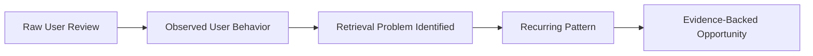

# Project: Evidence Collection for AI-Powered Photo Retrieval

> [!IMPORTANT]
> **Project Stage:** `EVIDENCE COLLECTION`
> 
> - **Do NOT assume** that the hypothesis is true.
> - **Do NOT search only** for reviews that support the hypothesis.
> - **Collect both positive and negative evidence** neutrally.

---

## 📌 Context & Research Hypothesis

We are researching a product problem related to photo retrieval in **Google Photos** and similar photo-management applications.

### Research Hypothesis
> *"Users have difficulty retrieving specific photos from their large photo libraries, and an AI-powered natural-language search experience could make photo retrieval easier than relying only on traditional search, albums, dates, locations, objects, or automatically detected faces."*

### Key Objectives for Evidence Gathering
Identify what real users state regarding:
1. Difficulty finding/retrieving photos.
2. Searching for photos using natural language or descriptive queries.
3. Problems with existing Google Photos search.
4. Problems with face/person recognition.
5. Problems with object/content recognition.
6. Problems with date/location-based retrieval.
7. Users' expectations from AI-powered photo search.
8. Cases where users cannot find a photo even though they know it exists.
9. Cases where AI/photo search successfully helps users find something.
10. Cases where AI search gives irrelevant, incorrect, incomplete, or unexpected results.

---

## 🎯 Primary Data Source

- **Primary Source:** Google Play Store reviews for **Google Photos** (and other major photo gallery applications when relevant).
- **Relevance Rule:** Do NOT treat every review mentioning "search" as relevant. A review must contain evidence related to photo discovery, photo retrieval, photo organization, search, recognition, or finding specific photos.

---

## 📋 Step-by-Step Research Methodology

### Step 1: Collect Raw Reviews
Collect as many relevant Google Play Store reviews as possible. Preserve exact text and metadata:
- **Original Review Text** (do NOT paraphrase during collection)
- **App Name**
- **Review Date** (if available)
- **Star Rating** (if available)
- **Reviewer Name / ID** (if available and permitted)
- **Metadata & Source URL** (if available)

---

### Step 2: Broad Inclusion Criteria

Include reviews that contain meaningful evidence about any of the following categories:

| Category | Description & Inclusion Scope | Example |
| :--- | :--- | :--- |
| **A. Photo Retrieval / Finding Photos** | Difficulty finding photos, large libraries, scrolling for hours, searching by memory/concept, inability to find known photos, unknown dates/locations/filenames. | *"I know I have a picture of my daughter with the dog somewhere but I can't find it."* `[INCLUDE]` |
| **B. Search Experience** | Google Photos search, search bar, suggestions, results, natural-language, visual/semantic/event/object/person search. | *"I searched for photos of my family at the beach and it showed the wrong pictures."* `[INCLUDE]` |
| **C. AI / Natural-Language Search** | AI search, Gemini/Ask Photos, semantic queries, conversational search, understanding context/relationships. (Explicit 'AI' tag not required if behavior matches). | *"I can ask it to find pictures from my trip and it actually finds them."* `[INCLUDE]` |
| **D. Face / Person Recognition** | Incorrect recognition, missing faces, side-profile/back-of-head issues, dark lighting failures, wrong person merged, inability to search by person. | *"The app doesn't recognize my mother's face in side-profile photos, so I can't find all her pictures."* `[INCLUDE]` |
| **E. Object / Image Content Recognition** | Issues finding photos by objects, animals, receipts/documents, screenshots, landmarks, activities, visual characteristics. | *"I have hundreds of pictures of receipts but search doesn't find them properly."* `[INCLUDE]` |
| **F. Date / Location / Event Retrieval** | Finding photos by date/location/trip/event, incorrect or missing date/location tags, forgetting exact dates/locations. | *"I want to find the photos from my cousin's wedding but I don't remember the date."* `[INCLUDE]` |
| **G. Photo Library Scale / Information Overload** | Thousands of photos, endless scrolling, difficulty navigating massive libraries, overload. | *"Scrolling through 20,000 photos just to find one memory."* `[INCLUDE]` |
| **H. User Expectations / Feature Requests** | Requests for smarter search, natural language, AI search, manual tagging, improved search accuracy/relevance. | *"I wish I could type what I remember about a picture."* `[INCLUDE]` |

---

### Step 3: Exclusion Criteria

Exclude reviews that are solely focused on unrelated topics unless they explicitly link back to photo retrieval/search:

* ❌ **Storage:** Prices, limits, subscriptions (unless connected to photo retrieval, e.g., *"Bought extra storage but can't find old photos"*).
* ❌ **Backup / Sync:** Cloud backup failures, upload speed, sync bugs (unless tied to retrieving photos).
* ❌ **Photo Editing:** Filters, cropping, Magic Eraser, video editing, effects.
* ❌ **Sharing:** Link sharing, family sharing, partner sharing.
* ❌ **General Performance:** Crashes, freezing, battery drain, device heating (unless specifically breaking search/retrieval).
* ❌ **General UI / Design:** Dark mode, button layouts, font sizes, animations.
* ❌ **Privacy / Security:** Permission prompts, data collection, facial recognition privacy concerns.
* ❌ **Non-Informative / Low Quality:** Single-word reviews ("Great app"), emojis only, punctuation, advertisements, spam, duplicates.

---

### Step 4: Important Filtering Principle

> [!TIP]
> **Do NOT Filter Based Only on Keywords.**
>
> Semantic meaning matters more than literal words. A review does NOT need to explicitly mention keywords like `"search"`, `"AI"`, or `"find"`.
>
> **Examples:**
> - *"Every time I want to show someone an old picture, I have to scroll forever."* → `KEEP` (Evidence of a retrieval/discovery pain point).
> - *"I wish I could just type 'photos from my Goa trip with my friends' and get them."* → `KEEP` (Natural language search expectation).
> - *"The app is great and I purchased 2TB."* → `REMOVE` (No retrieval evidence).

---

### Step 5: Classification Categories

Assign one or more of the following categories to each included review:

1. `RETRIEVAL_DIFFICULTY`
2. `SEARCH_PROBLEM`
3. `NATURAL_LANGUAGE_SEARCH`
4. `AI_SEARCH`
5. `FACE_RECOGNITION`
6. `OBJECT_RECOGNITION`
7. `EVENT_CONTEXT_SEARCH`
8. `DATE_SEARCH`
9. `LOCATION_SEARCH`
10. `LARGE_LIBRARY_OVERLOAD`
11. `SEARCH_ACCURACY`
12. `SEARCH_RELEVANCE`
13. `FEATURE_REQUEST`
14. `SUCCESSFUL_RETRIEVAL`
15. `OTHER_RETRIEVAL_EVIDENCE`

---

### Step 6: Direction of Evidence

Classify the overall nature/intent of the review as:

* `PAIN_POINT`: User describes a problem, frustration, failure, or unmet need.
* `FEATURE_REQUEST`: User explicitly asks for a capability.
* `SUCCESS`: User describes successful retrieval/search experience.
* `FAILURE`: User describes unsuccessful or inaccurate retrieval/search.
* `EXPECTATION`: User describes what they expect the product to understand or do.
* `MIXED`: Review contains both positive and negative evidence.

---

### Step 7: Job-to-Be-Done (JTBD) Extraction

Extract the underlying user goal/task. Examples:
- Find photos of a specific person
- Find photos from a trip / event
- Find an old memory
- Find a photo containing a specific object
- Find photos without remembering date/location
- Find a photo based on visual description or activity
- Find photos based on relationships between people
- Find specific document / receipt / screenshot
- Retrieve a photo from a large library
- Use `UNKNOWN` if the job cannot be reasonably inferred.

---

### Step 8: Search Method Extraction

Record how the user attempted retrieval (multiple values allowed):
- `KEYWORD_SEARCH`
- `PERSON_SEARCH`
- `FACE_RECOGNITION`
- `OBJECT_SEARCH`
- `DATE_SEARCH`
- `LOCATION_SEARCH`
- `ALBUM`
- `MANUAL_SCROLLING`
- `NATURAL_LANGUAGE`
- `AI_SEARCH`
- `UNKNOWN`

---

### Step 9: Failure Mode Classification

For reviews describing a problem, specify the primary failure mode:
- `CANNOT_FIND_PHOTO`
- `IRRELEVANT_RESULTS`
- `INCOMPLETE_RESULTS`
- `WRONG_PERSON`
- `PERSON_NOT_RECOGNIZED`
- `OBJECT_NOT_RECOGNIZED`
- `EVENT_NOT_RECOGNIZED`
- `CONTEXT_NOT_UNDERSTOOD`
- `SEARCH_TOO_BROAD`
- `SEARCH_TOO_NARROW`
- `REQUIRES_EXACT_DATE`
- `REQUIRES_EXACT_LOCATION`
- `MANUAL_SCROLLING_REQUIRED`
- `TOO_MANY_RESULTS`
- `DUPLICATE_RESULTS`
- `OTHER` / `UNKNOWN`

---

### Step 10: Original User Language vs. Research Interpretation

To prevent bias and preserve data integrity, store exact wording separately from interpretation:

```json
{
  "ORIGINAL_REVIEW": "I know I have a picture of my dog at the beach but search never shows it.",
  "RESEARCH_INTERPRETATION": "User knows the photo exists but cannot retrieve it using search."
}
```

---

### Step 11: Signal Strength Detection

Flag review quality based on concrete behavioral details:
- **`HIGH_SIGNAL`:** Contains specific user behavior, specific library size, detailed context, or explicit failure examples (e.g., *"I have 20,000 photos and searched for my daughter's school function, but it only showed 3 pictures"*).
- **`MEDIUM_SIGNAL`:** Clear problem or feature mention without full context.
- **`LOW_SIGNAL`:** Vague statements (e.g., *"Search could be better"*).

---

### Step 12 & Step 13: Data Integrity & Duplicate Removal

- ⛔ **No False Evidence:** Never fabricate, rewrite, merge, or embellish reviews. Never infer intent or demographic data without direct evidence. Mark unknown fields as `UNKNOWN`.
- 🧹 **De-duplication:** Keep only one copy of duplicated reviews (preferring the most complete version). Do not inflate metrics with duplicate reviews.

---

## 📊 Dataset Schema Format (Step 14)

The output dataset must adhere to the following schema structure:

```typescript
interface ReviewData {
  review_id: string;
  app_name: string;
  review_date?: string;
  rating?: number;
  original_review: string;
  relevance: "RELEVANT" | "NOT_RELEVANT";
  evidence_type: "PAIN_POINT" | "FEATURE_REQUEST" | "SUCCESS" | "FAILURE" | "EXPECTATION" | "MIXED";
  category: string[];
  job_to_be_done: string;
  search_method: string[];
  failure_mode: string;
  research_interpretation: string;
  signal_strength: "HIGH" | "MEDIUM" | "LOW";
  source: string;
}
```

---

## 📈 Research Summary Requirements (Step 15)

The post-analysis summary must report exact quantitative metrics & qualitative patterns:

### Quantitative Metrics
1. Total reviews collected
2. Total relevant reviews
3. Total excluded reviews
4. Number of high-signal reviews
5. Count per primary problem (Retrieval difficulty, Search failure, Face/Person recognition, Object recognition, AI/Natural language, Large libraries, etc.)

### Qualitative Patterns
Highlight validated user behavioral patterns such as:
- Known photo exists, but unfindable via current search.
- Reliance on manual scrolling due to search failure.
- Memory decay (forgetting exact dates/locations).
- Semantic intent mismatch (search returning irrelevant results).
- Facial recognition failure modes under varied visual conditions.
- Desiring descriptive natural-language queries over metadata filtering.

---

## 🎯 Final Strategic Objective

Transform raw feedback into evidence-backed product insights without skipping the evidence phase:



> [!WARNING]
> **Final Rule on Bias:**
> Do NOT optimize dataset analysis to force a justification for an AI solution. The evidence should determine the true user problem, and the problem will dictate whether an AI solution is truly justified.
